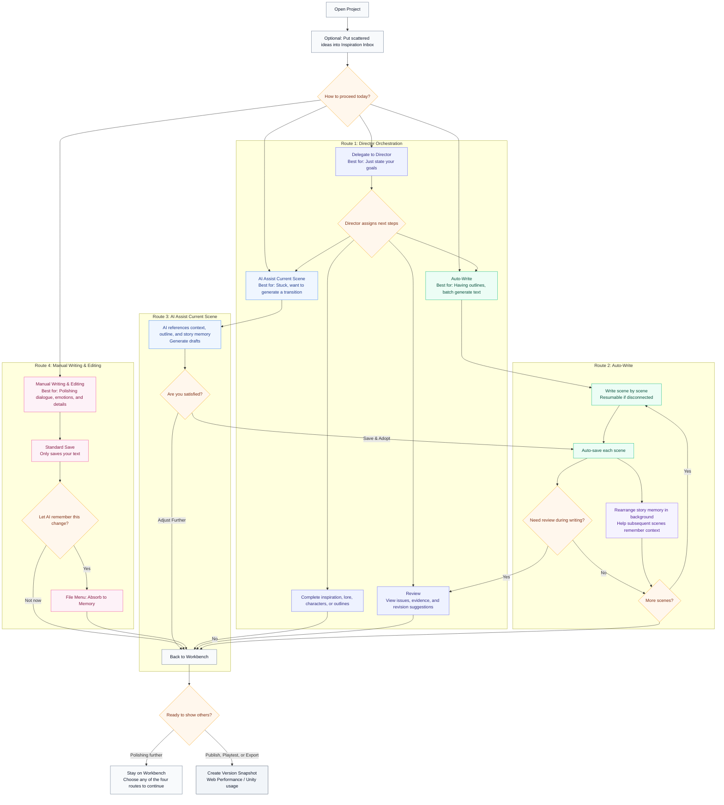
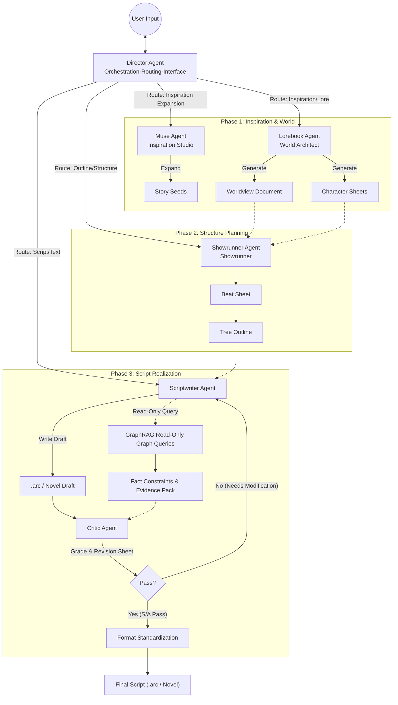
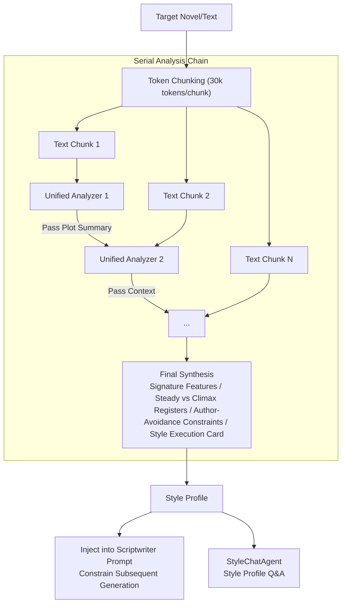
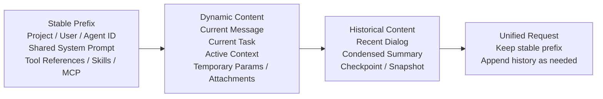
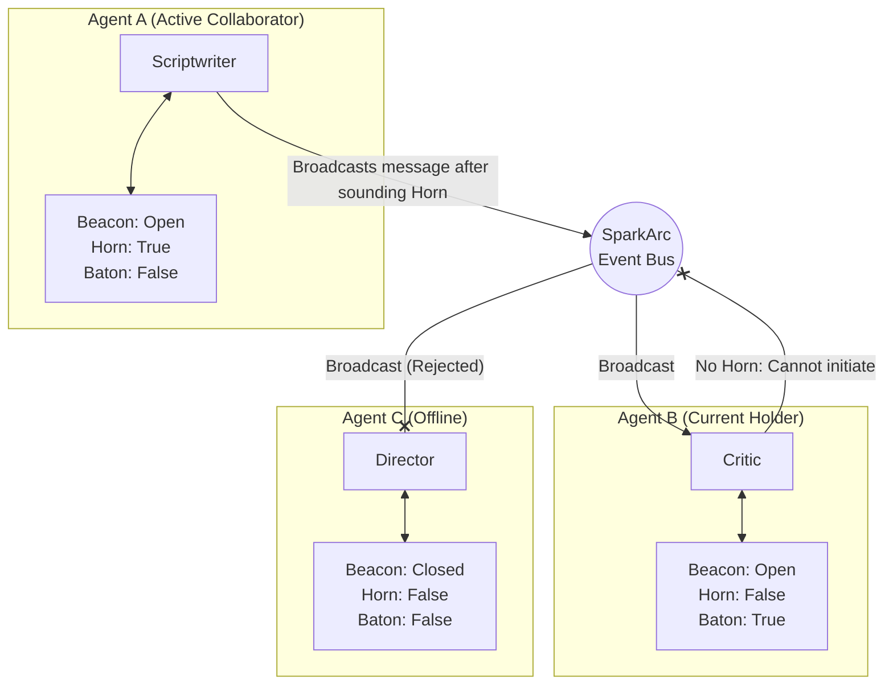

# SparkArc Studio

[简体中文](README.md) | [English](README.en.md) | [日本語](README.ja.md) | [한국어](README.ko.md)

**SparkArc Studio** is a **multi-agent autonomous creative pipeline**: it **compiles** sparks of inspiration into complete, runnable story worlds — novels and scripts, driving web performances and Unity engine performances.

It connects the entire chain of **Inspiration — Lore — Beat — Outline — Writing — Validation — Publishing — Sharing — Performance**: you own the inspiration and the decisions, and the agent cluster turns them into deliverable story assets.

> 📊 **Engineering at a glance**: 9 registered agents (7 delegatable experts + 2 in-process services) · 56 unified tools · tri-modal prompt protocol · stable-prefix cache engineering · 170+ automated test files · 5-platform clients · 4-language UI · MCP remote access
>
> ⚡ **Two steps to run**: `git clone https://github.com/1deaaa/spark-arc-studio && cd spark-arc-studio && docker compose up -d --build` → open `http://localhost:7788`
>
> 📢 **Support & Star**: If this project inspires or helps you, please give us a **Star** (bookmark the project to avoid losing it) and **Watch** (select Custom -> Releases to subscribe to new version updates). As an independent open-source project, every Star and Watch significantly increases our visibility in the community, which is crucial for the continuous iteration and long-term development of the project. Thank you very much for your support!
>
> 🤝 **Co-Authors**: Thanks to [ @wxwxwkai](https://github.com/wxwxwkai) for his work on publicity. Without these key contributions, this project could never have been released.

## Core Features

### 1. Human-Centric, Complete Control

SparkArc firmly believes that **inspiration and emotion are the non-negotiable core dignity of human creation**. This is the prerequisite for all AI creation.

Whether it is a quick note when inspiration strikes, or word-by-word polishing during meticulous refinement, you decide the level of AI intervention.
* **Co-creation (Recommended)**: You provide the core concept, key scenes, and dramatic beats, and the AI **strictly builds the entire world according to your requirements**. You can interrupt, modify, and rewrite at any time, and the AI will adapt immediately to your new direction.
* **Directed Writing**: With just a moving lyric, a vague idea, or a slice of life, simply instruct the Director Agent. You can then **close the page — the experts of SparkArc will execute a rigorous workflow in the background to present you with a complete story**.
* **Assisted Editing**: The ultimate assistant for perfectionist creators. Highly visualized, user-friendly workflows where AI only provides structuring, verification, and suggestions. **You are in complete control of every single word, using AI only as global labor or as a critical reader to polish your work**.

Creation without quality is destined for the wastebasket.

* **Long-Form Quality Assurance**: Through real-time status tracking in the **Story Memory Pool**, report cards from the **Critic**, and the negative constraints of **Style Cloning** to counter AI-generated tones, we implement a strict pipeline of **pre-writing lore validation, mid-writing logic checking, and post-writing quality assurance**. This guarantees the quality of long-form narratives while fully liberating the creator's productivity.
* **Lower-Cost Long-Form Creation**: SparkArc always pays attention to model cache hit rates and tries to reuse settings, outlines, and earlier chapters the model has already read. For model services that support caching, cached content usually costs less than reading it again, helping reduce unnecessary token costs as your project grows.
* **Customized Experts**: You decide exactly **how to write prompts** and **which models to bind** for each expert agent. You only need to focus on writing quality — the underlying infrastructure for these experts has been fully laid out by SparkArc.
* **Style Cloning & Countering AI-generated Tone**: Simply upload your work to launch the analysis cluster to **clone your own or a famous writer's** unique narrative voice, word choices, and emotional tones. This **effectively resolves the high-frequency word issues common in AI creation** and dramatically **reduces the "AI flavor" (AI味)** of the output.
* **Semantic Search & Batch Editing**: Natural language retrieval and global replacement driven by **Agentic RAG + Graph RAG**. You only need to know a concept or a plot point to retrieve it precisely. **Renaming characters, updating settings — let the AI handle the chores**.

### 2. An IDE for Creators: Intuitive Interaction

Now, you are the Head Writer. Simply **talk to the Director in the chat box**, and it will coordinate an intelligent agent team to **work collaboratively with you** — or run entirely in the background, building your massive world view and **automatically completing the entire creative process** using **various powerful structured editing tools**. Share your **novels/scripts** with your friends, allowing them to **immerse themselves in your inspiration** on the **interactive performance terminal**.

SparkArc is dedicated to carrying professional creative workflows on natural conversations through multi-agent capabilities.

* **Ultra-friendly & Professional Experience**: We visualize every creative node with intuitive components, allowing creators to edit conveniently and at will. It is as professional as **Cursor for writing**, but **without complex operational logic — what you see is what you get**.
* **Say Goodbye to Manual Editing**: You no longer need to write complex prompts to constrain the AI to write an outline while considering the world view, nor do you need to copy-paste texts output by various agents. Everything is organized by the workflow. The Director Agent understands your demands, splits sub-tasks, and accurately distributes them to lore experts, showrunners, or scriptwriters. They **use tools to edit automatically for you**, allowing you to enjoy the precise control of strictly structured text without adding a single bit of work.
* **Unveiling the Black Box: Collaborative White-Box Generation**: Traditional AI tools often generate the final long article directly in a black box. SparkArc, however, **runs autonomously** in the background, shows you the deduction process of each step, and **reveals the AI's reasoning**. If you are unsatisfied, you can **appoint an expert** to perform surgical local modifications. Generation is no longer a blind-box draw, but a fully visible white-box creation.

### 3. Borderless Creation, Anytime, Anywhere

Inspiration is often born **outside the computer — on the subway, during a walk, or in a casual chat with friends or even AI**.

* **Subway Time (Fragmented Creation)**: Specially adapted for mobile devices, allowing one-handed operation to review outlines, record inspirations, or make simple plot choices during commutes. Highly automated workflows let you complete creative tasks in just five minutes of subway time.
* **Multi-Platform Support**: Supports all common platforms — *Windows, macOS, Linux, Android, iOS; computers, tablets, and phones are all your professional Studio!*
* **MCP Across Space**: Break device boundaries. Through Model Context Protocol (MCP), your **RikkaHub on mobile**, **Claude Code on desktop**, or any other MCP-supported AI assistant can **remote-control the Director to start creating with just one sentence during casual chats or research**, or simply send ideas to the Inspiration Inbox.
* **Unattended Auto-Write**: Launch the Auto-Write pipeline with one click. The AI will generate chapters and scenes continuously according to the outline. **Closing the browser won't stop the writing** — simply reopen it to restore real-time progress. Supports pause/resume/breakpoint recovery, with nested progress rings displayed on the frontend.

### 4. Share the Spark, Showcase the World

**Under the AI accelerator, the protagonist you have envisioned for years can finally take the stage**. It's not just sharing plain text, but a complete show of your creation.

* **Web Performance Terminal**: Share your inspiration at any time. Audiences can enter the script with **just a single click**.
* **Version Snapshot & Export**: Supports one-click creation of version snapshots. Export as `.arc` interactive scripts or pure literary novels, and restore to the workspace from snapshots with one click.
* **AI-Generated Performance Assets (Shipped)**: Backgrounds, character sprites, and scene illustrations support both upload and online generation. Four kinds of consistency reference images — **style / scene / character / continuity** — lock the visual style so sprites and backgrounds stay consistent within a single work; uploaded sprites are automatically cut out, and image models from multiple vendors (OpenAI / Gemini / xAI, etc.) are adapted through one unified layer.
* **Immersive Performance Player**: Three.js full-screen atmosphere shaders with frame-rate adaptive degradation; Novel Mode automatically switches to a clean reader (page-flip / scrolling, font size, reading progress). Performance assets ship together with version snapshots.
* **Public-Share Content Safety**: Before a work goes public, AI shards it for concurrent review (Critic compliance mode); anything that fails is not published. Administrators can control the public sharing policy globally.
* **Planned Features**:

> 1. Customizable Scriptwriter capabilities that spawn sub-agents, such as daily-life writers, item lore writers, and more.
> 2. User-defined data structures, where agents generate matching parsing/editing components for frontend display, with the component code saved to the database (LUI / GEN-UI direction).
> 3. An automated Turing-style mimic-test loop for style cloning (the scoring rubric is already built into the analysis prompts).

### 5. Industrial Production, Democratic Creation

Make the world in your script move — **the generated script can be easily imported into Unity to drive the game engine's dialogue and cutscene systems**, and can be extended to Unreal, Godot, and other engines. We believe that with the development of AI, **everyone will have the right to create stories and even games**.

* **Program Decoupling**: Designers can focus purely on text and drama without writing a single line of code, controlling performances and game behaviors while iterating text at any time.
* **Blueprint System**: Each project can be configured with an exclusive `blueprint.json` defining creative preferences, style constraints, and process parameters, letting the AI write within your framework instead of guessing from scratch.
* **Unity Example**: A simple **Unity SDK** is provided. Experience the simplicity of one-click integration and refer to the **detailed beginner's integration guide**.

## Who SparkArc Is For

SparkArc is built first for creators, while also serving published-work audiences, technical integrations, and independent operators. Different roles can start from different entry points:

| You are | Start with | Primary use |
|---|---|---|
| Authors, screenwriters, and individual creators | Desktop, web, or mobile client | Work with AI across inspiration, lore, writing, review, and publishing |
| Creative teams and studios | A self-hosted team instance | Organize internal creation, model access, and project collaboration |
| Readers, players, and experience audiences | Web or Unity performances | Experience published interactive works |
| Indie game developers and technical integrators | Unity SDK, exported assets, and APIs | Bring scripts, events, and performances into their own projects |
| Self-hosters, operators, and contributors | Docker, source code, CI/CD, and developer docs | Operate an instance, extend the platform, or contribute upstream |

If you only want to create, connect to an available workspace. Choose self-hosting when you need control over data, models, or team collaboration; development and integration paths are for technical users.

---

The architecture of SparkArc is designed strictly according to the standard workflows of the literature, game, and film/television industries:

| Stage | Role Equivalent | How SparkArc Does It | Feature Description |
| :--- | :--- | :--- | :--- |
| **0. Communication & Dispatch** | Director | **Director** | Global entry and context manager. Based on LangGraph multi-turn tool-calling autonomous dispatch, it delegates tasks, triggers auto-writing, and checks progress. It is the interaction node directly facing the user. |
| **1. Planning / Concept** | Logline / High Concept | **Inspiration Seed** | Capture fleeting Flash Ideas and solidify them into story seeds with multi-dimensional tags (genre/tone/perspective). |
| **2. Lore / Setting** | Story Bible / World Guide | **Lorebook Expert** | Establish physical laws, magic systems, geopolitics, and core character bios to ensure subsequent logical consistency. |
| **3. Beat / Structure** | Beat Sheet / Treatment | **Showrunner** | "Save the Cat!" or "Hero's Journey"? Establish the story skeleton at this stage, divide the act structure, and generate precise beat sheets. |
| **4. Writing** | Screenplay / Script | **Scriptwriter** | The final "pen". Fills flesh into the structural framework, handling scene descriptions, action directions, and character dialogue. Supports dual-mode output: `.arc` interactive script and pure novel format. |
| **5. Quality Assurance** | Script Doctor / Coverage | **Critic & Style Cloning** | Critic simulates a harsh editor to provide professional feedback on conflicts or plot holes; Style Cloning eliminates AI-flavor high-frequency words through target style constraints. GraphRAG provides read-only graph queries (`query` / `status`), routed together with semantic search and the Story Memory Pool by question complexity to strengthen cross-chapter causal and long-term structural consistency. |
| **6. Publishing / Show** | Implementation / Assets | **Web Show / Unity SDK** | Script assetization. Compiles the script into a high-performance runtime to drive in-game dialogue systems, performance scheduling, and quest triggers. |

## Creator's One-Map Workflow

You can think of SparkArc as a creative workstation that "can drive automatically but always allows you to take over the steering wheel." In daily use, you only need to choose between several entrances: delegate tasks to the Director, start Auto-Write, let the AI assist you with the current scene, or write completely by yourself. The system organizes story memory without interrupting you; if you edit content manually, you can decide whether to let the AI absorb that change.



## Detailed Directory

* [Who SparkArc Is For](#who-sparkarc-is-for)
* [🚀 Quick Start](#-quick-start)
* [System Architecture](#system-architecture)
  * [1. Agent Cluster](#1-agent-cluster)
    * [Style Cloning Cluster](#style-cloning-cluster)
  * [2. Context Structure & Unified Execution Pipeline](#2-context-structure--unified-execution-pipeline)
  * [3. Beacon Bus Communication Mechanism](#3-beacon-bus-communication-mechanism)
* [Quality Engineering](#quality-engineering)
  * [Interactive Script Format (ARC)](#interactive-script-format-arc-example)
  * [Story Memory Pool](#story-memory-pool)
  * [Novel Mode](#novel-mode)
  * [Engineering Quality Guardrails](#engineering-quality-guardrails)
* [Infrastructure](#infrastructure)
  * [1. Matchbox Agent Gateway](#1-matchbox-agent-gateway)
  * [2. Database Auto-Migration](#2-database-management--auto-migration)
  * [3. Multi-Tenant SaaS](#3-multi-tenant-saas)
  * [4. Semantic Search Engine](#4-semantic-search-engine)
  * [5. CI/CD Automated Deployment](#5-cicd-automated-deployment)
* [Cross-Platform Ecology & Architecture](#cross-platform-ecology--architecture)
* [📚 Deep Dive](#-deep-dive)
* [Author's Note](#authors-note)

---

## 🚀 Quick Start

⚠️ This project separates the client and server. **You must deploy the server according to the following documentation to use it.**

**The client accesses the server's URL directly through a browser. Downloading the dedicated client from the Release page is highly recommended.**
It will automatically detect server APIs upon startup and attempt to connect.

To make it easier for everyone to experience, I maintain a server instance. If you do not start your own server, the client will automatically select mine, where you can register to experience the platform.
**Due to limited time and funding, I cannot guarantee stability. Therefore, this test instance may be frequently inaccessible. Please do not store important data on it. Deploy your own server for serious use.**

### Option 1: Managed Desktop Launcher (Recommended for Beginners)

The GitHub Release desktop Launcher supports Windows, macOS, and Linux. It is the low-barrier path: install the desktop package, then let Launcher prepare the local backend.

**Requirements**:

- Release Launcher users do **not** need system Git or Node.js. Launcher uses an embedded Git implementation and a private managed Node.js runtime.
- On macOS and Linux, the portable Python bootstrap still needs the normal base tools `bash`, `curl`, and `tar`.
- Source users who clone the repository and run `start.bat` / `start.sh` still need Git for cloning and Node.js 20+ for the frontend build.

#### How to Use the Release Launcher

1. Download and open the desktop package from GitHub Releases.
2. Choose **Start Local Backend** when no local backend is detected.
3. Launcher downloads its managed `main` checkout into `~/.sparkarc/sparkarc-server`, then prepares private Node.js, portable Python, and locked dependencies.
4. The local backend starts at **<http://localhost:6688>**. Launcher only updates this managed checkout; it never overwrites a manual clone, a `dev` worktree, or local source edits.
5. Launcher checks `main` for updates and asks before applying an update. It stops its own managed service before switching code, while retaining user data and runtime caches.
6. Launcher shell updates are discovered directly from GitHub Releases. When the API is rate-limited, it falls back to GitHub's standard Release redirect page and available mirrors; the first release only opens the matching download page and uses no custom update manifest.

#### Source Script Path

Clone the repository with Git, then run the root script:

```bash
git clone https://github.com/1deaaa/spark-arc-studio
cd spark-arc-studio
```

- Windows: double-click `start.bat`
- macOS / Linux: run `bash start.sh`

The scripts reuse their deployment marker on later launches. You own branch selection and `git pull` timing on this path. See the [managed Launcher deployment design](docs/project/local-deployment-manager.zh-CN.md) for the ownership and update boundaries.
For mobile devices, simply access **<http://192.168.x.x(your_lan_ip):6688>**.
If you want remote access, you can learn about intranet penetration (if you have a server, you probably won't use this method anyway ~~~).

> 💡 **Zero-Pollution Design**: All outputs are inside `server/.runtime/python/`. Deleting this directory completely restores your system without any residue.
> 💡 **Idempotence & Safety**: The script has built-in version detection and deployment flags; running it repeatedly will not repeat downloads or installations.
> 💡 **Pip Cache Exception**: The pip download cache defaults to `%LOCALAPPDATA%\pip\Cache\` (user-level, non-system-level), which does not affect the system. You can clear it by running `pip cache purge`.

### Option 2: Docker Deployment (Recommended)

The most hassle-free cross-platform deployment method, taking only 2 steps:

```bash
# 1. Clone the project
git clone https://github.com/1deaaa/spark-arc-studio
cd spark-arc-studio

# 2. Start the service
docker compose up -d --build
```

Access the service after startup at: **<http://localhost:7788>**

> 💡 **Port Differentiation**: Docker environment uses port `7788`, and bare-metal environment uses port `6688`. This makes it easy to run them simultaneously (for parallel debugging in some cases) and distinguishes environments (running both simultaneously in production is **strictly prohibited to avoid potential data conflicts**).
> 💡 **Data Persistence**: User data and databases are automatically saved in the host machine's `server/` directory, so restarting the container will not lose data.
> 💡 **Master Key Location**: `LLM_KEY` is written to `server/llm/agen_matchbox/.env` by default, eliminating the need to create a separate `server/.env`.

To recreate the container:

```bash
docker compose up -d --build --force-recreate
```

#### 🔄 Correct Update Method After Pulling New Versions (Very Important)

Please do not just execute `docker compose restart`. This only restarts the old container and does not guarantee that the new code will take effect.

After each `git pull`, please execute:

```bash
# 1) Pull the code
git pull --ff-only

# 2) Rebuild and replace containers (Mandatory)
docker compose up -d --build --force-recreate

# 3) Optional: Check recent logs to confirm successful startup
docker compose logs --tail=120 sparkarc
```

This workflow ensures that:
1. The latest Git code inside the image is rebuilt.
2. Files managed by Git are synchronized back to the mount directory upon startup, avoiding old persisted files shadowing the new version.
3. User databases and personal data (such as `*.db`, `_userdata`, `.env`) continue to be persisted and will not be overwritten.
4. GGUF models, llama.cpp runner packages, and tokenizer caches required for local embeddings are persisted in `server/.runtime` (Docker runtime cache volumes for CI deployments) and do not need to be re-downloaded after image reconstruction.

### Option 3: Local Bare-Metal Development Environment

Configuration is simple, and you can press F5 in VS Code to start. This is suitable for those who **do not want to use Docker** or want to do secondary development. Please configure according to the following steps:

1. **Initialize the Python Environment**
   ```bash
   # 1. Create and activate a Conda environment (make sure miniconda or anaconda is installed)
   conda create -n sparkarc python=3.13 -y
   conda activate sparkarc

   # 2. Install backend dependencies (requirements list is in the server directory)
   pip install -r server/requirements.txt
   ```

2. **Build the Frontend Interface**
   ```bash
   # Return to the project root directory, then enter client
   cd client
   npm install
   npm run build
   ```

3. **F5 to Start the Service**
   If there are no errors in the previous operations, press F5 to start the server.
   Access the service at: **<http://localhost:6688>**

#### Optional: Enable Turnstile CAPTCHA (Cloudflare Turnstile)

SparkArc supports Cloudflare Turnstile during the registration phase. It only protects the "Registration" entry: the frontend displays the Turnstile component to obtain a token, and the backend calls Cloudflare's `siteverify` interface to verify the token before creating a user.

Create or edit `.env` in the project root directory, adding:

```env
SPARKARC_REGISTRATION_VERIFICATION_ENABLED=1
SPARKARC_REGISTRATION_VERIFICATION_PROVIDER=turnstile
SPARKARC_TURNSTILE_SITE_KEY=your_turnstile_site_key
SPARKARC_TURNSTILE_SECRET_KEY=your_turnstile_secret_key
```

Description:
* `SPARKARC_TURNSTILE_SITE_KEY` is the public site key sent to the frontend via `/api/auth/verification-config`.
* You can also save the Turnstile configuration directly in the Admin Panel. The backend writes this into the runtime `.env` in the server's persisted data directory, which won't be lost after Docker rebuilds.
* `SPARKARC_TURNSTILE_SECRET_KEY` is the private key used only on the backend and will not be returned to the frontend.
* **If site key or secret key is not configured, registration verification is disabled by default**, which won't affect self-deployed developers registering for the first time.
* If you want to switch to other verification platforms like Google or Tencent Cloud later, keep the registration routes unchanged and extend the provider in [verification.py](server/core/verification.py).

### How to Access Self-Deployed Instances: Browser & Client

SparkArc's backend directly hosts the frontend pages. Once self-deployment is complete, the easiest way to access it is to open a browser and visit your backend address:
* Docker Deployment: `http://localhost:7788`
* Local Bare-Metal Launch: `http://localhost:6688`
* Remote Server Deployment: `http://your_server_address:port`

The desktop client from GitHub Releases first detects local backends (`6688` / `7788`) and can prepare its managed local backend through Launcher. For an existing private or remote backend, configure the actual server address before signing in. Mobile clients cannot deploy a backend locally and must be pointed at a PC or server address. The default address may point to the maintainer's demo instance and is not suitable for long-term private use.

Common configuration entries:
* Desktop client accessing local backend: `http://localhost:6688` or `http://localhost:7788`
* Mobile client accessing computer on the same LAN: `http://computer_lan_ip:6688` or `http://computer_lan_ip:7788`
* Remote private deployment: Enter your server's public domain/IP and port.

If you want to access your private instance on phones, tablets, or other remote devices, you can buy a cloud server for deployment, or use a simpler solution like exposing your local service to your devices using intranet penetration tools. Regardless of the method, please configure accounts, HTTPS, access control, firewalls, model keys, and data backups properly.

> 💡 If your private instance is open for public registration, we suggest configuring HTTPS, registration Turnstile verification, firewall/reverse proxy rate limiting, backup policies, and keeping `LLM_KEY` and other model platform keys secure.

#### MCP Client Integration

After signing in, open **MCP Connection Service** from the desktop dashboard or mobile AI management page. The shared configuration card generates one `spark-arc` configuration for the unified MCP endpoint `/api/mcp/`; control tools use the `control_` prefix there. `/api/mcp/control/` remains available as a compatibility endpoint for existing clients. Use Streamable HTTP (`"type": "http"`). See the [MCP Integration Guide](docs/project/mcp-integration.zh-CN.md) for the complete configuration, tool list, and Director task workflow.

---

## System Architecture

### 1. Agent Cluster

SparkArc does not rely on a single large model, but builds an agent cluster with clear division of labor. Each Agent has its own independent persona, prompt engineering, and model configuration.

> 💡 **Internationalization**: The Agent registry ([registry.py](server/agents/registry.py)) natively supports four languages: `zh-CN` / `en-US` / `ja-JP` / `ko-KR`. The frontend uses i18n mapping, and the backend extracts the corresponding fields via the locale resolver (`_resolve_i18n_field`) based on the request locale. Adding a new language only requires adding a set of translations in each Agent entry.

#### A. Dispatcher

* **Director Agent**:
  * **Responsibility**: Global entry and context manager. Based on **LangGraph SupervisorGraph**, it achieves multi-turn tool calling autonomous dispatch — delegating tasks to experts via `delegate_task`, triggering auto-writing via `trigger_auto_write`, and checking progress via `check_scriptwriter_status`, replacing early rule-based intent recognition schemes. It maintains user session coherence, records key decisions, and serves as the default receiver on the "bus".
  * **Core Code**: `agent_director.py` + `director_graph.py` (LangGraph SupervisorGraph definition)

#### B. Creative Core

* **Muse Agent**:
  * **Responsibility**: The starting point of creativity. It captures fleeting inspiration flashes, solidifies them into story seeds using multi-dimensional tags (style/tone/viewpoint), and can automatically expand them into more complete creative concepts. It supports receiving inspiration from external AI assistants via MCP.
* **Lorebook Agent**:
  * **Responsibility**: Build the world view from scratch. It can generate detailed geography, history, magic/technology systems, and batch-generate character sheets matching the world view based on simple seeds.
* **Showrunner Agent**:
  * **Responsibility**: Macro-narrative control. It is responsible for generating the **Beat Sheet** and **Tree Outline**, ensuring that the story structure aligns with classic narrative models like "Save the Cat!" or the "Hero's Journey".
* **Scriptwriter Agent**:
  * **Responsibility**: Micro-scene realization. It is the sole "writer" responsible for transforming outlines into script text. It supports **dual-mode output**: `.arc` interactive script format (containing dialogue branches, action commands, scene jumps) and pure novel format (Markdown). It has a built-in **Conception Chain** mechanism that generates `<conception>` tags for logical deduction before outputting text.

#### C. Quality Assurance

* **Style Agent** (Style Cloning Sub-Cluster):
  * **Responsibility**: Counter AI flavor. By mimicking the writing style of a specified writer or even yourself, it ensures that the large model avoids using high-frequency phrases common to AI when generating, **minimizing the AI flavor**.
  * **Sub-Cluster Structure**: Completed collaboratively by **UnifiedStyleAnalyzer** (unified serial analysis) and **StyleChatAgent** (style profile Q&A). See the [Style Cloning Cluster](#style-cloning-cluster) section for details.
* **Critic Agent (Logic Auditor)**:
  * **Responsibility**: Simulates a harsh editor. It does not directly modify text, but audits script/novel fragments for **AI flavor residues perceivable by readers, dialogue distortion, lack of literary depth, and logic/character persona issues**, outputting structured review feedback.
  * **Work Mode**: Can operate either through natural language dialog in the chat panel, or be triggered manually as a structured review in the right panel of the ScriptWriter.
  * **Output Protocol**: Uses a five-grade system of **S / A / B / C / D** instead of numeric scores; simultaneously outputs original text evidence, hit issues, and `fix_ticket` style modification orders to facilitate subsequent revisions.
  * **Model Strategy**: Prioritizes leveraging the discriminative and attribution capabilities of large models, treating them as an **LLM Judge / Editor** rather than training a proprietary classifier that only gives probability scores.
* **GraphRAG Tool (Read-Only Graph Queries)**:
  * **Responsibility**: Converts the world view, characters, outlines, and script fragments in the project into a searchable relationship graph, returning actionable fact constraints and source evidence during writing or review.
  * **Current State**: The Agent-facing side keeps only the read-only `query` / `status` operations; graph building and rebuilding are triggered manually from Settings. It ships bound to Director / Scriptwriter / Critic / Showrunner (continuity toolset). Simple factual questions prefer semantic search, recent-state questions prefer the Story Memory Pool, and only cross-chapter causality, relationship evolution, knowledge boundaries, and long-term threads enter GraphRAG.
  * **Quality Value**: Focuses on enhancing cross-chapter consistency, character relationship stability, and setting retrieval capability, reducing "retconning" (eating settings) in long narratives.

#### Critic Review Mechanism

The Critic does not answer "is this written by AI?", but rather "**where in this text will the reader feel like a model is completing a task**". It outputs `S/A/B/C/D` grades + source text evidence + `fix_ticket` revision sheets, and by default, does not modify the text directly, preserving the creator's autonomy.

> 📗 For the complete four core mechanisms and the rationale for using LLM over ML models, please refer to [Architecture Document §6](docs/project/architecture.md#6-critic-审核机制完整版).

#### Collaborative Data Flow



#### Agent Three-Mode Calling Protocol

Each expert Agent's prompt strictly distinguishes three calling modes, carried by three top-level fields of the same `yaml` file, ensuring that the three paths of "Manual Panel", "User Chat", and "Director Delegation" do not bleed into each other:

| Mode | YAML Field | Output Characteristics |
| :--- | :--- | :--- |
| **Specialized Work** | `system` + `user` | Strictly structured, can be directly parsed and saved by parsers. |
| **User Interaction** | `chat_system` | Natural conversation, open-ended, format not forced. |
| **Director Delegation** | `pipeline_system` | Strictly structured + tool saving + briefing the Director. |

> 📗 For complete runtime logic, `pipeline_system` writing constraints, tool reference mechanisms, and new Agent self-checklists, please refer to [Architecture Document §2](docs/project/architecture.md#2-agent-统一调用管线) and [AGENTS.md §4.5](AGENTS.md).

#### Style Cloning Cluster

SparkArc's most technically deep module — built from **UnifiedStyleAnalyzer** serial relay analysis + **StyleChatAgent** (style profile Q&A). It captures the subtle writing voice of human authors and generates **executable style profiles** that constrain subsequent generation and eliminate AI-flavor high-frequency words.

* **Serial Analysis**: Long novels are chunked by 30k tokens. Each chunk receives a full **5-dimension analysis** (thinking & cognitive fingerprint / linguistic texture / emotional processing / senses & attention / interpersonal field), with plot summaries passed between chunks to preserve context and avoid the context loss of fragmented retrieval.
* **Executable Output**: Every conclusion must be an **instruction, not an observation**, backed by a short sanitized example; the final synthesis yields signature features, steady-state vs climax-state registers, **author-avoidance negative constraints (a taboo list)**, and a 10-15-line **style execution card**, injected directly into the Scriptwriter's prompt.
* **Turing Backtest Scoring Rubric**: Style profiles ship with an `S/A/B/C/D` five-tier mimicry backtest rubric, used for manual verification and future automated backtesting (the automated closed loop is on the roadmap).

#### Workflow: Serial Deep Analysis



> 📗 For full descriptions of serial analysis details and negative constraint mechanisms, please refer to [Architecture Document §7](docs/project/architecture.md#7-风格克隆集群完整版).

---

### 2. Context Structure & Unified Execution Pipeline

SparkArc's multi-agent architecture is not "multiple prompts called in parallel", but a unified execution infrastructure. The system attempts to keep a stable prefix for continuous requests of the same platform, model, and Agent: project/user/Agent identity, shared system prompt, tool reference, and AgentSkills/MCP capability explanations remain unchanged as much as possible; the current message, active context, attachments, and temporary parameters are placed in the back segment. This makes the upstream prefix cache easier to hit, resulting in lower costs and faster responses when the same model works continuously in SparkArc.



* **Fixed Content**: Identity, role, shared system prompt, tool references, protocol skeleton.
* **Dynamic Content**: Current message, target, active context, attachments, temporary parameters.
* **Historical Content**: Recent conversations, condensed summaries, checkpoints / snapshots.
* **Actual Benefit**: In DeepSeek V4 flash max tests, during continuous director dialogs, the second-turn upstream cache hit reached `10752` tokens, representing a hit rate of about `94.5%`.

When a complete request approaches the configured context limit of the current model, SparkArc automatically starts a creation-oriented compaction and reports its live state in the chat UI. Compaction only replaces the runtime history view used by subsequent model requests: the original user and assistant messages remain intact within the current user, project, Agent, and chat room. When the summary is insufficient, the Agent can retrieve original excerpts on demand through the server-scoped `search_chat_history` tool. If the stable system prompt and current request cannot fit into a shorter model by themselves, SparkArc explicitly asks the user to choose a larger-context model instead of silently dropping constraints.

This is **persisted short-term chat context**, not a cross-project user profile and not StoryMemory, which records story-domain facts. See [Chat Context Management](docs/project/context-management.zh-CN.md) for the complete budget, checkpoint transaction, edit invalidation, retrieval authorization, and frontend event protocols.

> ⚠️ **Cache Invalidation Reminder**: Changing models or platforms, modifying expert prompts / `pipeline_system` / `tool_rules`, adjusting tool bindings, changing language strategies, or changing some global parameters will alter the stable prefix and cause the upstream cache to rebuild.
> 
> The cache hit tokens displayed below the current chat window only count the `context_window_stats` of the Agent belonging to that window. Sub-tasks generated by Director delegations activate new Agents, toolsets, and context prefixes, so their hit rates should not be mixed into the current window; full task-level `llm_usage` still retains the global summary for background cost diagnostics.

* **Context Concatenation**: `communication.py` constructs the stable system prefix, `prompt_layout.py` puts the current editing area, attachment scene, and the current user request into the back segment, and `context_budget.py` handles historical budgets, compression, and tool loop re-budgeting.
* **Unified Execution Protocol**: Typical expert Agents reuse `SparkBaseAgent` and `SparkAgentExecutor`, using `build_context -> execute -> write_result` to unify business entries; chat and director delegations go through `chat_stream(skip_tool_confirmation)`.
* **Long-Context Handling**: Long documents that exceed a single model window (attachments, oversized worldviews) go through a unified sliding-window base — chunked persistence + global map + dual-retrieval locating (both semantic and regex search accept `scope=["attachment"]` to scope to attachments and jump straight to chunks) + on-demand window reading + clue ledger (read one window, note one entry, persisted across turns). The model only ever sees "map + ledger + one current window"; rooms without attachments are unaffected. See [Long-Context Handling](docs/project/long-context.zh-CN.md) and [Threshold Reference](docs/project/longread-thresholds.zh-CN.md).
* **Unified Tool Ecosystem**: All 56 tools are grouped and registered by domain in [registry.py](server/agents/tools/registry.py), exported through `agent_tools.py` as a public facade, and bound per Agent responsibilities. Skill tools and chat-history retrieval use **conditional injection** (mounted only when Skills are installed / a chat room exists), keeping the stable prefix unpolluted by irrelevant tools. Local replacements of scripts, outlines, and settings all reuse `_apply_patch`; token splitting and semantic chunking also reuse the public base.
* **AgentSkills & MCP**: AgentSkills are read on demand through `search_skills` / `read_skill` / `read_skill_reference` and do not automatically pollute the system prefix. MCP is unified at `/api/mcp/`: inspiration tools keep their original names, while control tools use the `control_` prefix. `/api/mcp/control/` remains only as a compatibility endpoint for existing clients; writes still run through the existing Agent tool pipeline.
* **Frontend Mapping**: Agent names, descriptions, icons, and theme colors use [registry.py](server/agents/registry.py) as the source of truth; tool-calling UI metadata is injected by the backend's `build_tool_stream_event` and consumed and rendered uniformly by the frontend's `chatStore`.
* **Execution Discipline (Saying ≠ Doing)**: Director delegations must close the loop with a **real persistence receipt** (`complete_pipeline_step`) — draft-only output without saving is rejected and redone. The Director's **work tracker** (work_tracker) persists the task list and forces every delegation to bind to a task entry; repeated failures of the same tool trigger circuit breaking. Multi-agent collaboration stays accountable and auditable.
* **Reliability Foundation**: Model-stream idle watchdog (first-activity deadline + one-shot retry, without inflating user wait); three crash-recovery paths for chat / Auto-Write / background builds (interrupted runs close out and keep progress, cursor-based resume, and partial-result saving under dual-event cancellation); context compaction never tears apart tool-chain history (ToolCall / ToolMessage kept in pairs).
* **Pre-Write Context Handoff**: When the Director delegates to the Scriptwriter, it automatically assembles a **scene handoff package** — the outline's scene contract plus real-time character states, relationships, open threads, and revision tickets from the Story Memory Pool. The writing context follows a three-ring strategy of "recent scene full text + cross-chapter tail + synopsis beat sheet", directly powering long-form coherence.

> 📗 For more complete details on context structure, cache hit displays, Agent responsibility tables, AgentSkills/MCP boundaries, and tool registration, please refer to [Architecture Document §2-§3](docs/project/architecture.md#2-agent-统一调用管线).

### 3. Beacon Bus Communication Mechanism

To solve the complex horizontal interaction problems between multiple agents, SparkArc designed and implemented the **Beacon Bus**. This is a message routing architecture with access control, using a "Beacon / Horn / Baton" triad to simulate "visibility", "active communication right", and "current task assignment" in real-world collaborations.

> ⚠️ **Current State**: The full infrastructure of the Beacon Bus is implemented and can be operated via the UI, but horizontal autonomous communication between Agents is currently a **reserved capability** — evaluations have shown that **current mainstream models do not fully possess the ability to handle multi-turn, multi-character, long-context interactions**. Once the complex reasoning and attention capabilities of mainstream models reach the required standard, this mechanism will be officially enabled, **achieving a second leap in creative efficiency and quality by enabling horizontal interaction**.

#### Core Mechanism: Beacon / Horn / Baton

Each Agent possesses an independent triad: **Beacon** (visibility/reachability), **Horn** (active communication permission), and **Baton** (current task chain ownership). Separating visibility, active communication rights, and task attribution reduces the context mental burden of multi-agent clusters.

#### Interaction Topology



> 📗 For complete triad definitions and application scenarios, please refer to [Architecture Document §8](docs/project/architecture.md#8-信标总线核心机制完整版).

#### Director Orchestration vs Beacon Collaboration (Vertical & Horizontal Collaboration)

SparkArc contains **two independent communication mechanisms with different responsibilities**:
* **Director Orchestration** (Vertical): The Director autonomously dispatches tasks based on LangGraph multi-turn tool calling. It is not limited by beacons and can directly instantiate and call Agents.
* **Beacon Collaboration** (Horizontal): Autonomous communication between Agents is constrained by beacons, horns, and batons to prevent broadcast storms and infinite loops.

> 📗 For comparison tables, interaction mode diagrams, and design rationales, please refer to [Architecture Document §1](docs/project/architecture.md#1-导演调度-vs-信标协作双系统对比).

---

## Quality Engineering

SparkArc is dedicated to **liberating the maximum potential of AI**. To this end, we have designed several unique quality engineering solutions.
We define a hybrid format, **ARC**, that balances **human readability** with **machine parsing capability**. It combines Markdown's fluid reading experience with XML's rigorous logical structure, allowing you to edit easily while letting the AI unleash its greatest creative potential.
Based on rigorous research, **it maximizes the literary quality of large models when creating long structured text.** This is the greatest value of this data format.

### Interactive Script Format (ARC) Example

```markdown
# Scene Title: The Last Farewell
@guide Task Guide: Accompany her through the last journey
@intro Scene initialization description...

[-1]
This is the narrator area. The setting sun stretches the street extremely long, and the sycamore shadows are mottled.

[0]
Do you still remember this place?

[1]
Grandpa... Candy...

<choice>
  <opt text="Pointing at the school gate in the distance">
    [0]
    Look, that's where we met for the first time.
    @next Scene_Memory
  </opt>
  
  <opt text="Keep silent">
    [-1]
    Silence spreads in the air.
    @act system:AddMood(-5)
  </opt>
</choice>
```

This format is eventually compiled into a high-performance, zero-error database to drive performances.
By default, we do not give AI the permission to write function nodes, ensuring AI focuses on creation. **Once model capabilities improve, we will gradually open this up.**

> 📗 For parsing strategy details, please refer to [Architecture Document §9](docs/project/architecture.md#9-arc-格式解析策略).

### Story Memory Pool

Long-form creation fears two things: first, that the world view and character settings are frequently messed up by temporary plots; second, that subsequent chapters forget what has already happened in previous ones. SparkArc treats these two issues separately:
* The **Story Memory Pool** records factual plot points that have already been saved, such as characters' recent appearances, current states, relationships, open threads, must-keep facts, and original text evidence.
* After saving in Auto-Write or AI-assisted writing, the system organizes memory in the background; manual writing content can be manually "absorbed to memory" through the file menu.
* The memory pool **only honestly organizes facts and evidence, and does not decide how the plot should be written**. Real literary expression, foreshadowing retrieval, and character arcs are still completed by the scriptwriter based on outlines, settings, and **your intentions**.

This design maintains the stability of the "Story Bible" while ensuring subsequent scenes remember the context that was actually written, without turning every small change into a dangerous global settings rewrite.

### Novel Mode

In addition to the interactive script format, SparkArc supports the **pure literary novel** output mode. When a project switches to Novel Mode:
* Expert agents adopt a literary style suitable for novels.
* The show terminal automatically switches to a clean, focused novel reader.
* The script editor automatically switches to a novel view.

Both modes share the same world view, characters, outline, and beat sheet, diverging only in the final output format.

### Engineering Quality Guardrails

* **Automated Tests**: 96 server test files (24 business-domain directories + 10 foundation architecture contract tests + the independent Matchbox gateway suite) + 81 frontend test suites (architecture / performance / integration layers). Foundation architecture tests never call real LLMs — they guard the unified pipeline protocols only.
* **CI Quality Gates**: Strict i18n validation (CJK hardcoding scan toolchain), type checking, frontend & backend unit tests, and dual-end & Docker builds gate the pipeline stage by stage.
* **Runtime Forensics**: Switchable request-level JSON capture (`runtime_capture`) for auditing real context layouts and tool-call closures, supporting cache-hit analysis and quality evaluation.
* **Content Safety**: LLM compliance review before public sharing (30k chunking, concurrent review, no pass = no publish); the ARC safety sanitizer strips control commands and illustration prompts before content enters the model (anti prompt-injection); sensitive keys in tool events are redacted.

---

## Infrastructure

For the stability of this massive platform, SparkArc builds many fully functional infrastructures. They are designed with generality in mind, so you can **easily migrate them to your own projects**. **I hope my work can help more developers who want to build something in this wave**.

### 1. Matchbox Agent Gateway

The underlying layer is managed by the Matchbox Agent Gateway, an independent LLM gateway developed specifically for Agent environments. It strictly decouples interfaces, can be deployed in other projects, and features a built-in GUI, fine-grained dual-quota billing, rate limiting, and other full-chain capabilities.

The gateway is **compatible with the OpenAI protocol** and supports automatically unifying common reasoning fields into reasoning streams, ensuring the best streaming experience.

Core Capabilities:
* **Dual-Channel Design**: Strong management channel (default business channel) + Lightweight direct-connect channel (bypass capability).
* **Flexible Hosting Models**: System hosting / BYOK / Hybrid mode, allowing site administrators to decide commercial models freely.
* **Multi-Quota & Billing**: Independent rate limiting on `sys_paid` / `self_paid`, periodic limits + total caps.
* **Precise Token Estimation**: Based on `tiktoken` + dynamic CJK correction coefficients, ensuring billing accuracy.
* **Multi-Purpose Slots**: Fast / Reason / Main, routing models based on task complexity.

> 📗 For complete documentation on the dual-channel design, access links, slot configurations, and reasoning stream compatibility, please refer to the [Matchbox Agent Gateway Guide](server/llm/agen_matchbox/README.md).

### 2. Database Management & Auto-Migration

SparkArc uses SQLite and the high-performance vector database LanceDB as its local, zero-deployment database solution by default.
The business database can be **switched to PostgreSQL with one click** for production-grade performance at large user scales; the project-level semantic vector index stays on LanceDB by default, decoupled from the business database.

#### Automatic Migration

SparkArc features **automatic migration upon startup**, ensuring that users do not need to manually upgrade databases after pulling new code.

#### 🚑 First of all, the life-saving method is written at the very front

The automatic migration mechanism considers various extreme situations, but the possibility of database version errors still cannot be completely avoided. We cannot prevent mistakes made by developers (including myself) during development.
But one thing is guaranteed: data safety. If a database error occurs, **do not panic, your data is intact**.
Please copy out the models defining the table structures and the erroneous database file.
1. Give the models and database file to your AI assistant, and **make a backup of the database file**.
2. Ask the AI to write SQL statements to synchronize the database file to the latest version of the models based on the migration history. Data safety must be guaranteed. (Since database key data is stored encrypted, you don't need to worry about AI leaking it).
3. Overwrite the database file back.
4. Restart the backend, done.

#### Core Features

1. **Multiple Database Branches**: `users.db` and `llm_config.db` use independent `version_locations` without interfering with each other.
2. **Auto-Upgrade on Startup**: If the upstream database format updates, the startup script uses the Alembic API to upgrade directly; when already up to date, it skips automatically.
3. **Runs at the Earliest Stage**: Migrations complete at the very front of the application lifecycle, avoiding business initialization from holding database locks.
4. **Temp DB Generated Migrations**: Generation scripts build temporary databases based on the migration chain, keeping the development machine's actual database clean.
5. **Smart Rename Detection**: Automatically identifies field renames and asks for confirmation.
6. **Dangerous Action Interception**: `DROP COLUMN` / `DROP TABLE` forces interactive confirmation.
7. **Orphan Version Self-Healing**: When the migration chain is broken, it conservatively patches missing tables/columns and aligns version numbers, defaulting not to delete extra structures.
8. **Head Drift Protection**: Throws errors when the version number is already at head but fields are missing, preventing silent swallowing of migrations that should have been committed.

> 📗 For the developer workflow, migration integration guide, and instructions for clearing historical risks, please refer to the [Database Auto-Migration Guide](docs/project/database-migration.md).

### 3. Multi-Tenant SaaS

**You can completely deploy SparkArc for your team members or friends to use.**
The system adopts role-based access control and simplifies initial configurations through automation.

* **First Administrator**: The system automatically sets the **first registered user** as the administrator, who has permission to modify the system's model platforms.
* **Default Permissions**: Except for the first user, all newly registered users default to ordinary users (`is_admin = 0`).
* **Privilege Granting**: The first administrator can authorize other users as administrators through the "Admin Panel" UI.
* **Operations Loop**: Credit ledgers with per-model pricing, redemption codes, quota-grant campaigns (idempotent re-grants / revocation semantics), user feedback tickets, and system announcements — self-hosting gives you the complete multi-tenant operational toolkit.

---

### 4. Semantic Search Engine

SparkArc has a built-in project-level semantic search engine, providing the Director Agent with **regex search + semantic search** dual-mode retrieval, and supporting text replacements based on search results.

#### Product Capabilities

* **Dual-Mode Retrieval**: `search_project` regex search supports precise pattern matching; `semantic_search` semantic search understands content meaning based on vector similarity. Both output formats are unified and can serve as inputs for `replace_from_search`.
* **Project-Level Toggle**: Independently enabled/disabled for each project. Upon enabling, it automatically tests embedding model availability and gives clear guidance on failure.
* **Enabled by Default**: Supports configuring whether new projects enable semantic search by default.
* **Auto-Index Updates**: After project content changes, the next search automatically detects file hash changes and incrementally rebuilds indexes.

#### Technical Architecture

* **Vectorization Pipeline**: Built on the LanceDB local vector database, obtaining the user-configured Embedding model through the Matchbox gateway, supporting any OpenAI-compatible embedding API.
* **Lazy Building & Incremental Hashing**: Automatically builds indexes on the first search, and subsequently detects changes using MD5 file hashes, reusing existing indexes when unchanged.
* **Chunking Strategy**: `SemanticChunker` splits project text by semantic boundaries, preserving metadata such as narrative location (`narrative_ref`) and line range.
* **Chinese Project Name Compatibility**: LanceDB table names are converted via MD5 hashes, solving naming convention violations caused by Chinese project names.
* **Batch Vectorization**: Calls embedding APIs in batches of `batch_size=50`, adapting to the batch limits of mainstream models.
* **Optional Local Embedding Engine**: Local vectorization with zero external APIs — automatically downloads the llama.cpp runner package and GGUF embedding models (with mirror fallback), with local process hosting and health diagnostics, ready out of the box.

---

### 5. CI/CD Automated Deployment

SparkArc has a built-in CI/CD pipeline, supporting **fully automated image builds, testing, and deployment** after code pushes without any manual intervention.
The pipeline ships across the **Gitea Actions and GitHub Actions** ecosystems (including desktop / Android release pipelines and Gitee Release sync), and can be migrated to other CI platforms at low cost.
Pipeline Stages: **Checkout Code → Build Image → Test (Reserved) → Deploy → Cleanup**

> 📗 For complete Runner configurations, CI Secrets, and GitHub Actions migration instructions, please refer to the [CI/CD Automated Deployment Guide](docs/project/cicd-deployment.md).

---

## Cross-Platform Ecology & Architecture

### Component Logical Layout Decoupling

To achieve a seamless **five-minute subway** experience, SparkArc uses a decoupled architecture:

* **Business Logic (Composables)**: All core business logic is encapsulated in independent Composable functions (26 in total) that do not depend on specific UIs. Key Composables include:
  * `useSynopsisLogic` / `useScriptWriterLogic` — Synopsis and Scriptwriter
  * `useWorldLogic` / `useStyleLogic` / `useStructureLogic` — Worldview, Style, Structure
  * `useAIModelManager` / `useAIPlatformManager` / `useAIEmbeddingManager` — Model and Platform management
  * `useAgentRegistry` / `useChatActions` / `useAdminLogic` — Agent registry, Chat, and Administration
  * **The project is evolving towards LUI. In the near future, every sentence you speak can launch a complex creative flow.**
* **Streaming Infrastructure**: The frontend manages all business streaming tasks uniformly via `createStreamingTask` in `streamingRuntime.ts` (SSE / text / NDJSON protocol readers, unified thinking-stream parsing, cancellation and statistics), forming a complete streaming consumption closed loop with `loadingStats.ts` (global loading statistics), `eventBus.ts` (event bus), and `GlobalLoading.vue` (global loading UI). Chat streams support reconnect recovery and `afterSeq` cursor replay, so a refresh never drops the stream; chat streams and business task streams run independently and do not interfere with each other.
* **All-Size Screen Adaptation**:
  * **Desktop Views**: Complex workstations optimized for wide screens, providing multi-column layouts and detailed control panels.
  * **Mobile Views**: Flow-like interactive interfaces optimized for vertical screens, emphasizing reading experiences and quick operations. Most core views (synopsis, structure, worldview, style analysis, etc.) provide independent mobile views; the script writing workbench (ScriptWriter) provides a lightweight workstation on mobile, while complex refinement is still recommended on desktop.

### Tauri 2 Cross-Platform Builds

The frontend is integrated with Tauri 2. For the complete "idiot-proof" build guide for Windows / Linux / macOS / Android / iOS, please see [docs/tauri/tauri2-all.md](docs/tauri/tauri2-all.md).

Quick Release Guide (enter project root directory, then `cd client`):
1. Install dependencies: `npm install`
2. Desktop (Windows / Linux / macOS): `npm run tauri:build`
3. Android: `npm run tauri:android`
4. iOS: `npm run tauri:ios`
5. Local Debugging (Desktop): `npm run tauri:dev`

Notes:
* **macOS / iOS** must be compiled and signed on a macOS device.
* **Android** requires Android Studio and configured SDK / NDK environments.
* **Build Artifacts** are automatically synced to the project root directory's `app-build/` and separated by platform.

### Unity Game Engine Integration (BETA)

> The Unity SDK (`SparkArc.Unity`) is currently located as an independent module in `presenter/UnitySDK`, aimed at providing indie game developers with an out-of-the-box story solution. **It is currently in BETA**: it already covers dialogue trees, branch jumps, scene condition evaluation, state save & effect write-back, and attributed behavior dispatch (including an Editor behavior-list exporter), and ships with a MinimalRuntime sample project, a runtime smoke probe, and two integration documents.

#### Full-Process Data Pipeline

1. **Creative Phase**: Designers complete scripts and export standardized `.arc` files or `stories.db` SQLite databases.
2. **Asset Layer**: Place the database file into the Unity project's `StreamingAssets` directory.
3. **Runtime**:
   * **StoryRepository**: Automatically loads and caches script data upon game startup.
   * **DialogueManager**: The core driver. Parses the current Story Node, handling text display and option branch jumps.
   * **Event System**: `@act` action commands in the script are broadcast via a unified `OnActionTriggered(string func, string[] args)` event. Developers register corresponding handlers (e.g., play animations, add quests) in the business layer without modifying the dialogue system code.

With this pipeline, developers can achieve flexible story iterations — modifying scripts does not require recompiling code, and calling the reload method manually at runtime refreshes the database.

---

## Localization & Language Policy

* UI Supported Languages: `zh-CN`, `en-US`, `ja-JP`, `ko-KR`
* Frontend language can be switched instantly in settings.
* Language policy for Agent system prompts:
  1. Default to using the current locale.
  2. Switch only when the user actively uses another language or explicitly requests a switch.

Frontend Contribution Specification: Avoid hardcoding user-visible text; use Vue I18n.

---

## Repository Guide

* Main Contribution Guide: `.github/CONTRIBUTING.md` (English)
* Agent Constraints & Architectural Specifications: [AGENTS.md](AGENTS.md)
* Agent Language Policy & Development Specifications: [AGENTS.md](AGENTS.md)

---

## 📚 Deep Dive

| Document | Content |
| :--- | :--- |
| [Architecture Deep Dive](docs/project/architecture.md) | Director Orchestration vs Beacon Collaboration, Agent Three-Mode Protocol, Critic Review Mechanism, Style Cloning Sub-Cluster, Beacon Bus, ARC Parsing Strategy, Tool Registry, Streaming Infrastructure, stable-prefix contract, frontend recovery contract, MCP mount order. |
| [Chat Context Management](docs/project/context-management.zh-CN.md) | Adaptive budgets, automatic compaction, original-history persistence, checkpoint transactions, on-demand retrieval, and the StoryMemory boundary. |
| [Long-Context Handling](docs/project/long-context.zh-CN.md) | Sliding-window base for attachments and oversized worldviews: chunked persistence, global map, dual-retrieval locating, on-demand window reading, clue ledger, prefix-cache layout. |
| [Sliding-Window Thresholds](docs/project/longread-thresholds.zh-CN.md) | Definition sites, defaults, and scopes of all long-text thresholds. |
| [Narrative GraphRAG Positioning & Roadmap (2026, Chinese)](docs/project/narrative-graphrag-optimization-2026.zh-CN.md) | GraphRAG scope, read-only runtime, hybrid recall with query routing, narrative-graph upgrade and incremental build roadmap. |
| [Context Compaction Comparison (Chinese)](docs/project/context-compaction-comparison.zh-CN.md) | Source-level comparison of context compaction strategies across Codex, OpenCode, and SparkArc. |
| [Client Runtime Update Strategy (Chinese)](docs/project/client-runtime-update-strategy.zh-CN.md) | Independent frontend releases and shell upgrade strategy for browser and Tauri clients. |
| [Local Deployment Manager (Chinese)](docs/project/local-deployment-manager.zh-CN.md) | Release Launcher managed `main`, system Git/Node boundaries, network fallback, data protection, and update flow. |
| [Matchbox Agent Gateway Guide](server/llm/agen_matchbox/README.md) | Dual-channel design, access links, slot configurations, reasoning stream compatibility. |
| [Database Auto-Migration Guide](docs/project/database-migration.md) | Developer workflow, migration integration, historical risk cleanup. |
| [CI/CD Deployment Guide](docs/project/cicd-deployment.md) | Runner configurations, CI Secrets, GitHub Actions migration. |
| [AGENTS.md](AGENTS.md) | Agent development specifications, new Agent self-checklists, prompt protocols. |
| [Semantic Search Engine](#4-semantic-search-engine) | Dual-mode retrieval, project-level toggles, lazy builds + hash increments, LanceDB vector storage. |
| [LEGAL/README.md](LEGAL/README.md) | Unified entry for legal and operational policies. |

---

## Legal & Operational Policies

To facilitate explanations regarding official instances, third-party deployments, content governance, privacy handling, and intellectual property boundaries, a new [`LEGAL/README.md`](LEGAL/README.md) has been added to the repository root directory as a unified entry point.

Current Chinese legal and operational documents include:
* [`LEGAL/LicensePolicy.zh-CN.md`](LEGAL/LicensePolicy.zh-CN.md)
* [`LEGAL/TrademarkPolicy.zh-CN.md`](LEGAL/TrademarkPolicy.zh-CN.md)
* [`LEGAL/TermsOfService.zh-CN.md`](LEGAL/TermsOfService.zh-CN.md)
* [`LEGAL/PrivacyPolicy.zh-CN.md`](LEGAL/PrivacyPolicy.zh-CN.md)
* [`LEGAL/OfficialInstancePolicy.zh-CN.md`](LEGAL/OfficialInstancePolicy.zh-CN.md)
* [`LEGAL/ThirdPartyOperatorNotice.zh-CN.md`](LEGAL/ThirdPartyOperatorNotice.zh-CN.md)
* [`LEGAL/ContentPolicy.zh-CN.md`](LEGAL/ContentPolicy.zh-CN.md)
* [`LEGAL/EvidenceAndIPCompliance.zh-CN.md`](LEGAL/EvidenceAndIPCompliance.zh-CN.md)

Description:
* Repository-level legal documents are used for public evidence, site reuse, and third-party deployment references.
* The in-site ToS endpoint reads `LEGAL/TermsOfService.{lang}.md` first according to `?lang=`, falling back to `server/data/TermsOfService.md` when missing; `LEGAL/TermsOfService.zh-CN.md` is also retained as a reference template for third-party deployments.
* Third-party deployers should add operational entities, domains, ICP filings/licenses, complaint emails, and privacy info according to their own circumstances before offering services to the public.

## Brand & Trademark Policy

SparkArc is the official name and logo of this project.
This project's code is licensed under the AGPL-3.0-only license, but **the "SparkArc" name, logo, brand visuals, and related identifiers are not included in the code authorization**.
Any deployments, modified versions, or distributions based on this project must not imply any official, authorized, agency, or cooperative relationship with the original project.

The Matchbox Agent Gateway (`server/llm/agen_matchbox`) is an independent reusable component licensed separately under Apache-2.0 in its directory; other parts of the root project, unless otherwise specified, are licensed under AGPL-3.0-only.

---

## Sponsorship & Commercial Cooperation

If you are a model API aggregation platform, please feel free to check out our [**Sponsorship & Cooperation Guide**](.github/SUPPORT.md). We provide high-value traffic options such as "default configuration distribution" to reciprocate your sponsored development and testing API credits. **We need sponsorship to sustain the high-speed iteration of the project.**

---

## Author's Note

The initial version of this project — from design and development to testing — was completed entirely by us, so it inevitably contains many shortcomings. Our time is relatively tight, and maintenance work might not be very timely. Contributors are highly welcome to actively participate in maintenance.

This project was originally used internally within our studio for game plot system development.

**Because AI has dramatically accelerated most of the game development processes through MCP, skills, etc., a one-person game dream is no longer out of reach.**

**The original intention of designing it was to complete a very important piece of the AI game development puzzle that AI is not yet good at — the plot system.**

Later, I decided to settle down and treat this project as a testing ground for cutting-edge Agent technologies, getting users first, and gradually iterating it to game engines based on feedback.

Unless forced by force majeure, I will keep SparkArc open source in the long run. No matter what new features are added in the future, the maintainers will prioritize syncing them to the public repository.

I welcome individuals, creators, small teams, and studios to self-deploy SparkArc for personal creation or internal collaboration. Everyone is welcome to jointly build the ecosystem via Issues, PRs, documentation, workflows, tutorials, etc.

SparkArc is released under AGPL-3.0-only. You may run, copy, modify, deploy, and distribute this project provided you comply with the AGPL-3.0. If you modify SparkArc and provide services to others over a network, you must provide the complete source code of the corresponding version to those users according to AGPL-3.0 requirements (contributions back to this project are welcome), preserving copyright, license, and source declarations.

I am also bound by the agreement, and I welcome contributors, deployers, and community members to jointly maintain the open ecosystem of SparkArc.

The official instance of SparkArc is operated independently only by 1deaaa / AIdeaStudio. The official instance may sustain continuous project development in the future through public welfare, sponsorships, paid credits, hosted services, or other methods.

I also hope that every contributor, deployer, and community member keeps this awareness: **the openness of SparkArc is not for someone to close the source, rebrand it, erase the source, and make unilateral profits from community achievements**. **Please safeguard the rights granted to us by AGPL**: **retain attribution and licensing**, **disclose corresponding source code** as required, **indicate modifications and sources**, and respect brand and official instance boundaries.

**Compliant self-deployment, internal use, academic research, and ecosystem contributions are all welcomed; circumventing AGPL, white-label impersonation, or transferring third-party operational risks to the community is not accepted.**

The maintainer does not grant closed-source commercialization, white-label operations, brand agencies, official co-branding, trademark use, or AGPL exemption authorizations to third parties. Any third party deploying, modifying, distributing, or operating SparkArc must comply with AGPL-3.0 and assume their own user, content, model access, payment, credits, redemption codes, customer service, compliance, and legal responsibilities.

**Any compliance issues regarding generative content produced by actual operators and their users have nothing to do with me.** I also remind all webmasters offering public services: **please handle anonymous sharing, content auditing, real-name requirements, log retention, and model compliance issues with caution.**
