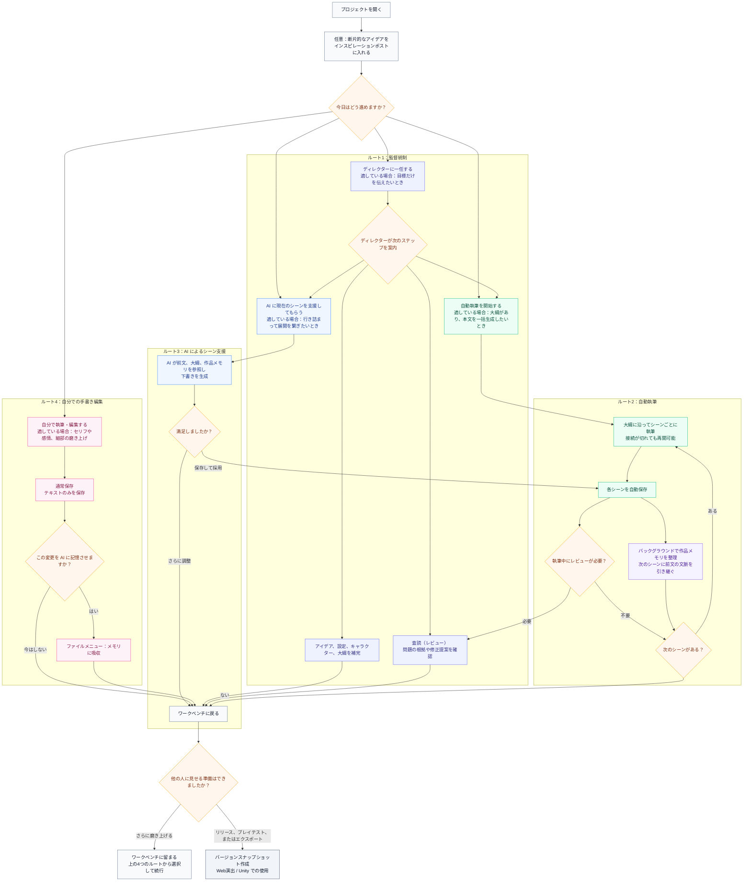
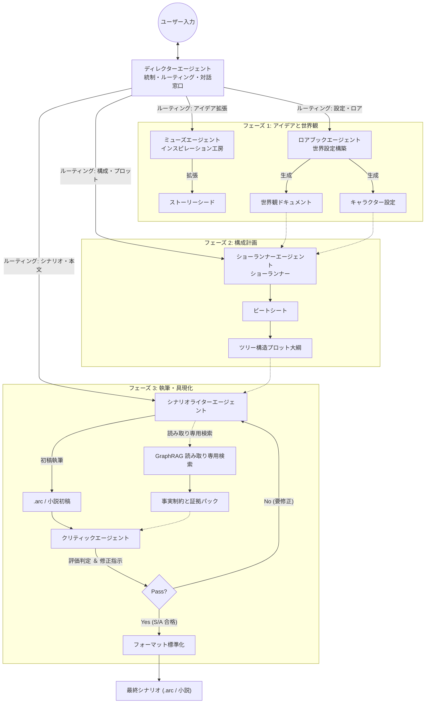
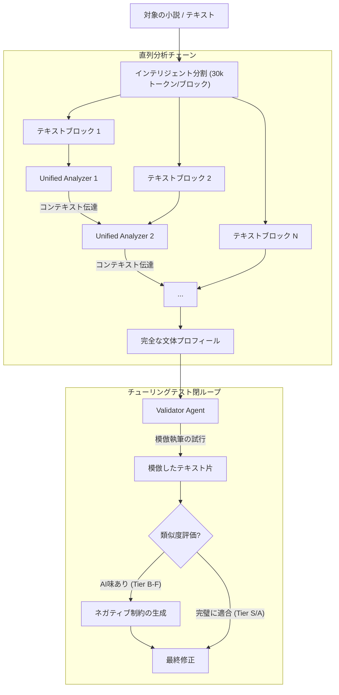
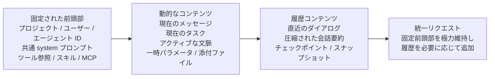
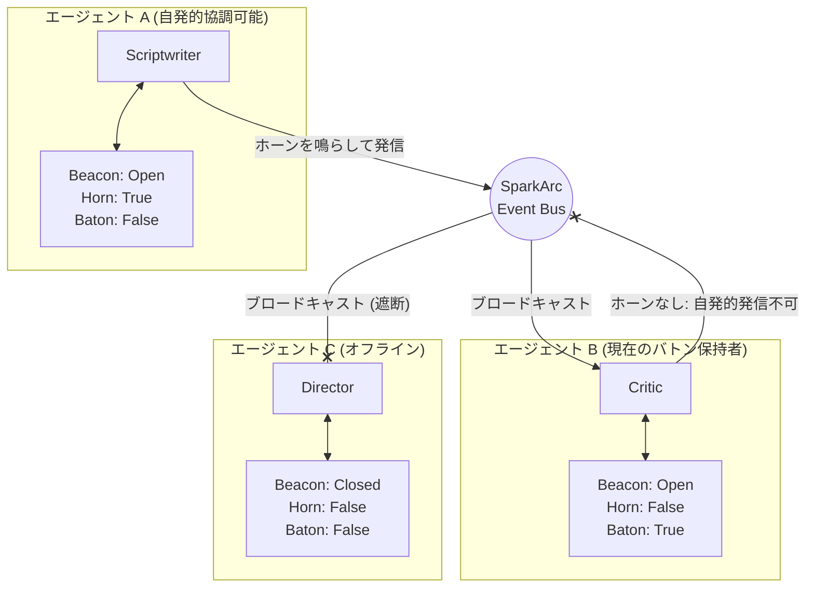

# SparkArc Studio

[简体中文](README.md) | [English](README.en.md) | [日本語](README.ja.md) | [한국어](README.ko.md)

> 📢 **サポートとスターのお願い**：本プロジェクトがあなたのインスピレーションや創作活動の助けになりましたら、ぜひ画面右上の **Star**（プロジェクトをお気に入りに登録して見失わないようにする）と **Watch**（Custom -> Releases を選択して新バージョンの更新を受け取る）をお願いいたします！独立したオープンソースプロジェクトとして、皆様からの Star と Watch の一つひとつがコミュニティでの露出向上に繋がり、プロジェクトの持続的な反復開発と長期的な成長において非常に大きな力となります。温かいご支援をよろしくお願いいたします！
> 
> 🤝 **共同制作者**：宣伝における尽力に対して、[ @wxwxwkai](https://github.com/wxwxwkai) 氏に感謝いたします。これらの重要な貢献がなければ、本プロジェクトが世に出ることはありませんでした。

**SparkArc Studio** は、自律型マルチエージェント（Agent）群によって駆動する創作プラットフォームです。専門的な創作パイプラインを通じて、ひらめいたアイデアの火種を完全な物語の世界へと拡張し、小説や脚本の執筆、さらには美しい Web 演出や Unity エンジンによる演出制御までを一気通貫で駆動できるように設計されています。
本作は、**「インスピレーション → 設定 → テンポ（ビート） → プロット大綱（アウトライン） → 執筆 → 検証 → リリース → 共有 → 演出」** の全ライフサイクルを繋ぎ、クリエイターに強力な生産性ツールスイートを提供します。

## コア機能

### 1. 人間中心の設計、自在なコントロール

SparkArc は、**「インスピレーションと感情こそが、人間の創作における不可侵の尊厳である」** と強く信じています。これがすべての AI 創作の前提条件です。

インスピレーションが湧いた時の素早いメモ書きから、推敲を重ねる一字一句の磨き上げまで、AI が介入する度合いを自由に決定できます。
* **共同創作（推奨）**: あなたが核となるテーマ、重要なシーン、物語のテンポ（ビート）を提供し、AI が**あなたの要求通りに厳密に世界を構築**します。いつでも指示を遮って変更や書き直しを行え、AI はあなたの新しい方向に即座に適応します。
* **監督モード（丸投げ執筆）**: 印象的な歌詞、曖昧なアイデア、日常のふとした出来事など、簡単なアイデアをディレクター（監督）に伝えるだけで、**あとはブラウザを閉じてしまっても構いません**。バックグラウンドで SparkArc の専門家たちが綿密なワークフローを実行し、完全なストーリーを仕上げてお届けします。
* **アシスタントモード（推敲支援）**: 完璧主義のクリエイターにとっての強力なアシスタントです。高度に視覚化された使いやすいワークフローで、AI は構成の整理、検証、提案のみを行います。**あなたはすべての言葉を完全にコントロールし、AI は単なる雑用係や、厳しい批評家としての役割に徹します**。

品質の伴わない創作物はゴミ箱行きになります。

* **長編創作の品質保証**: **「作品メモリプール」**によるリアルタイムな状態追跡、**「クリティック（批評家）」**によるレビュー報告書、そして AI 独特の定型句を抑制する**「文体クローン」**のネガティブ制約により、**「執筆前の設定確認 → 執筆中のロジック推敲 → 執筆後の品質検査」**の厳密なパイプラインを実現しました。クリエイターの生産性を最大限に解放しつつ、長編ストーリーの質を担保します。
* **長編創作のコストも節約**: SparkArc は大規模言語モデルへのリクエストのキャッシュヒット率を常に意識し、モデルがすでに読んだ設定、アウトライン、前の文章をできるだけ再利用します。キャッシュに対応したモデルサービスでは、キャッシュされた内容は通常、もう一度読み込ませるより安価です。作品が長く、連続して創作するほど、不要なトークン費用を減らせます。
* **専門家のカスタム可能**: 各エージェントの**プロンプト構成**や**バインドするモデル**は、すべて自由に決定できます。クリエイターは創作物の品質にのみ集中でき、各専門エージェントの基礎インフラは SparkArc がすべて整備済みです。
* **文体クローンと脱AI化**: ご自身の過去の作品をアップロードするだけで、分析クラスターが起動し、**あなた自身や著名な作家**特有の語り口、言葉選び、感情表現のトーンを複製（クローン）します。AI 生成テキストにありがちな**高頻度語彙の重複問題を効果的に解消**し、生成物の**「AI臭さ（AI味）」を大幅に低減**します。
* **セマンティック検索と一括編集**: **Agentic RAG + Graph RAG** が駆動する自然言語検索およびグローバル置換機能を搭載。大まかなコンセプトやプロットの一部さえ分かれば、目的の箇所をピンポイントで検索できます。**キャラクターの名前変更や設定の更新といった雑用は、すべて AI に任せましょう**。

### 2. クリエイターのための IDE、直感的なインタラクション

これで、あなたは「総監督（チーフライター）」です。**チャットボックス**で**ディレクター（監督エージェント）**に話しかけるだけで、ディレクターが複数の専門エージェントを束ね、**あなたと協力しながら**（あるいは**バックグラウンドで SparkArc にすべてを委ねて**）壮大な世界観の構築を開始します。**多様で強力な構造化編集ツール**が**全プロセスにわたり自動で創作を完了**させます。執筆した**小説や脚本**を友人に共有し、**インタラクティブ演出端**を通じてあなたの世界観に**没入**させましょう。

SparkArc は、自然な対話の上にマルチエージェント能力を重ね、プロフェッショナルな創作ワークフローの構築に心血を注いでいます。

* **極めて使いやすくプロフェッショナルな創作体験**: 創作の各フェーズをビジュアルコンポーネントとして分かりやすく表示し、クリエイターがいつでも編集できるようにしています。**「執筆版の Cursor」**のようにプロフェッショナルでありながら、**複雑な操作ロジックはなく、見たままを直感的に編集可能（WYSIWYG）**です。
* **手動コピー＆ペーストからの解放**: 世界観とプロット大綱を同時に考慮するような複雑なプロンプトを記述したり、各エージェントが出力したテキストをあちこちコピー＆ペーストしたりする必要はもうありません。すべてのプロセスはワークフローによって自動で整理されます。ディレクターエージェントがあなたの意図を汲み取ってサブタスクに分解し、設定専門家、ショーランナー、シナリオライターに的確にタスクを分配します。各エージェントは**ツールを使用して自動でドキュメントを編集**するため、クリエイターは構造化テキストによる緻密な制御の恩恵を受けながら、一切の手間を増やす必要がありません。
* **ブラックボックスの排除、ホワイトボックスでの協働**: 一般的な AI ツールは、ブラックボックス内で最終的な長文を直接生成してしまいます。対して SparkArc は、バックグラウンドでの**自律的な実行プロセス**と各ステップでの推論過程を可視化し、**AI の思考プロセス（Reasoning）を示してくれます**。生成結果に満足できない場合は、**特定のエージェントを指定**して部分的な微修正（手術）を行うことが可能です。生成プロセスはもはや「ガチャ」ではなく、全行程が見えるホワイトボックス創作です。

### 3. いつでも、どこでも、ボーダーレスな創作

インスピレーションは**PC の前以外（電車の中、散歩中、友人や AI との雑談の中など）**で生まれることがほとんどです。

* **「隙間時間」のスマホ創作**: モバイル向けに最適化されており、片手操作でアウトラインの確認、インスピレーションの記録、簡単なストーリー分岐の選択などが行えます。高度な自動化により、移動中のわずか 5 分間で創作を進めることが可能です。
* **全プラットフォーム対応**: 主要なプラットフォームすべてに対応しています。*Windows、macOS、Linux、Android、iOS などの PC、タブレット、スマホのすべてが、あなたのプロフェッショナルな Studio になります！*
* **MCP による空間の超越**: デバイスの境界を取り払います。Model Context Protocol (MCP) を通じて、**スマホ上の RikkaHub**、PC 上の **Claude Code**、あるいはその他 MCP に対応するあらゆる AI アシスタントから、**雑談や調査中にひらめいたアイデアを一行送信するだけで、リモートでディレクターエージェントを起動して創作を開始**させたり、インスピレーションポストに記録したりできます。
* **全自動無人執筆**: ワンクリックで「Auto-Write」パイプラインを起動すれば、AI がアウトラインに沿って章ごと、シーンごとに連続してテキストを生成します。**ブラウザを閉じても執筆は止まりません**。再度開くだけでリアルタイムの進捗が復元されます。一時停止、再開、ブレークポイントからの復帰に対応し、フロントエンドには入れ子式の進捗リングが表示されます。

### 4. 火種を共有し、世界を魅せる

**AI による超高速化のもと、あなたが心の中に思い描いていた主人公たちがついに舞台に上がります**。単なるテキスト共有ではなく、あなたの創作した世界全体の「演出」を届けることができます。

* **Web 演出端**: いつでもインスピレーションを共有できます。観客は**リンクをクリックするだけ**で、脚本（シナリオ）の世界に入り込めます。
* **バージョンスナップショットとエクスポート**: ワンクリックでバージョンスナップショットを作成できます。`.arc` インタラクティブ脚本形式、または純文学小説形式（Markdown）の 2 種類でエクスポートでき、スナップショットからワークスペースへのワンクリック復元も可能です。
* **予定している機能**: *まだまだ構想段階のものが多くあります。どうぞご期待ください。*
  1. キャラクターの立ち絵生成と、全立ち絵のスタイルの一貫性を保つスタイルの固定機能。
  2. 画像生成モデルと画像編集モデルを組み合わせた、簡易な背景画像機能。
  3. Scriptwriter（シナリオライター）機能をカスタマイズし、日常シナリオ担当やアイテム設定担当などのサブエージェントを派生させる機能。
  4. ユーザーがデータ構造をカスタム定義し、エージェントが対応する解析コンポーネントをフロントエンド用に自動生成して画面表示・編集できるようにし、そのコードをデータベースに保存する LUI / Gen-UI 機能。

### 5. 工業化された生産性、創作の民主化

脚本の中の世界を動かしましょう。**生成されたシナリオは Unity に簡単に取り込むことができ、ゲームエンジンのダイアログやイベントシステムを直接駆動できます**。Unreal Engine や Godot など、他のゲームエンジンへの拡張も可能です。AI の発展により、**誰もが物語を作り、さらにはゲームを作る権利を持つようになる**と確信しています。

* **プログラムとのデカップリング**: プランナーはテキストとドラマ性に集中でき、コードを一行も書かずに演出やゲームの挙動を制御し、いつでもテキストをイテレーションできます。
* **ブループリントシステム**: プロジェクトごとに専用の `blueprint.json` を設定し、創作の好み、スタイルの制約、プロセスのパラメータを定義できます。AI はゼロから推測するのではなく、定義されたフレームワークの中で創作を行います。
* **Unity サンプル**: 簡易的な **Unity SDK** を提供しています。ワンクリックで統合できる手軽さを体感し、**詳細な初心者向け統合ガイド**をご参照ください。

## SparkArc は誰のためのものか

SparkArc の中心にいるのはクリエイターですが、公開作品の体験者、技術統合を行う人、自ら運用する人にも対応しています。役割ごとに適した入口があります。

| あなたが | おすすめの入口 | 主な用途 |
|---|---|---|
| 小説家、脚本家、個人クリエイター | デスクトップ、Web、モバイルクライアント | AI と協働し、発想、設定、執筆、検証、公開まで進める |
| 創作チーム、スタジオ | チーム向けの自己ホスト環境 | 社内創作、モデル接続、プロジェクト協働を運用する |
| 読者、プレイヤー、作品の体験者 | Web 演出または Unity 演出 | 公開されたインタラクティブ作品を体験する |
| インディーゲーム開発者、技術統合者 | Unity SDK、エクスポート資産、API | 脚本、イベント、演出機能を自分のプロジェクトへ組み込む |
| 自己ホスト運用者、管理者、コントリビューター | Docker、ソースコード、CI/CD、開発文書 | インスタンス運用、機能拡張、オープンソースへの貢献 |

創作だけをしたい場合は、利用可能なワークスペースへ接続するだけで始められます。データ、モデル、チーム協働を自分で管理したい場合に自己ホストを選び、開発・統合の入口は技術ユーザー向けです。

---

SparkArc のアーキテクチャは、文学、ゲーム、映画・映像業界の標準的なワークフローに厳格に沿って設計されています：

| フェーズ | 業界の職種対応 | SparkArc でのアプローチ | 機能概要 |
| :--- | :--- | :--- | :--- |
| **0. 意思疎通・分配** | ディレクター (Director) | **ディレクター** | 全体のエントリポイントおよび文脈管理者。LangGraph をベースにした複数回のツール呼び出し自律ルーティングにより、専門エージェントへのタスク委託、自動執筆のトリガー、進捗確認を行います。ユーザーと直接対話するノードです。 |
| **1. 企画・アイデア** | ログライン / 企画骨子 | **インスピレーションの種** | 瞬時に湧き出たアイデア（Flash Idea）を捉え、多次元タグ（ジャンル/トーン/視点）で物語の種として固定化します。 |
| **2. 世界観・設定** | 世界設定資料 (Story Bible) | **設定専門家** | 物理法則、魔法体系、地理・政治、キャラクター詳細プロフィールを確立し、以降の創作における論理的整合性を担保します。 |
| **3. 構成・テンポ** | ビートシート / プロット | **ショーランナー** | 「猫を救え！」や「英雄の旅」をベースにするか？この段階で物語の骨組みを決定し、幕（アクト）を分割して、詳細なビートシートを作成します。 |
| **4. 執筆** | シナリオ / スクリプト | **シナリオライター** | 最終的な「筆」です。構成の枠組みに肉付けを行い、シーン描写、アクション指示、セリフを処理します。`.arc` インタラクティブ脚本形式と小説形式の双方に出力可能です。 |
| **5. 品質保証** | スクリプトドクター / 監修 | **ロジック監査役 ＆ 文体クローン** | ロジック監査役は厳しい編集者として機能し、不整合やプロットの穴に対する改善点を提示します。文体クローンは目標の文体制約を通じて AI 独特の言葉遣いを排除します。GraphRAG は読み取り専用のグラフ検索機能（`query` / `status`）であり、セマンティック検索や作品メモリプールと問い合わせの複雑さに応じて使い分け、クロスチャプターの因果・長期構造の一貫性を高めます。 |
| **6. リリース・演出** | 実装 / アセット化 | **ブラウザ演出 / Unity SDK** | シナリオのアセット化。脚本を軽量なランタイムにコンパイルし、ゲーム内の会話システム、演出制御、クエストのフラグ管理などを駆動します。 |

## クリエイターのワンマップワークフロー

SparkArc は、「自動運転も可能だが、いつでもハンドルを奪い取ることができる」創作スタジオのようなものです。日常的な使用では、ディレクターにタスクを委任する、全自動執筆を開始する、AI に現在のシーンの先を書いてもらう、あるいは完全に自分だけで執筆する、といった選択肢から選ぶだけです。システムは創作の邪魔をせずにバックグラウンドで物語のメモリを整理します。手動で編集した箇所を AI に記憶させるかどうかも、クリエイターが任意に決定できます。



## 詳細目次

* [SparkArc は誰のためのものか](#sparkarc-は誰のためのものか)
* [🚀 クイックスタート](#-クイックスタート)
* [システムアーキテクチャ](#システムアーキテクチャ)
  * [1. エージェントクラスター](#1-エージェントクラスター)
    * [文体クローンクラスター](#文体クローンクラスター)
  * [2. コンテキスト構造と統一実行パイプライン](#2-コンテキスト構造と統一実行パイプライン)
  * [3. ビーコンバス通信メカニズム](#3-ビーコンバス通信メカニズム)
* [品質エンジニアリング](#品質エンジニアリング)
  * [インタラクティブ脚本形式（ARC）](#インタラクティブ脚本形式arc)
  * [作品メモリプール](#作品メモリプール)
  * [小説モード](#小説モード)
* [インフラストラクチャ](#インフラストラクチャ)
  * [1. Matchbox Agent Gateway](#1-matchbox-agent-gateway)
  * [2. データベース自動移行](#2-データベース自動移行)
  * [3. マルチテナント SaaS](#3-マルチテナント-saas)
  * [4. セマンティック検索エンジン](#4-セマンティック検索エンジン)
  * [5. CI/CD 自動デプロイ](#5-cicd-自動デプロイ)
* [マルチプラットフォームエコシステムとアーキテクチャ](#マルチプラットフォームエコシステムとアーキテクチャ)
* [📚 詳細情報](#-詳細情報)
* [開発者あとがき](#開発者あとがき)

---

## 🚀 クイックスタート

⚠️ 本プロジェクトはサーバーとクライアントが分離しています。**利用するには、以下の手順に従ってサーバー側をデプロイする必要があります。**

**クライアントからは、ブラウザでサーバーの URL にアクセスするだけで利用可能です。基本的には、Releases から専用クライアントをダウンロードして使用することをお勧めします。**
クライアント起動時にサーバー側 API を自動検出し、接続を試みます。

手軽にお試しいただくため、開発者が管理するテスト用サーバーインスタンスを提供しています。ご自身でサーバーを起動しない場合、クライアントは自動的にこのテストサーバーを選択し、登録して体験することができます。
**しかし、時間と資金の制約上、このインスタンスの安定性は保証できません。頻繁にアクセス不能になる可能性がありますので、重要なデータは絶対に保存しないでください。本格的なご利用には、必ずご自身でのデプロイをお願いいたします。**

### 方法1：管理対象デスクトップ Launcher（初心者推奨）

GitHub Releases のデスクトップ Launcher は Windows、macOS、Linux に対応しています。デスクトップパッケージを入れ、Launcher にローカルバックエンドを準備させる方法が最も手軽です。

**要件**:

- Release Launcher の利用者はシステムの Git や Node.js をインストールする必要がありません。Launcher は内蔵 Git 実装とユーザーディレクトリ内の管理対象 Node.js を使用します。
- macOS / Linux では、ポータブル Python の初回準備に通常の基本ツール `bash`、`curl`、`tar` が必要です。
- リポジトリを手動で clone して `start.bat` / `start.sh` を実行する場合は、clone 用の Git とフロントエンド構築用の Node.js 20+ が必要です。

#### Release Launcher の使用手順

1. GitHub Releases からデスクトップパッケージをダウンロードして開きます。
2. ローカルバックエンドが見つからない場合は「Start Local Backend」を選びます。
3. Launcher は管理対象の `main` を `~/.sparkarc/sparkarc-server` に取得し、専用 Node.js、ポータブル Python、固定依存関係を準備します。
4. バックエンドは **<http://localhost:6688>** で起動します。Launcher が更新するのはこの管理対象ディレクトリだけで、手動 clone、`dev` ワークツリー、ローカル変更は上書きしません。
5. Launcher は `main` の更新を確認し、適用前に確認を求めます。コードの切替前に自分が管理するサービスを停止し、ユーザーデータとランタイムキャッシュを保持します。
6. Launcher 自身の更新は GitHub Releases から直接確認します。API が制限された場合は標準 Release リダイレクトと利用可能なミラーへ切り替えます。初期段階では独自 manifest を作らず、対応するダウンロードページを開くだけです。

#### ソーススクリプト経由

Git で clone してからルートのスクリプトを実行します。

```bash
git clone https://github.com/1deaaa/spark-arc-studio
cd spark-arc-studio
```

- Windows: `start.bat` をダブルクリック
- macOS / Linux: `bash start.sh` を実行

この経路ではデプロイ済みフラグを再利用しますが、ブランチ選択と `git pull` のタイミングは利用者が管理します。管理対象 Launcher の所有権と更新境界は [詳細設計](docs/project/local-deployment-manager.zh-CN.md) を参照してください。
スマホからアクセスする場合は、同じルーター（LAN）に接続し、**<http://PCのローカルIP:6688>** にアクセスします。
外部からリモートでアクセスしたい場合は、イントラネット透過（ポートマッピング）技術などをご自身でお調べください。

> 💡 **環境を汚さないゼロ・ポリューション設計**: 生成されるアセットはすべて `server/.runtime/python/` 内に閉じ込められています。このディレクトリを削除するだけで、システムにゴミを残さず完全にアンインストールできます。
> 💡 **べき等性と安全性**: スクリプト内にバージョン検出とデプロイフラグが組み込まれており、繰り返し実行しても重複してダウンロードやインストールが行われることはありません。
> 💡 **Pip キャッシュの例外**: pip のダウンロードキャッシュのみ、デフォルトで `%LOCALAPPDATA%\pip\Cache\`（ユーザーレベル、システム全体には影響しません）に書き込まれます。クリアしたい場合は `pip cache purge` を実行してください。

### 方法2：Docker による一発デプロイ（推奨）

最も手間のかからないクロスプラットフォームデプロイ方法です。わずか 2 ステップで完了します：

```bash
# 1. プロジェクトをクローン
git clone https://github.com/1deaaa/spark-arc-studio
cd spark-arc-studio

# 2. サービスを起動
docker compose up -d --build
```

サービス起動後のアクセス先：**<http://localhost:7788>**

> 💡 **ポートの区別**: Docker 環境はポート `7788`、ローカル直接起動（ベアメタル）環境はポート `6688` を使用します。これにより、両方を並行してデバッグ（同時起動）することが容易になり、環境の誤認を防げます（本番環境では、**データ競合を避けるため同時に起動することは厳禁**です）。
> 💡 **データの永続化**: ユーザーデータとデータベースは、ホストマシンの `server/` ディレクトリ配下に自動保存され、コンテナを再起動しても失われません。
> 💡 **マスターキーの格納場所**: `LLM_KEY` はデフォルトで `server/llm/agen_matchbox/.env` に書き込まれるため、別途 `server/.env` を作成する必要はありません。

コンテナを再作成する場合：

```bash
docker compose up -d --build --force-recreate
```

#### 🔄 新バージョン取得時の正しい更新方法（極めて重要）

単に `docker compose restart` を実行しないでください。これでは古いコンテナが再起動するだけで、最新のコードが反映されない場合があります。

`git pull` を行うたびに、以下の手順を必ず実行してください：

```bash
# 1) コードをプル
git pull --ff-only

# 2) 再ビルドとコンテナの完全差し替え（必須）
docker compose up -d --build --force-recreate

# 3) 任意：直近のログを確認して起動成功を確かめる
docker compose logs --tail=120 sparkarc
```

このプロセスにより、以下が保証されます：
1. イメージ内の最新の Git コードが必ず再ビルドされます。
2. 起動時に Git 管理対象ファイルがマウントディレクトリに同期され、古い永続化ファイルが新しいバージョンを覆い隠すのを防ぎます。
3. ユーザーのデータベースや個人データ（`*.db`、`_userdata`、`.env` など）は永続化され、上書きされません。
4. ローカル埋め込みに必要な GGUF モデル、llama.cpp 実行パッケージ、およびトークナイザーキャッシュは `server/.runtime`（CI デプロイ時は Docker のランタイムキャッシュボリューム）に永続化され、イメージ再構築のたびに再ダウンロードする必要がありません。

### 方法3：ローカル直接起動（ベアメタル開発環境）

設定が完了すれば、VS Code で F5 キーを押すだけで起動できます。Docker を使用したくない場合や、二次開発を行いたい場合に最適です。以下の手順に従って構成してください：

1. **Python 環境の初期化**
   ```bash
   # 1. Conda 環境を作成して有効化（事前に miniconda または anaconda をインストールしてください）
   conda create -n sparkarc python=3.13 -y
   conda activate sparkarc

   # 2. バックエンドの依存関係をインストール（依存関係リストは server ディレクトリ内にあります）
   pip install -r server/requirements.txt
   ```

2. **フロントエンドインターフェースのビルド**
   ```bash
   # プロジェクトのルートに戻り、client ディレクトリに入ります
   cd ../../../client
   npm install
   npm run build
   ```

3. **F5キーで起動**
   これまでの手順でエラーが出なければ、F5 キーを押すだけでサーバーが起動します。
   アクセス先：**<http://localhost:6688>**

#### 任意：ユーザー登録時の CAPTCHA（Cloudflare Turnstile）の有効化

SparkArc は、登録フェーズでの Cloudflare Turnstile によるボット防止に対応しています。これは「登録」エンドポイントのみを保護します。フロントエンドに Turnstile コンポーネントを表示してトークンを取得し、バックエンドはユーザーを作成する前に Cloudflare の `siteverify` API を呼び出してトークンを検証します。

プロジェクトのルートディレクトリに `.env` ファイルを作成または編集し、以下を追加します：

```env
SPARKARC_REGISTRATION_VERIFICATION_ENABLED=1
SPARKARC_REGISTRATION_VERIFICATION_PROVIDER=turnstile
SPARKARC_TURNSTILE_SITE_KEY=あなたの Turnstile Site Key
SPARKARC_TURNSTILE_SECRET_KEY=あなたの Turnstile Secret Key
```

注意点：
* `SPARKARC_TURNSTILE_SITE_KEY` は公開用サイトキーであり、`/api/auth/verification-config` を通じてフロントエンドに送信されます。
* 管理画面から直接 Turnstile の設定を保存することもできます。管理画面で保存された設定は、サーバーの永続化データディレクトリ内にある実行時 `.env` に書き込まれるため、Docker コンテナの再作成時にも失われません。
* `SPARKARC_TURNSTILE_SECRET_KEY` は秘密鍵であり、バックエンドでのみ使用され、フロントエンドに渡されることはありません。
* **これらが設定されていない場合、登録検証はデフォルトで無効**になり、自己デプロイ時の初回ユーザー登録には影響しません。
* 将来的に Google やテンセントクラウドなどの他の検証プラットフォームに切り替えたい場合は、登録ルーティングを変更せずに [verification.py](server/core/verification.py) の検証プロバイダーを拡張してください。

### 自己デプロイ時のアクセス方法：ブラウザとクライアント

SparkArc のバックエンドは、フロントエンドのページも直接配信します。デプロイ完了後、最も簡単なアクセス方法は、ブラウザでバックエンドの配信アドレスを開くことです：
* Docker デプロイ：`http://localhost:7788`
* ローカル直接起動：`http://localhost:6688`
* リモートサーバーデプロイ：`http://あなたのサーバーアドレス:ポート`

GitHub Releases のデスクトップクライアントは、まずローカルバックエンド（`6688` / `7788`）を検出し、Launcher から管理対象のローカルバックエンドを準備できます。既存のプライベートまたはリモートバックエンドを使う場合は、ログイン前に実際のサーバーアドレスを設定してください。モバイルクライアントは端末上でバックエンドをデプロイできないため、PC またはサーバーのアドレスを指定する必要があります。既定アドレスは開発者が管理するデモインスタンスを指す場合があり、長期的な自己運用には適していません。

入力例：
* デスクトップクライアントからローカルバックエンドにアクセス：`http://localhost:6688` または `http://localhost:7788`
* モバイルから同じ LAN 内の PC にアクセス：`http://PCのローカルIP:6688` または `http://PCのローカルIP:7788`
* リモートの自己デプロイ環境：お使いのサーバーのパブリックドメイン / IP とポートを入力

スマホやタブレット、外出先から自己インスタンスにアクセスしたい場合は、クラウドサーバーを購入してデプロイするか、あるいは内網透過（ポートマッピング）ツールを利用してローカルサービスをデバイスに公開するのが簡単です。どのような方法を採用する場合でも、アカウント管理、HTTPS 化、アクセス制御、ファイアウォール、モデル API キーの隠蔽、データバックアップはご自身の責任で行ってください。

> 💡 プライベートインスタンスのユーザー登録を一般開放する場合は、HTTPS 化、登録時ボット検証の有効化、ファイアウォールやリバースプロキシによるレート制限、定期バックアップポリシーなどを構成し、`LLM_KEY` やモデルプラットフォームのキーを厳重に管理することを強く推奨します。

#### MCP クライアント接続

ログイン後、デスクトップのダッシュボードまたはモバイルの AI 管理画面から「MCP 接続サービス」を開きます。共通の設定カードで、統合 MCP エンドポイント `/api/mcp/` 用の `spark-arc` 設定を 1 つ生成できます。統合入口ではコントロールツールに `control_` プレフィックスを使用し、`/api/mcp/control/` は既存クライアント向けの互換エンドポイントとして残ります。通信方式は Streamable HTTP（`"type": "http"`）を選択してください。設定、ツール一覧、Director タスク手順の詳細は [MCP 接続ガイド](docs/project/mcp-integration.zh-CN.md) を参照してください。

---

## システムアーキテクチャ

### 1. エージェントクラスター

SparkArc は単一の巨大な AI モデルに依存せず、役割分担の明確なエージェント群（クラスター）を構築しています。各エージェントは独立したペルソナ、プロンプト、モデル設定を持っています。

> 💡 **多言語対応（国際化）**: エージェント登録簿（[registry.py](server/agents/registry.py)）は `zh-CN` / `en-US` / `ja-JP` / `ko-KR` の 4 言語をネイティブサポートしています。フロントエンドは i18n マッピングを使用し、バックエンドはリクエストのロケールに基づいて `resolve_agent_i18n_field()` を呼び出すことで、対応する翻訳フィールドを抽出します。新しい言語を追加する場合は、各エージェントのエントリに翻訳グループを追加するだけです。

#### A. 意思決定・オーケストレーター

* **ディレクターエージェント (Director)**:
  * **役割**: 全体の司令塔であり、コンテキストの管理者。**LangGraph SupervisorGraph** をベースにした複数ターンの自律ツール呼び出しルーティングを実装しています。`delegate_task` による専門家へのタスク委託、`trigger_auto_write` による自動執筆の開始、`check_scriptwriter_status` による進捗の問い合わせなどを自律的に行い、従来のルールベースの意図検出を置き換えました。対話の文脈を維持し、重要な決定を記録し、イベントバスのデフォルトレシーバーとして機能します。
  * **コアコード**: `agent_director.py` + `director_graph.py` (LangGraph SupervisorGraph 定義)

#### B. クリエイティブコア

* **ミューズエージェント (Muse)**:
  * **役割**: 創作の出発点。ひらめいたアイデアの火種を捉え、多次元のタグ（ジャンル/トーン/視点）で物語の種（シード）として固定し、さらに詳細なコンセプト案へと自動で拡張します。MCP を通じて外部の AI アシスタントからインスピレーションを受信することも可能です。
* **ロアブックエージェント (Lorebook)**:
  * **役割**: ゼロからの世界観構築。簡単なシード情報から、詳細な地理、歴史、魔法・科学システムを構築し、その世界観に合致したキャラクター設定シートを大量生成します。
* **ショーランナーエージェント (Showrunner)**:
  * **役割**: マクロなシナリオ統制。**ビートシート（進行表）**と**ツリー構造のシナリオプロット大綱（アウトライン）**を生成し、ストーリー構成が「猫を救え！」や「英雄の旅」などの古典的な物語モデルに沿うように制御します。
* **シナリオライターエージェント (Scriptwriter)**:
  * **役割**: ミクロなシーンの肉付け。大綱を具体的なシナリオテキストに変換する唯一の「執筆者」です。**.arc インタラクティブ脚本形式**（ダイアログ分岐、アクションコマンド、シーンジャンプを含む）と、**小説形式**（Markdown）の**2つのモードの出力**に対応しています。独自の**構思チェーン（Conception Chain）**機構を備え、本文を出力する前にまず `<conception>` タグを用いて論理的な展開を推敲します。

#### C. 品質保証

* **スタイルエージェント (Style)**（文体クローンサブクラスター）:
  * **役割**: AI 感の排除。指定された作家やあなた自身の過去の文体を模倣することで、AI 生成テキストに特有の定型表現や頻出ワードを回避し、**AI 臭さを最小限に抑えます**。
  * **クラスター構成**: 分析フローを統合調整する **Coordinator**、チューリング・バックテストを実行する **Validator**、スタイルファイルに基づきチャット対話を行う **StyleChatAgent** の3つが連携します。詳細は[文体クローンクラスター](#文体クローンクラスター)セクションをご参照ください。
* **クリティックエージェント (Critic)**（ロジック監査役）:
  * **役割**: 厳しい編集者のシミュレーション。テキストを直接改変するのではなく、シナリオや小説の断片から**読者が感じる不自然な AI 臭さ、対話の崩れ、文学的な表現の不足、整合性やキャラクター設定の矛盾**を監査し、構造化されたレビュー結果を出力します。
  * **動作モード**: チャットパネルでの自然言語による対話、または ScriptWriter の右側パネルから手動で構造化レビューを実行可能です。
  * **出力プロトコル**: 数値スコアではなく、**S / A / B / C / D** の 5 段階評価を使用します。同時に指摘箇所、検知された問題、および後続の推敲に役立つ `fix_ticket`（修正指示書）を出力します。
  * **モデル戦略**: AI の判定と根拠説明の能力を活用し、単に確率スコアを出す分類器ではなく **LLM Judge / Editor** として機能させることに特化しています。
* **GraphRAG Tool**（読み取り専用グラフ検索）:
  * **役割**: プロジェクト内の世界設定、キャラクター、プロット、シナリオの断片を検索可能なリレーショングラフに変換し、執筆やレビューの実行時に具体的な事実制約と原文証拠を適用します。
  * **現状**: AI 側は読み取り専用の `query` / `status` のみを保持し、グラフの構築・再構築は設定画面から手動で実行します。Director / Scriptwriter / Critic / Showrunner（連続性ツール群）に標準でバインドされています。単純な事実確認はセマンティック検索、直近の状態確認は作品メモリプールを優先し、クロスチャプターの因果・関係変化・知識境界・長期スレッドのみ GraphRAG を使用します。
  * **品質上の利点**: 長期的な物語執筆における設定矛盾（いわゆる「設定崩れ / 食い違い」）を防止し、チャプター間の一貫性やキャラクター関係性の安定度を大幅に高めます。

#### クリティック監査メカニズム

クリティックエージェントは「これが AI によって書かれたものかどうか」ではなく、**「この文章のどこが、モデルがタスクを機械的にこなしているような印象を読者に与えるか」**を指摘します。評価は `S/A/B/C/D` 段階 ＋ 指摘原文 ＋ 修正指示 `fix_ticket` で構成され、デフォルトでは本文を直接改変しないため、クリエイターが創作の主導権を握り続けられます。

> 📗 4つのコア監査機能と、機械学習分類器ではなく LLM を採用する理由の詳細については、[アーキテクチャ詳細ドキュメント §6](docs/project/architecture.md#6-critic-审核机制完整版) をご参照ください。

#### 協調データフロー



#### エージェントの 3 つの呼び出しモードプロトコル

各専門エージェントのプロンプトは、同一の `yaml` ファイルに定義された 3 つのトップレベルフィールドを介して 3 種類の呼び出しモードを厳密に区別しています。これにより、「手動編集画面」「ユーザーとの通常チャット」「監督からのタスク委託（パイプライン）」の 3 つのルートが互いに干渉し合わないようになっています：

| モード | YAML フィールド | 出力特性 |
| :--- | :--- | :--- |
| **専有動作モード** | `system` + `user` | 高度に構造化され、パーサーが直接パッチを適用して保存できる形式。 |
| **対話モード** | `chat_system` | 自然な会話調。インスピレーションの拡大を目的とし、特定の出力フォーマットを強制しない。 |
| **監督委託モード** | `pipeline_system` | 構造化出力 ＋ ツールによる自動保存 ＋ 監督エージェントへの簡易レポート。 |

> 📗 実行時の割り振りロジック、`pipeline_system` 記述上の制約、ツール参照（Reference）自動注入機能、および新規エージェント追加時のチェックリストは、[アーキテクチャ詳細ドキュメント §2](docs/project/architecture.md#2-agent-三模态调用协议完整版) および [AGENTS.md §4.5](AGENTS.md) をご参照ください。

#### 文体クローンクラスター

SparkArc の中で最も技術的深度が高いモジュールです。**UnifiedStyleAnalyzer** によるシリアル分析と **ValidatorAgent** によるチューリング・バックテスト閉ループを連携させ、人間のクリエイターが持つ繊細な文体を捉えたスタイルプロフィールを構築します。これは後続の生成を制御し、AI 独特の頻出表現を抑制するために使用されます。

* **シリアル分析**: 長編小説を 30k トークン単位に細分化し、各ブロックを 7 つの次元で完全分析します。ブロック間でストーリー概要を渡すことで、文脈を維持したまま直列に処理します。
* **対抗的チューリングテスト**: ValidatorAgent が構築されたスタイルプロフィールに基づいて「擬似テキスト」を模倣執筆し、自己評価を行います。AI 臭さが検出された場合はネガティブ制約を生成してプロンプトに強制注入します。

#### ワークフロー: シリアル深度分析



> 📗 シリアル分析の詳細とネガティブ制約メカニズムの完全な解説については、[アーキテクチャ詳細ドキュメント §7](docs/project/architecture.md#7-风格克隆集群完整版) をご参照ください。

---

### 2. コンテキスト構造と統一実行パイプライン

SparkArc のマルチエージェント構造は、「複数のプロンプトを個別に呼び出す」だけのものではなく、統一された実行インフラです。システムは、同一プラットフォーム・同一モデル・同一エージェントによる連続リクエストに対して、コンテキストの共通前頭部を極力固定するように動きます（プロジェクト情報、ユーザー設定、エージェント設定、共通システムプロンプト、ツール参照、スキル定義、MCP 仕様など）。そして、現在のメッセージ、アクティブな文脈、添付ファイル、一時パラメータなどの動的データを後ろに配置します。これにより、アップストリーム（上流）の共通前頭部キャッシュのヒット率が飛躍的に高まり、SparkArc 内で同一モデルが連続して動作する際の料金が抑制され、応答が高速化されます。



* **固定コンテンツ**: ペルソナ、役割、共通システムプロンプト、ツール参照（Reference）、通信プロトコルの骨格。
* **動的コンテンツ**: 現在のユーザーメッセージ、タスク、アクティブな文脈、添付ファイル、一時パラメータ。
* **履歴コンテンツ**: 直近の会話、圧縮された会話要約、スナップショット。
* **実際の実績**: DeepSeek V4 (flash max) を用いた連続する監督ダイアログのテストにおいて、2回目以降のアップストリーム・キャッシュヒットトークン数は `10752` に達し、ヒット率約 `94.5%` を記録しました。

> ⚠️ **キャッシュ無効化に関する注意点**: 使用するモデルやプラットフォームの変更、各専門エージェントのシステムプロンプト / `pipeline_system` / `tool_rules` の書き換え、バインドするツールの変更、言語ポリシーの設定変更、一部のグローバルパラメータの変更は、すべて固定前頭部を書き換えることになるため、キャッシュの再構築が発生します。
> 
> 現在のチャットウィンドウ下部に表示されるキャッシュヒット数は、そのウィンドウを処理しているエージェント独自の `context_window_stats` のみを集計しています。監督（ディレクター）からタスク委任されたサブタスクは、別のエージェントやツール、コンテキスト前頭部を使用するため、現在のウィンドウのヒット率には混入しません。バックエンド側のログには、コスト診断用としてタスク全体の全エージェント合計使用量 `llm_usage` が別途記録されます。

* **コンテキスト構築**: `communication.py` が安定したシステム前頭部を構築し、`prompt_layout.py` が現在の編集領域や添付ファイル、本ターンのユーザー要求を後半部に結合します。`context_budget.py` は対話履歴のトークン予算管理、要約の圧縮、ツールループ時の再計算を行います。
* **統一実行プロトコル**: 各専門エージェントは `SparkBaseAgent` と `SparkAgentExecutor` を継承し、`build_context -> execute -> write_result` の手順で処理を統一管理します。対話と監督からの委任タスクはすべて `chat_stream(skip_tool_confirmation)` を経由して実行されます。
* **長文コンテキスト処理**: 単一モデルのウィンドウに収まらない長文ドキュメント（添付ファイル、超過サイズの世界観など）は統一スライディングウィンドウ基盤で処理します——分割保存＋全体マップ＋二重検索による位置特定（セマンティック検索・正規表現検索とも `scope=["attachment"]` で添付ファイルに限定しチャンクへ直接ジャンプ）＋オンデマンド読み取り＋手がかり台帳（1ウィンドウ読むごとに1件記録し、ターンをまたいで保持）。モデルが見るのは常に「マップ＋台帳＋現在の1ウィンドウ」のみで、添付のないルームへの影響はありません。詳細は[長文コンテキスト処理](docs/project/long-context.zh-CN.md)、閾値は[閾値一覧](docs/project/longread-thresholds.zh-CN.md)をご参照ください。
* **統一ツールシステム**: すべてのツールは [registry.py](server/agents/tools/registry.py) でグループ分けして登録され、`agent_tools.py` のパブリックファサードから外部に公開されます。本文、アウトライン、世界設定の部分修正はすべて `_apply_patch` を再利用し、トークン分割やセマンティックチャンキングも共通インフラを利用します。
* **スキルと MCP の境界**: AgentSkills は `search_skills` / `read_skill` / `read_skill_reference` 経由でオンデマンドに読み込まれます。MCP は `/api/mcp/` に統合され、インスピレーションツールは従来の名前を保ち、コントロールツールには `control_` プレフィックスを付けます。`/api/mcp/control/` は既存クライアント向けの互換入口としてのみ残り、書き込みは既存の Agent ツールパイプラインを経由します。
* **フロントエンド対応**: エージェント名、説明、アイコン、テーマカラーなどの情報は [registry.py](server/agents/registry.py) をマスターデータとして参照します。ツール呼び出し時の UI メタデータは、バックエンドの `build_tool_stream_event` によってストリームに注入され、フロントエンドの `chatStore` が一元的に処理・レンダリングします。

> 📗 コンテキストの結合構造、キャッシュヒットの表示、各エージェントの役割一覧、スキルと MCP の統合境界、ツールの登録構造の詳細については、[アーキテクチャ詳細ドキュメント §2-§3](docs/project/architecture.md#2-agent-统一调用管线) をご参照ください。

### 3. ビーコンバス通信メカニズム

エージェント同士の複雑な水平連携を解決するため、SparkArc はアクセス制御機能を備えたメッセージルーティング機構**「信標（ビーコン）バス」**を設計・実装しました。「信標（ビーコン） / 号角（ホーン） / 接棒旗（バトン）」の3点セットを用いて、現実世界のチーム協調における「可視状態」「自発的な発言権」「現在のタスク担当者」をそれぞれ表現します。

> ⚠️ **現在のステータス**: ビーコンバスのインフラストラクチャはすべて実装されており、UI からの設定や操作も可能ですが、現在のエージェント間水平自律通信は**「予備能力」**として保留されています。テストの結果、**現在の主流モデルは、複数ターンのマルチロール・長対話の協調を完全に自律制御するレベルに達していない**と判断されたためです。今後のモデル推論能力の向上に伴い、本機能は正式に有効化され、**水平連携による創作効率と品質の飛躍的向上を実現します**。

#### コア機構：ビーコン / ホーン / バトン

各エージェントは以下の3つのステートを持ちます：**ビーコン（Beacon）**（他のエージェントから存在が見えるか）、**ホーン（Horn）**（自発的に発信できるか）、**バトン（Baton）**（現在のタスクチェーンを所有しているか）。これらを個別に制御することで、エージェント群が抱える文脈上の判断オーバーヘッドを軽減します。

#### 水平協調トポロジー



> 📗 3つのステートの定義や具体的な応用シーンについては、[アーキテクチャ詳細ドキュメント §8](docs/project/architecture.md#8-信标总线核心机制完整版) をご参照ください。

#### 監督による統制 vs ビーコンによる協調（垂直連携と水平連携）

SparkArc には、**役割と動作ルートが異なる 2 つの通信システムが並行して存在します**：
* **監督（ディレクター）による統制**（垂直型）: ディレクターが LangGraph のツール呼び出しルーティングに基づいて自律的にタスクを割り振ります。これはビーコンの制約を受けず、任意のエージェントを直接インスタンス化して指示を実行させることができます。
* **ビーコンによる協調**（水平型）: エージェント同士の直接対話は、無限ループやブロードキャスト嵐を避けるため、互いのビーコン・ホーン・バトンの制約を受けます。

> 📗 2つの仕組みの比較表、協調パターンの違い、設計意図については、[アーキテクチャ詳細ドキュメント §1](docs/project/architecture.md#1-导演调度-vs-信标协作双系统对比) をご参照ください。

---

## 品質エンジニアリング

SparkArc は、**AI の可能性を極限まで引き出すこと**を目指しています。そのために、数々のユニークな品質エンジニアリングを施しています。
その一環として、**人間にとっての可読性**と**機械によるパースのしやすさ**を高い次元で両立させたハイブリッド言語 **ARC** 形式を定義しました。これは、Markdown の読みやすさと XML の論理構造の厳密さを融合させたものであり、クリエイターによる編集のしやすさを維持しつつ、AI の創作能力を最大化します。
綿密な設計に基づき、**長文の構造化テキスト創作時における、モデルの文芸的表現の質を最大化します。** これがこのデータ形式の最大の価値です。

### ARCインタラクティブ脚本形式の例

```markdown
# 演出タイトル：最後の別れ
@guide タスクガイダンス：彼女の最期を見届ける
@intro シーンの初期描写...

[-1]
ここはナレーション表示領域です。夕日が街路を長く引き伸ばし、プラタナスの影が斑に揺れる。

[0]
ここを覚えているかい？

[1]
おじいちゃん……飴……

<choice>
  <opt text="遠くの校門を指差す">
    [0]
    ほら、あそこが僕たちが初めて出会った場所だよ。
    @next シーン_思い出
  </opt>
  
  <opt text="沈黙を守る">
    [-1]
    沈黙が空気のなかに広がっていく。
    @act system:AddMood(-5)
  </opt>
</choice>
```

このフォーマットは最終的に、高速かつバグのないデータベースへとコンパイルされ、実際のゲームや Web の演出を駆動します。
なお、AI に直接コードや関数ノードを記述する権限はデフォルトでは付与しておらず、純粋な物語創作に集中させています。**今後のモデルの発展を見据え、段階的に解放していく予定です。**

> 📗 構文解析の戦略や最適化の詳細については、[アーキテクチャ詳細ドキュメント §9](docs/project/architecture.md#9-arc-格式解析策略) をご参照ください。

### 作品メモリプール

長編創作での最大の懸念は、一時的なプロット展開によって世界観やキャラクターの基本設定が矛盾してしまうことと、前半で発生したイベントを後半の執筆時に忘れてしまうことです。SparkArc はこの問題を個別に分離して処理します：
* **作品メモリプール**は、これまでに確定して保存された「ストーリーの事実」（最近登場したキャラクター、現在の状況、登場人物の関係性、残された伏線、破ってはいけないルール、およびそれらに対応する本文中の根拠・証拠など）を誠実に記録します。
* 自動執筆（Auto-Write）や AI 執筆支援でコンテンツを保存すると、システムが裏側で自動的にメモリを再整理します。手書きで書き直した内容は、ファイルメニューから「メモリに吸収」を実行して手動で同期させることができます。
* メモリプールは**事実と証拠を整理するだけであり、次にどんなストーリーを展開するかを決定することはありません**。文学的な演出、伏線の回収、キャラクターアークの構築などは、設定資料やプロット大綱、そして**あなたの意図**を踏まえ、シナリオライターが執筆します。

この設計により、設定資料としての「作品の聖典（Story Bible）」の普遍的な安定性を維持しつつ、後続のチャプターがこれまでの実際の執筆内容を正しく引き継ぎ、一部の修正が設定全体の破壊を招く危険を回避します。

### 小説モード

インタラクティブ脚本形式に加えて、SparkArc は**純文学の「小説」**出力モードもフルサポートしています。プロジェクトの設定を小説モードに切り替えると、以下のようになります：
* 各専門エージェントが、小説特有の文学的な文体で執筆するように切り替わります。
* 演出プレビュー画面が、文章に集中できる専用の読書リーダービューに切り替わります。
* エディター画面が、段落重視の小説専用エディターに切り替わります。

どちらのモードを選択しても、世界観設定、キャラクター設定、プロット、ビートシートは共通で使用され、最後の本文出力フォーマットのみが変化します。

---

## インフラストラクチャ

本プラットフォームの安定稼働を支えるため、SparkArc には再利用性を考慮した多くのインフラが構築されています。汎用的な設計を採用しているため、**ご自身の他のプロジェクトにも容易に移行できます**。**本プロジェクトでの成果が、AI 時代の新しいプロダクトを作ろうとしている開発者の皆様の一助となれば幸いです**。

### 1. 火柴Agent网关 (Matchbox Agent Gateway)

バックエンドの最下層は「Matchbox Agent Gateway」によって一元管理されています。これはエージェント駆動開発のために特別に設計された、独立した AI モデルアクセスゲートウェイです。インターフェースを厳格に切り離しており、他のプロジェクトにも単体デプロイ可能です。専用の管理画面（GUI）、ユーザーごとの詳細な利用制限、レート制限などの機能を完備しています。

このゲートウェイは **OpenAI 互換の API プロトコルを採用**しており、主要なモデルの思考プロセス（Reasoning Token）をパースして通常のストリームに変換し、フロントエンドに最適なストリーミング表示を提供します。

主なコア機能：
* **デュアルチャネル設計**: 厳格なアクセス制御を行う管理チャネル（デフォルトのビジネス通信用） ＋ 軽量でオーバーヘッドのない直連チャネル（補助的な通信用）。
* **柔軟なホスティングモデル**: システム一元管理 ＋ ユーザー自身のキーを使用する BYOK（Bring Your Own Key） ＋ 混合モードをサポート。運営形態に合わせた収益モデルを自由に設計できます。
* **周期的な利用枠制限**: `sys_paid`（システム負担枠）と `self_paid`（自己負担枠）をそれぞれ分離し、周期的なレート制限や累積上限を設定可能。
* **正確なトークン計算**: `tiktoken` に加え、日中韓（CJK）テキスト用の動的な修正係数を組み合わせることで、高精度な利用料金計算を行います。
* **用途別のモデル割り当て**: 高速処理（Fast）、推理思考（Reason）、デフォルト（Main）の 3 つのスロットを定義し、タスクの難易度に応じてモデルを自動で振り分けます。

> 📗 デュアルチャネルの設計仕様、デプロイ方法、スロットの構成方針、Reasoning ストリームの処理方法については、[Matchbox Agent Gateway ガイド](server/llm/agen_matchbox/README.md) をご参照ください。

### 2. データベース管理と自動移行

SparkArc は、デフォルトのローカルデータベースとして SQLite を使用し、ベクトルストアにはローカル組み込み型の LanceDB を採用しています。セットアップ不要で即座に動作します。
また、大規模なユーザーアクセスを想定した本番環境向けに、**ワンクリックで PostgreSQL + PG Vector** に切り替えることも可能です。

#### 自動マイグレーション

SparkArc には**起動時のデータベース自動移行**機能が組み込まれており、リポジトリから新しいコードをプルした後に手動でデータベースをアップグレードする手間は一切不要です。

#### 🚑 まずは、トラブル時の「救命措置」を解説します

自動マイグレーションは様々な例外パターンを想定して作られていますが、データベースのバージョン競合や破損を完全に防ぎきることはできません。開発者（もちろん私自身も含む）の開発時のミスによるエラーは防げません。
しかし、これだけは保証できます：データは安全です。データベース関連のエラーが発生した場合も、**決して慌てないでください。あなたのデータは壊れていません**。
テーブル定義の models コードと、エラーが発生したデータベースファイルを一度コピー（バックアップ）してください。
1. その models コードとデータベースファイルを AI コードアシスタントに渡し、**データベースの予備を保存**します。
2. AI に対し、マイグレーション履歴に基づいてデータベースを models の最新定義と同期させる SQL スクリプトを出力させます。データが破壊されないように慎重に行ってください（データベース内の重要データやパスワードは暗号化されているため、AI に渡しても安全です）。
3. 修正されたデータベースファイルを元の位置に上書きします。
4. バックエンドを再起動すれば復旧完了です。

#### コア機能

1. **データベースブランチの分離**: `users.db` と `llm_config.db` はそれぞれ個別の `version_locations` を持ち、互いのアップデート履歴が干渉しません。
2. **起動時の自動アップグレード**: 上流のデータベーススキーマに変更があった場合、起動時に Alembic API が自動で最新の HEAD バージョンへとスキーマをアップデートします。
3. **テンポラリ DB によるスクリプト生成**: マイグレーションスクリプトの自動生成は、開発マシンの実データを汚染しないよう、メモリ上のテンポラリ DB を用いて行われます。
4. **カラム名の変更検知**: カラムのリネームを賢く検出して確認を促します。
5. **危険操作のブロック**: `DROP COLUMN` や `DROP TABLE` などのデータ消失を伴う操作は、実行前に強制的に警告を出し、確認を求めます。
6. **履歴の修復**: 移行履歴が途切れている場合、安全のため足りないテーブルやカラムを追加した上でバージョン番号を合わせます（既存のカラムは削除しません）。
7. **バージョン差分の保護**: バージョン履歴上は HEAD（最新）であるにもかかわらず実カラムが足りない場合は起動時にエラーを出し、未コミットの移行ファイルの漏れを早期検知します。

> 📗 開発者向けのワークフロー、新しいテーブル定義時の移行手順、履歴データ整理上の注意点については、[データベース自動移行ガイド](docs/project/database-migration.md) をご参照ください。

### 3. 多テナント SaaS

**SparkArc をご自身のサーバーにデプロイし、チームメンバーや友人に使わせることも非常に簡単です。**
ロールベースのアクセス制御（RBAC）を採用しており、セットアップを簡略化するための自動初期設定が備わっています。

* **初代管理者**: システムを起動した後に**最初にユーザー登録を行ったアカウント**が、自動的にシステム管理者（Admin）に設定され、AI モデルやプラットフォームの設定を行う権限が与えられます。
* **デフォルトユーザー**: 2人目以降に登録されたアカウントは、デフォルトで一般ユーザー（`is_admin = 0`）になります。
* **管理者権限の追加授与**: 最初の管理者は、管理パネルから他の一般ユーザーを管理者に昇格させることができます。

---

### 4. セマンティック検索エンジン

SparkArc はプロジェクト全体の情報を把握するため、セマンティック検索エンジンを内蔵しています。ディレクターエージェントはこれを利用して、**正規表現検索 ＋ セマンティック（ベクトル）検索**を状況に応じて切り替えて実行し、検索結果に基づいたテキストの一括置換を行うことができます。

#### 機能仕様

* **ハイブリッド検索**: 正規表現を用いる `search_project`（厳密なキーワード一致）と、意味の近さで検索する `semantic_search`（ベクトル類似度による類似シーンの検索）を提供。検索結果の出力フォーマットは統一されており、そのまま `replace_from_search`（検索結果に基づく一括置換）の引数に引き渡せます。
* **プロジェクト別設定**: プロジェクト単位でセマンティック検索の有効・無効を切り替えられます。有効化する際、Embedding モデルの接続テストが自動で走り、失敗時にはエラー対処法を表示します。
* **新規作成時のデフォルト設定**: 新しいプロジェクトを作成した際に、セマンティック検索を標準で有効にするかどうかを設定可能です。
* **自動インデックス更新**: プロジェクトにコンテンツの追加や変更があった場合、次回検索時にファイルの MD5 ハッシュ値を検知し、変更された部分のみをインクリメンタル（増分）に再インデックスします。

#### 内部技術構成

* **ベクトル生成パイプライン**: ローカルベクトルストアの LanceDB をベースに構築。Matchbox ゲートウェイを経由してユーザー指定の Embedding モデルに接続し、OpenAI と互換性のある任意の埋め込み API を利用できます。
* **遅延構築（Lazy Building）とハッシュ比較**: 初めて検索処理が呼び出されたタイミングでインデックスを自動構築します。以降はファイルのハッシュ比較を行い、変更がなければ構築済みのインデックスを高速で使い回します。
* **セマンティックチャンキング**: `SemanticChunker` を用いて、テキストをストーリー上の意味の切れ目に沿って分割します。分割時にも、シナリオ上の該当位置（`narrative_ref`）や行番号のメタデータを正確に保持します。
* **日本語・中国語のプロジェクト名への対応**: LanceDB のテーブル名における文字制約を回避するため、マルチバイトのプロジェクト名を MD5 ハッシュ化したものをテーブル名に用いることで不具合を防止しています。
* **バッチ処理**: 埋め込みベクトルの生成は 50 件ずつのバッチ（`batch_size=50`）に分けて API を呼び出すことで、主要モデルの最大バッチ制限に抵触するのを防ぎます。

---

### 5. CI/CD 自動デプロイ

SparkArc は完全自動化された CI/CD パイプラインを内蔵しています。コードがリポジトリにプッシュされると、**自動ビルド、自動テスト、自動デプロイ**が走り、手動での操作は不要です。
Gitea Actions および GitLab CI をサポートしており、Gitea Actions の定義ファイルは GitHub Actions にも簡単に移植可能です。
実行フェーズ：**コードチェックアウト → イメージビルド → テスト（事前定義） → デプロイ → クリーンアップ**

> 📗 ランナーの設定方法、CI シークレットの登録、GitHub Actions への移行手順については、[CI/CD 自動デプロイガイド](docs/project/cicd-deployment.md) をご参照ください。

---

## マルチプラットフォームエコシステムとアーキテクチャ

### UI 表示とロジックのデカップリング

通勤中の**「電車内の5分間」**でも快適に操作できるよう、フロントエンドは表示とロジックを分離した設計を採用しています：

* **ビジネスロジック (Composables)**: すべての主要ロジックは UI コンポーネントから切り離され、単体で動作する Vue Composable 関数にカプセル化されています。
  * `useSynopsisLogic` / `useScriptWriterLogic` — プロット概要とシナリオ執筆ロジック。
  * `useWorldLogic` / `useStyleLogic` / `useStructureLogic` — 設定構築、スタイル、シナリオ構成ロジック。
  * `useAIModelManager` / `useAIPlatformManager` / `useAIEmbeddingManager` — AI プラットフォーム・モデル管理。
  * `useAgentRegistry` / `useChatActions` / `useAdminLogic` — エージェント管理、チャット対話、管理者用ロジック。
  * **プロジェクトは現在 LUI（Language User Interface）に向けて進化を続けています。近い将来、あなたが発した一言から、複雑な共同創作ワークフローが直接起動できるようになります。**
* **ストリーミング通信レイヤー**: フロントエンドは `streamingRuntime.ts` の `createStreamingTask` を介して、すべてのバックエンド通信ストリームを監視・管理します。`loadingStats.ts`（読み込み負荷統計）、`eventBus.ts`（イベントバス）、`GlobalLoading.vue`（共通ロード画面）とシームレスに連動し、通常の対話用ストリームと裏での自動執筆ストリームを完全に独立させて処理します。
* **あらゆる画面サイズへの適合**:
  * **デスクトップ画面**: 横長モニターに最適化した高機能なワークベンチビュー。マルチカラムレイアウトと詳細設定パネルを完備しています。
  * **モバイル画面**: スマホの縦画面に特化した対話重視の UI。読みやすさと片手でのクイック操作を優先しています。世界観、キャラクター、ビートシートなどのほとんどの画面がモバイルに完全対応していますが、シナリオ執筆画面（ScriptWriter）のみ、現在は画面サイズ上の制約によりデスクトップのみのサポートとなっています。

### Tauri 2 を用いたクロスプラットフォームビルド

フロントエンドは Tauri 2 に対応しています。Windows、Linux、macOS、Android、iOS 向けのシンプルなビルド手順については、[docs/tauri/tauri2-all.md](docs/tauri/tauri2-all.md) をご参照ください。

ビルド手順のクイックリファレンス（ルートから `cd client` を実行）：
1. 依存関係のインストール：`npm install`
2. デスクトップ版ビルド（Windows / Linux / macOS）：`npm run tauri:build`
3. Android版ビルド：`npm run tauri:android`
4. iOS版ビルド：`npm run tauri:ios`
5. デスクトップ版のローカル開発モード起動：`npm run tauri:dev`

開発上の注意点：
* **macOS / iOS 用ビルド** は、署名とコンパイルのために macOS 実機が必要です。
* **Android 用ビルド** は、ビルド用 PC に Android Studio と適切な NDK / SDK のセットアップが必要です。
* **ビルドされた成果物** は、プロジェクトルートの `app-build/` ディレクトリ内にプラットフォーム別に自動保存されます。

### Unity 拡張パッケージの提供（BETA）

> Unity 用 SDK（`SparkArc.Unity`）は、独立したモジュールとして `presenter/UnitySDK` ディレクトリ内に配置されています。個人ゲーム開発者の皆様が、AI で作成したシナリオをゲーム内に即座に反映できるように設計されています。**本機能はまだ極めて初期のベータ版であり、今後のアップデートでカバー範囲を順次拡張する予定です。**

#### シナリオデータ反映のパイプライン

1. **創作フェーズ**: プランナーが Web 画面でシナリオを完成させ、データを `.arc` 形式または SQLite の `stories.db` として出力します。
2. **配置フェーズ**: 出力したデータベースファイルを、Unity プロジェクト内の `StreamingAssets` ディレクトリにドラッグ＆ドロップします。
3. **実行フェーズ（ゲーム内ランタイム）**:
   * **StoryRepository**: ゲーム起動時にデータベースを読み込み、データをメモリにキャッシュします。
   * **DialogueManager**: 会話システムの制御コアです。現在再生中のストーリーノードを読み込み、キャラクター名、セリフ表示、選択肢によるストーリーの分岐などを自律処理します。
   * **Event System**: 脚本内に記述された `@act` コマンドを、ゲーム内の共通イベント `OnActionTriggered(string func, string[] args)` として発信します。開発者はゲーム側でこのイベントを受け取る処理（特定のカメラアングルの適用、BGM の再生、クエストの受注など）を実装するだけでよく、会話表示の仕組み自体を改造する必要はありません。

この仕組みにより、シナリオを少し修正するたびにプログラムをビルドし直す必要がなくなり、ゲームを動かしたままデータベースを差し替えて「リロード」メソッドを実行するだけで、新しいシナリオのテストが可能になります。

---

## 国際化と言語ポリシー

* UI 対応言語：`zh-CN`、`en-US`、`ja-JP`、`ko-KR`
* 設定画面からワンタップで即座に表示言語を変更可能です。
* エージェントにおける言語戦略：
  1. 原則として、フロントエンドの現在の選択言語（locale）と同じ言語でエージェントがセリフを出力します。
  2. ユーザーが能動的に別言語で入力を開始した場合、または言語変更を明示的に要求した場合にのみ、出力言語を切り替えます。

フロントエンド貢献時のコーディングルール：ユーザーに直接見える文言はハードコードせず、必ず Vue I18n を使用してください。

---

## 開発・リポジトリガイド

* 開発への参加（コントリビューション）方法：`.github/CONTRIBUTING.md`（英語）
* エージェントの開発・記述制約と設計仕様：[AGENTS.md](AGENTS.md)
* エージェント言語規則と開発規範：[AGENTS.md](AGENTS.md)

---

## 📚 詳細情報

| ドキュメント | 主な解説内容 |
| :--- | :--- |
| [アーキテクチャ詳細ドキュメント](docs/project/architecture.md) | ディレクターとビーコンバスの連携仕様、3つの呼び出しモード仕様、クリティック監査メカニズム、文体クローンクラスター、信標バスの定義、ARC 解析戦略、ツール登録、ストリーミング共通インフラ、安定プレフィックス契約、フロント復旧契約、MCP マウント順序。 |
| [チャット文脈管理（中国語）](docs/project/context-management.zh-CN.md) | 適応型予算、自動圧縮、原文履歴の永続化、チェックポイント、オンデマンド原文検索と StoryMemory の境界。 |
| [長文コンテキスト処理](docs/project/long-context.zh-CN.md) | 添付ファイル・超過サイズ世界観向けスライディングウィンドウ基盤：分割保存、全体マップ、二重検索による位置特定、オンデマンド読み取り、手がかり台帳、前方キャッシュ配置。 |
| [スライディングウィンドウ閾値一覧](docs/project/longread-thresholds.zh-CN.md) | 長文関連の全閾値の定義場所・既定値・適用範囲。 |
| [長編 GraphRAG 位置づけと改善案（2026・中国語）](docs/project/narrative-graphrag-optimization-2026.zh-CN.md) | GraphRAG の適用範囲、読み取り専用運用、ハイブリッド検索と問い合わせルーティング、ナラティブグラフ改善ロードマップ。 |
| [文脈圧縮戦略の比較（中国語）](docs/project/context-compaction-comparison.zh-CN.md) | Codex・OpenCode・SparkArc の文脈圧縮戦略のソースレベル比較。 |
| [クライアント実行時更新戦略（中国語）](docs/project/client-runtime-update-strategy.zh-CN.md) | ブラウザ版と Tauri 版のフロント独立リリースとシェル更新戦略。 |
| [ローカル配置マネージャー（中国語）](docs/project/local-deployment-manager.zh-CN.md) | Release Launcher の管理対象 `main`、Git/Node 境界、ネットワークフォールバック、データ保護と更新フロー。 |
| [Matchbox Agent Gateway ガイド](server/llm/agen_matchbox/README.md) | デュアルチャネル構造、デプロイ方法、APIスロット設定、Reasoning ストリームの処理。 |
| [データベース自動移行ガイド](docs/project/database-migration.md) | データベース修正時のマイグレーション自動生成ワークフロー、トラブルシューティング。 |
| [CI/CD 自動デプロイガイド](docs/project/cicd-deployment.md) | ランナー構築、シークレットトークンの管理、GitHub Actions への移植。 |
| [AGENTS.md](AGENTS.md) | エージェント開発時の規約、追加時のチェックリスト、プロンプト定義ポリシー。 |
| [セマンティック検索エンジン](#4-セマンティック検索エンジン) | 正規表現検索とベクトル検索、自動重構築とハッシュ比較、LanceDB。 |
| [LEGAL/README.md](LEGAL/README.md) | 利用規約、免責事項、法的文書へのポータル。 |

---

## 法的説明・運営について

公式デモサーバー、サードパーティでの公開デプロイ、コンテンツのガバナンス、プライバシー保護、および知的財産権の責任境界について説明するため、ルート配下に [`LEGAL/README.md`](LEGAL/README.md) を新設し、ポータル窓口として定義しました。

現在用意されている法的文書（中国語）：
* [`LEGAL/LicensePolicy.zh-CN.md`](LEGAL/LicensePolicy.zh-CN.md)
* [`LEGAL/TrademarkPolicy.zh-CN.md`](LEGAL/TrademarkPolicy.zh-CN.md)
* [`LEGAL/TermsOfService.zh-CN.md`](LEGAL/TermsOfService.zh-CN.md)
* [`LEGAL/PrivacyPolicy.zh-CN.md`](LEGAL/PrivacyPolicy.zh-CN.md)
* [`LEGAL/OfficialInstancePolicy.zh-CN.md`](LEGAL/OfficialInstancePolicy.zh-CN.md)
* [`LEGAL/ThirdPartyOperatorNotice.zh-CN.md`](LEGAL/ThirdPartyOperatorNotice.zh-CN.md)
* [`LEGAL/ContentPolicy.zh-CN.md`](LEGAL/ContentPolicy.zh-CN.md)
* [`LEGAL/EvidenceAndIPCompliance.zh-CN.md`](LEGAL/EvidenceAndIPCompliance.zh-CN.md)

補足説明：
* これらの法的文書は、公式の法的証拠の提示、およびサードパーティがデプロイする際の参考テンプレートとして利用可能です。
* 稼働中のシステムの利用規約（ToS）画面は、デフォルトで `server/data/TermsOfService.md` のファイルを読み込みます。`LEGAL/TermsOfService.zh-CN.md` はあくまでもリファレンス用のファイルです。
* ご自身でサーバーを一般向けに公開デプロイされる場合は、現地の法規制に従い、運営主体情報、独自ドメイン、必要な許認可、お問い合わせ用のメールアドレス、プライバシー保護ポリシーなどを必ず実態に合わせて適切に整備してください。

## ブランドおよび商標に関する声明

「SparkArc」は、本プロジェクトの公式名称およびロゴです。
本リポジトリのソースコード自体は AGPL-3.0-only ライセンスの下で公開されていますが、**「SparkArc」の名称、ロゴマーク、ブランドカラーおよびデザインは、このコードライセンスの許諾範囲に含まれません**。
本リポジトリのコードをフォークまたはコピーした成果物をデプロイ・配布する場合、元の公式プロジェクトと何らかの提携、公認、代理店、または協力関係にあるかのように誤解させる表現を使用することはできません。

また、Matchbox Agent Gateway（`server/llm/agen_matchbox`）は、独立して再利用可能なコンポーネントとして、そのディレクトリ内にある `LICENSE` ファイル（Apache-2.0）に基づいて単独でライセンスされています。特に明記がない限り、その他のソースコードはすべて AGPL-3.0-only ライセンスの下で提供されます。

---

## スポンサーシップとビジネス連携

API 提供サービスを運営されている企業・団体の皆様へ：もしよろしければ、開発やテストに必要となる API 枠の支援を頂けましたら幸いです。お礼として、システム初期設定時の「デフォルト提供モデル」のリストに掲載させていただくなどの連携プラン（[**スポンサーシップ・連携ガイド**](.github/SUPPORT.md)）を用意しております。**プロジェクト開発を維持するため、皆様からの温かいスポンサーシップをお待ちしております。**

---

## 開発者あとがき

このプロジェクトの最初のバージョンは、設計から開発、テストまでのすべての工程を私が二人で行いました。そのため、至らない点が多々あるかと思います。本職の都合上、個別の要望への即時対応やメンテナンスは遅れる場合がありますので、ぜひ皆様にプルリクエストや Issue などを通じて開発にご協力いただけますと幸いです。

もともとこのツールは、私のスタジオのゲーム開発チーム内で、ゲーム中のシナリオイベントを作るために設計したものでした。

**今や AI の台頭により、MCP や skills などのツールを用いることで、ゲーム開発プロセスの大部分が圧倒的に高速化されています。かつては一人で抱くだけだった「ゲーム制作の夢」が、今や決して手の届かないものではなくなりました。**

**本プロジェクトを設計した動機は、AIゲーム開発プロセスのうち、AIがまだ苦手とする最も重要なパズルのピース、すなわち「一貫性のあるストーリー構成システム」を埋めることでした。**

その後、技術をしっかり根付かせるため、一旦これを Agent 技術の実証の場として整理し、まず多くのユーザーの皆様に使っていただいて、フィードバックを得ながらゆっくりとゲームエンジンへ逆輸入していこうと考えた次第です。

不可抗力がない限り、SparkArc は長期的にオープンソースとして無償公開し続けます。将来的にどのような機能が追加されたとしても、必ず先にオープンなこの公開リポジトリに同期します。

創作を楽しむ個人、クリエイター、インディー開発チーム、スタジオなどの皆様が、創作や内部コラボレーションのために SparkArc をデプロイすることを心から歓迎します。また、Issue、PR、ドキュメントの整備、ワークフローやチュートリアルの執筆を通じて、このエコシステムを一緒に育てていただければ大変嬉しく思います。

SparkArc は AGPL-3.0-only の下でリリースされています。ライセンス条項を遵守する限り、実行、複製、改変、デプロイ、再配布は自由です。本ソフトウェアを改造してネットワーク越しにサービスとして第三者に提供する場合は、ライセンスの要件に基づき、改造したソースコードをユーザーに提供（開示）する必要がある点にご留意ください（元のプロジェクトへ PR として還元いただくことも歓迎します）。また、著作権表示、ライセンス、ソース元の表示は必ずそのまま残してください。

私自身もライセンスに従って活動します。デプロイを行うすべての開発者の皆様と一緒に、健全なオープンソースコミュニティを育てていけることを願っています。

SparkArc の公式デモサーバーは、1deaaa / AIdeaStudio が独立して運営しています。公式サーバーは、今後の持続的な開発資金を賄うため、将来的に非営利の寄付、スポンサーシップ、クレジット販売、マネージドホスティングサービスなどを展開する可能性があります。

また、コントリビューターや自己デプロイを行う皆様に、一つ心に留めておいていただきたいことがあります。**「SparkArc のコードがオープンソースである目的は、誰かがこっそり非公開にして名前を変え、ソース元の表示を消してコミュニティの成果から単独で不正な利益を得ることではありません」**。**ライセンスが与えてくれた権利を守りましょう**。署名と許可を残し、求めに応じてコードを開示し、修正箇所を明記し、公式ロゴやブランドの境界を尊重してください。

**正当な手順によるデプロイ、開発チームでの利用、学術研究、エコシステムへの貢献はすべて歓迎いたします。しかし、ライセンスの回避、ロゴを消しただけのなりすまし、第三者運営の金銭トラブルや責任をコミュニティに転嫁する行為は受け入れられません。**

外部への非公開商用ライセンス、白標（ホワイトラベル、白箱化）によるOEM販売、商標の勝手な利用などの例外的なライセンス契約は、どのような第三者に対しても一切提供しておりません。SparkArc をデプロイ、改変、配布、または運営する第三者は、すべて自らの責任において AGPL-3.0 を遵守し、サービス利用者、生成物の法適合性、モデル API への接続、支払い、決済、返金、カスタマーサポート、およびすべての法的責任をご自身で負っていただく必要があります。

**サードパーティが運営するサーバーやそのユーザーが生成したコンテンツに関する法的な問題については、私は一切の責任を負いません。** 一般向けに公開サーバーを立ち上げる運営者の皆様におかれましては、**コンテンツ監査、実名認証、接続ログの保持、現地の生成AI関連規制などについて、十分な注意を払って運営を行ってください。**
