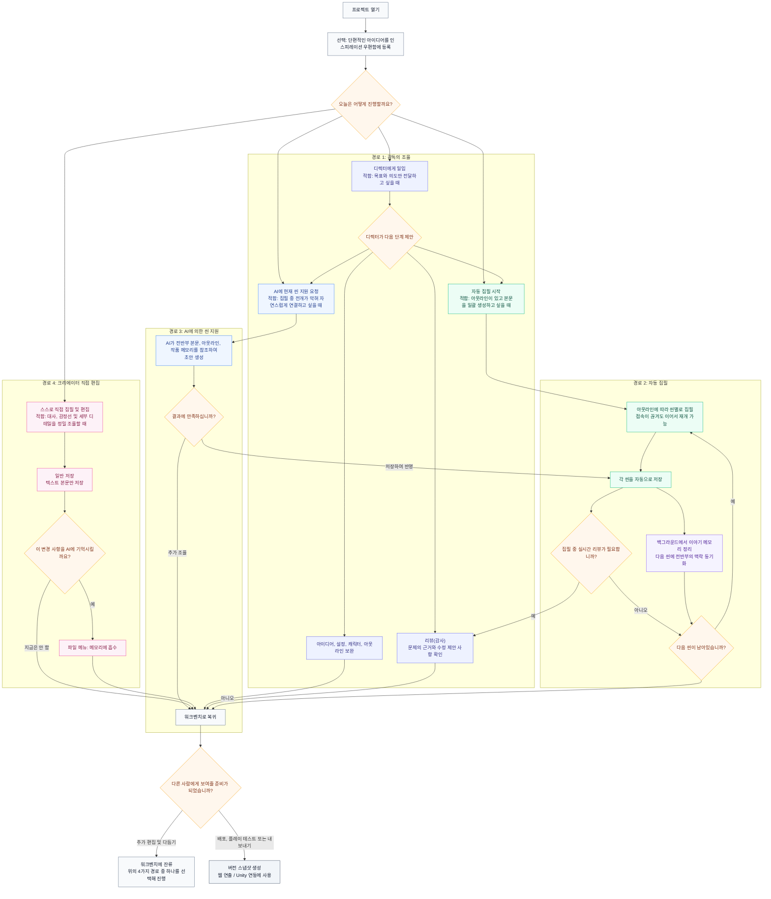
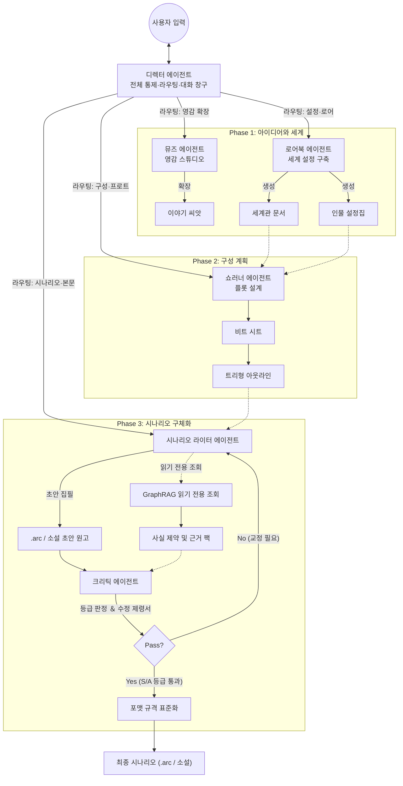
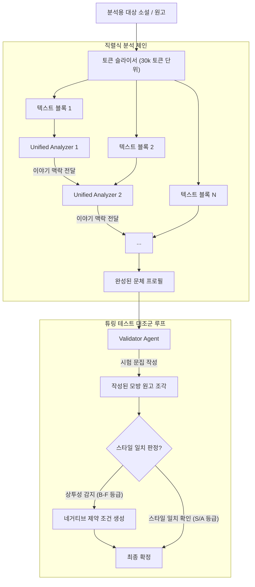
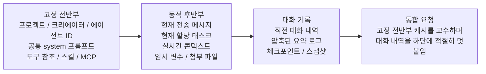
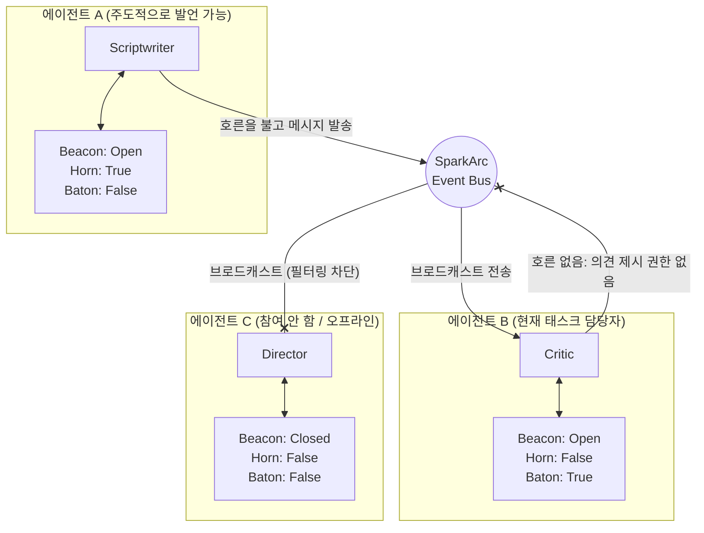

# SparkArc Studio

[简体中文](README.md) | [English](README.en.md) | [日本語](README.ja.md) | [한국어](README.ko.md)

> 📢 **지원 및 스타(Star) 요청**: 본 프로젝트가 창작 활동에 영감을 주거나 도움이 되었다면, 화면 우측 상단의 **Star**(프로젝트 즐겨찾기 추가로 잊지 않고 다시 찾기)와 **Watch**(Custom -> Releases를 선택하여 신규 버전 업데이트 구독)를 부탁드립니다! 독립적인 오픈소스 프로젝트로서, 여러분이 눌러주시는 Star와 Watch 하나하나가 커뮤니티 내 노출도를 높이고, 프로젝트의 지속적인 개선과 장기적인 발전에 매우 중요한 원동력이 됩니다. 아낌없는 성원에 감사드립니다!
> 
> 🤝 **공동 저자**: 홍보 분야의 헌신에 대해 [ @wxwxwkai](https://github.com/wxwxwkai) 님께 감사드립니다. 이러한 핵심 기여가 없었다면 본 프로젝트는 세상에 나올 수 없었을 것입니다.

**SparkArc Studio**는 자율형 멀티 에이전트(Agent) 그룹이 구동하는 창작 플랫폼입니다. 전문적인 창작 파이프라인을 통해 한 줄기 영감의 불씨를 온전한 스토리 세계관으로 확장하고, 소설이나 시나리오를 집필하며, 나아가 미려한 웹(WEB) 연출 및 Unity 엔진 연출 제어까지 일련의 과정을 유기적으로 연결하도록 설계되었습니다.
이 플랫폼은 **영감 → 설정 → 템포(비트) → 프로트 대강(아웃라인) → 집필 → 검증 → 배포 → 공유 → 연출**에 이르는 모든 라이프사이클을 관통하여 창작자에게 강력한 생산성 도구 세트를 제공합니다.

## 핵심 기능

### 1. 인간 중심, 자유로운 제어

SparkArc는 **영감과 감정이 인간 창작에 있어서 결코 양보할 수 없는 고유한 존엄성**이라고 굳게 믿습니다. 이것이 모든 AI 창작의 전제 조건입니다.

영감이 떠올랐을 때의 빠른 메모부터 한 자 한 자 공들여 다듬는 미세한 교정 작업까지, AI가 개입하는 정도를 직접 결정할 수 있습니다.
* **공동 창작 (추천)**: 사용자가 핵심 주제, 주요 씬, 극적 비트(템포)를 제공하면, AI는 **사용자의 요구사항에 맞추어 엄격하게 세계를 구축**합니다. 언제든지 지시를 중단하고 수정하거나 다시 쓸 수 있으며, AI는 새로운 방향에 즉시 적응합니다.
* **감독 모드 (자동 집필)**: 감동적인 가사 한 구절, 모호한 아이디어, 일상에서의 가벼운 영감 등을 디렉터(감독)에게 간단히 전달하기만 하면 됩니다. **그 후에는 브라우저를 닫아도 무방합니다**. 백그라운드에서 SparkArc의 전문가 에이전트들이 면밀한 워크플로우를 실행하여 완결된 스토리를 완성해 드립니다.
* **어시스턴트 모드 (퇴고 지원)**: 완벽주의 성향을 가진 크리에이터에게 최적의 도구입니다. 고도로 시각화된 직관적인 워크플로우를 제공하며, AI는 오직 구성 정리, 검증, 제안만을 수행합니다. **모든 단어를 온전히 제어하면서, AI를 단순한 잡무 처리기나 엄격한 독자(리뷰어) 역할로만 활용할 수 있습니다**.

품질이 담보되지 않은 창작물은 휴지통으로 직행합니다.

* **장편 창작 품질 보장**: **'작품 메모리 풀'**을 통한 실시간 상태 추적, **'크리틱(비평가)'**의 보고서 피드백, 그리고 AI 특유의 정형화된 표현을 억제하는 **'문체 클론'**의 네거티브 제약 조건을 결합했습니다. 이를 통해 **'집필 전 설정 확인 → 집필 중 로직 검토 → 집필 후 품질 검증'**의 엄격한 파이프라인을 구축하여 크리에이터의 생산성을 극대화하는 동시에 장편 내러티브의 완성도를 보장합니다.
* **장편 창작 비용도 절약**: SparkArc는 대규모 언어 모델 요청의 캐시 적중률을 항상 고려하며, 모델이 이미 읽은 설정, 아웃라인, 이전 내용을 최대한 다시 활용합니다. 캐시를 지원하는 모델 서비스에서는 캐시에 적중한 내용이 보통 다시 읽히는 것보다 저렴하므로, 작품이 길어지고 연속 창작이 많아질수록 불필요한 토큰 비용을 줄일 수 있습니다.
* **맞춤형 전문가 구성**: 각 에이전트가 **프롬프트를 작성하는 방식**과 **바인딩할 모델**을 자유롭게 결정할 수 있습니다. 창작자는 오직 작품의 질에만 신경 쓰면 되며, 전문가 에이전트들의 근간이 되는 기초 인프라는 SparkArc가 완벽히 구축해 두었습니다.
* **문체 클론 및 Anti-AI 효과**: 작성한 텍스트를 업로드하기만 하면 분석 클러스터가 동작하여 **사용자 본인 또는 유명 작가** 고유의 서사 톤, 어휘 패턴, 감정적 색채를 복제(클론)합니다. AI 생성 문장에서 흔히 나타나는 **고빈도 어휘 편중 문제를 효과적으로 해결**하고, 결과물의 **'AI 냄새(AI味)'를 대폭 줄여줍니다**.
* **시맨틱 검색 및 일괄 편집**: **Agentic RAG + Graph RAG** 기반의 자연어 검색 및 글로벌 치환 기능을 탑재했습니다. 대략적인 개념이나 프로트의 일부만 알아도 원하는 부분을 정확히 찾아낼 수 있습니다. **캐릭터 이름 변경, 설정 정보 업데이트와 같은 번거로운 작업은 AI에 맡겨 생산성을 확보할 수 있습니다**.

### 2. 크리에이터를 위한 IDE, 직관적인 상호작용

이제 당신이 '총괄 작가(메인 시나리오 라이터)'입니다. **채팅창**에서 **디렉터(감독 에이전트)**에게 한마디 건네기만 하면, 디렉터가 여러 전문가 에이전트를 조율하여 **사용자와 함께 협업하거나** (또는 **백그라운드에서 SparkArc에 전권을 위임하여**) 방대한 세계관 구축을 시작합니다. **다양하고 강력한 구조화 편집 도구**가 **전체 프로세스에 걸쳐 자동으로 창작을 완료**합니다. 완성된 **소설이나 시나리오**를 친구에게 공유하고, **인터랙티브 연출 단말**을 통해 당신의 영감 속에 깊이 **몰입**하게 만들어 보세요.

SparkArc는 자연스러운 대화 인터페이스 위에 멀티 에이전트 성능을 조화롭게 얹어, 전문적인 창작 워크플로우를 구현하는 데 전념해 왔습니다.

* **매우 친화적이고 전문적인 워크스테이션 경험**: 창작의 각 단계를 비주얼 컴포넌트로 한눈에 보여주어, 크리에이터가 언제든 편리하게 편집할 수 있도록 돕습니다. **'집필용 Cursor'**처럼 전문적이면서도 **복잡한 조작 논리 없이 보이는 그대로 편집할 수 있는 직관적인 경험(WYSIWYG)**을 제공합니다.
* **수동 복사·붙여넣기에서의 해방**: 세계관을 챙기면서 아웃라인을 짜라고 에이전트에게 복잡한 프롬프트를 일일이 작성할 필요도 없고, 각 에이전트가 출력한 텍스트를 복사해서 이리저리 옮겨 적을 필요도 없습니다. 모든 과정은 파이프라인에 의해 정교하게 흐릅니다. 디렉터 에이전트가 사용자의 요구사항을 정확히 이해해 서브 태스크로 분할하고, 설정 전문가, 쇼러너, 시나리오 작가에게 작업을 분배합니다. 이들은 **도구를 사용하여 문서를 자동으로 편집**하므로, 사용자는 구조화된 텍스트의 정밀한 제어 혜택을 온전히 누리면서도 작업 공수를 최소화할 수 있습니다.
* **블랙박스의 투명화, 화이트박스 협업**: 일반적인 AI 도구들은 대개 블랙박스 안에서 최종 장문을 한 번에 생성합니다. 반면 SparkArc는 백그라운드에서 **자율적으로 태스크를 수행**하며 각 단계의 추론 과정을 시각적으로 보여주고 **AI의 사고 흐름(Reasoning)을 명확히 설명**해 줍니다. 생성 결과물이 마음에 들지 않으면 **특정 에이전트를 지정**하여 칼로 도려내듯 정밀한 부분 수정이 가능합니다. 무작위 '뽑기식' 생성이 아닌, 전 과정이 투명한 화이트박스 창작입니다.

### 3. 언제 어디서나, 경계 없는 창작

영감은 대개 **PC 앞이 아닌 공간(지하철 안, 산책 중, 혹은 친구나 AI와의 가벼운 대화 속 등)**에서 태어납니다.

* **'지하철 시간' 자투리 창작**: 모바일 기기에 최적화되어 있어, 출퇴근 길에 한 손 조작으로 아웃라인을 검토하고 영감을 기록하거나 간단한 스토리 분기를 선택할 수 있습니다. 고도화된 자동화 프로세스를 통해 이동 중 5분이라는 짧은 시간 동안에도 의미 있는 창작을 이어갈 수 있습니다.
* **멀티 플랫폼 지원**: 주요 플랫폼을 모두 지원합니다. *Windows, macOS, Linux, Android, iOS 등의 PC, 태블릿, 스마트폰 모두가 당신의 전문적인 Studio가 됩니다!*
* **MCP를 통한 공간 초월**: 디바이스의 경계를 완전히 허뭅니다. Model Context Protocol(MCP)을 통해 **모바일 상의 RikkaHub**, PC 상의 **Claude Code**, 혹은 그 외 MCP를 지원하는 모든 AI 비서로부터 **대화나 조사 중에 떠오른 아이디어를 한 줄 전송하는 것만으로, 원격으로 디렉터 에이전트를 구동해 창작을 시작**하게 하거나 영감 우편함에 기록할 수 있습니다.
* **무인 자동 집필**: 클릭 한 번으로 'Auto-Write' 파이프라인을 실행하면 AI가 아웃라인에 따라 장별, 씬별로 본문을 연속해서 생성합니다. **브라우저를 닫아도 집필은 계속되며**, 다시 열기만 하면 실시간 진행 상황이 복원됩니다. 일시 정지, 재개, 중단점 복구를 지원하며, 프론트엔드 화면에는 중첩된 진행 링이 표시됩니다.

### 4. 불씨를 공유하고 세계를 연출하다

**AI를 통해 가속화된 창작 생태계 속에서, 당신의 머릿속에만 존재하던 주인공이 드디어 무대 위로 올라옵니다**. 단순한 텍스트 공유를 넘어, 당신이 창조한 세계 전체의 '연출'을 선사할 수 있습니다.

* **웹 연출 단말**: 언제든 영감을 타인에게 공유할 수 있습니다. 관객은 **링크 클릭 한 번**으로 시나리오 세계관에 즉시 몰입하게 됩니다.
* **버전 스냅샷 및 내보내기**: 원클릭으로 버전 스냅샷을 생성할 수 있습니다. `.arc` 인터랙티브 스크립트 형식 또는 순수 문학 소설 형식(Markdown) 두 가지로 내보낼 수 있으며, 스냅샷에서 작업 영역으로 원클릭 복구도 지원합니다.
* **개발 예정 기능**: *많은 로드맵이 준비되어 있습니다. 지속적인 관심을 부탁드립니다.*
  1. 스타일이 고정된 캐릭터 일러스트(스탠딩 이미지) 생성 지원으로 일러스트 풍의 일관성 유지.
  2. 이미지 생성 및 편집 모델을 조합한 간이 배경 이미지 기능 구현.
  3. Scriptwriter(시나리오 라이터) 기능을 커스터마이징하여 일상물 집필용, 아이템 설정용 등 서브 에이전트 파생 기능 지원.
  4. 사용자가 데이터 구조를 커스텀 정의하면, 에이전트가 이에 대응하는 분석 컴포넌트를 프론트엔드용으로 자동 생성하여 화면 표시 및 편집을 지원하고 해당 코드를 데이터베이스에 보관하는 LUI / Gen-UI 기능.

### 5. 산업용 생산성, 창작의 민주화

시나리오 안의 세계를 움직이게 하세요. **생성된 시나리오는 Unity에 쉽게 통합하여 게임 엔진의 대화 및 이벤트 시스템을 직접 구동할 수 있습니다**. Unreal Engine이나 Godot 등 다른 게임 엔진으로의 확장도 가능합니다. AI의 발전에 힘입어 **누구나 이야기를 만들고, 나아가 게임까지 제작할 수 있는 권리를 누리게 될 것**이라 확신합니다.

* **프로그램과의 디커플링**: 기획자는 오직 텍스트와 드라마성에만 집중할 수 있으며, 코드 한 줄 작성하지 않고도 게임 내 연출과 행동을 제어하고 언제든 텍스트를 이터레이션할 수 있습니다.
* **블루프린트 시스템**: 프로젝트마다 전용 `blueprint.json`을 구성하여 창작 성향, 문체 제약, 프로세스 파라미터를 정의할 수 있습니다. AI는 무에서 추측하는 것이 아니라, 정의된 프레임워크 내에서 규격화된 창작을 수행합니다.
* **Unity 예제**: 간이 **Unity SDK**를 제공합니다. 원클릭으로 결합되는 간단함을 직접 체험해 보시고, **자세한 초보자용 연동 가이드**를 참고해 보세요.

## SparkArc은 누구를 위한가

SparkArc의 중심 사용자는 창작자이지만, 공개 작품의 체험자, 기술 통합 사용자, 독립 운영자도 지원합니다. 역할에 따라 적합한 시작점이 다릅니다.

| 당신이 | 추천 시작점 | 주요 용도 |
|---|---|---|
| 소설가, 시나리오 작가, 개인 창작자 | 데스크톱, 웹 또는 모바일 클라이언트 | AI와 함께 영감, 설정, 집필, 검토, 배포까지 진행 |
| 창작 팀과 스튜디오 | 팀용 자체 호스팅 인스턴스 | 내부 창작, 모델 연결, 프로젝트 협업 운영 |
| 독자, 플레이어, 작품 체험자 | 웹 또는 Unity 연출 | 공개된 인터랙티브 작품 체험 |
| 인디 게임 개발자와 기술 통합 사용자 | Unity SDK, 내보낸 에셋, API | 시나리오, 이벤트, 연출 기능을 자체 프로젝트에 통합 |
| 자체 호스팅 사용자, 운영자, 기여자 | Docker, 소스 코드, CI/CD, 개발 문서 | 인스턴스 운영, 기능 확장, 오픈소스 기여 |

창작만 원한다면 사용 가능한 작업 공간에 연결하면 됩니다. 데이터, 모델, 팀 협업을 직접 관리해야 할 때 자체 호스팅을 선택하고, 개발 및 통합 경로는 기술 사용자를 위한 것입니다.

---

SparkArc의 아키텍처는 문학, 게임, 영화·영상 업계의 표준적인 워크플로우에 철저히 입각하여 설계되었습니다:

| 단계 | 업계의 직무 대응 | SparkArc의 접근 방식 | 기능 설명 |
| :--- | :--- | :--- | :--- |
| **0. 커뮤니케이션·조율** | 디렉터 (Director) | **디렉터** | 전체 엔트리 포인트이자 콘텍스트 관리자. LangGraph 기반의 다회차 도구 호출 자율 라우팅을 구현하여 전문가에게 태스크를 위임하고, 자동 집필을 실행하며 진행 상황을 확인합니다. 사용자와 직접 대화하는 창구입니다. |
| **1. 기획·아이디어** | 로그라인 / 기획 골자 | **영감의 씨앗** | 순간적으로 스친 아이디어(Flash Idea)를 붙잡아 다차원 태그(장르/톤/시점)를 통해 이야기의 씨앗으로 고착화합니다. |
| **2. 세계관·설정** | 설정 자료집 (Story Bible) | **설정 전문가** | 물리 법칙, 마법 체계, 지리·정치적 배경 및 캐릭터 상세 프로필을 확립하여 이후 창작 단계에서의 논리적 일관성을 담보합니다. |
| **3. 구성·템포** | 비트 시트 / 트리트먼트 | **쇼러너** | 「고양이 구하기」나 「영웅의 여정」 중 어느 쪽을 따를 것인가? 이 단계에서 이야기의 뼈대를 결정하고 막(아웃라인)을 분할하여 상세한 비트 시트를 생성합니다. |
| **4. 집필** | 시나리오 / 스크립트 | **시나리오 라이터** | 최종적인 '필체'입니다. 구성의 프레임워크에 살을 붙여 씬 묘사, 액션 지시, 캐릭터 대사를 처리합니다. `.arc` 인터랙티브 스크립트 형식과 소설 형식 양측 모두로 출력을 지원합니다. |
| **5. 품질 보증** | 시나리오 닥터 / 감수 | **로직 감사역 ＆ 문체 클론** | 로직 감사역은 까다로운 편집자처럼 작동하여 모순점이나 프로트의 구멍에 대한 피드백을 제공합니다. 문체 클론은 목표 문체 제약을 통해 AI 특유의 정형화된 단어 사용을 배제합니다. GraphRAG는 읽기 전용 그래프 조회 기능(`query` / `status`)으로, 시맨틱 검색·작품 메모리 풀과 질문 복잡도에 따라 라우팅되어 크로스 챕터 인과 및 장기 구조 일관성을 높입니다. |
| **6. 배포·연출** | 구현 / 아셋화 | **웹 연출 / Unity SDK** | 시나리오의 아셋화. 스크립트를 경량 런타임용 데이터베이스로 컴파일하여 게임 내 대화 시스템, 연출 제어, 퀘스트 플래그 처리 등을 구동합니다. |

## 크리에이터의 원맵 워크플로우

SparkArc는 "자율 주행도 가능하지만 언제든 사용자가 핸들을 빼앗아 쥘 수 있는" 창작 스테이션과 같습니다. 일상적인 창작 과정에서는 디렉터에게 태스크를 위임하거나, 전 자동 집필을 시작하거나, AI에게 현재 씬의 다음 내용을 작성해 달라고 요청하거나, 완전히 스스로 집필하는 등 몇 가지 경로 중 하나를 선택하기만 하면 됩니다. 시스템은 집필을 방해하지 않고 백그라운드에서 이야기 메모리를 정리하며, 수동으로 편집한 내용을 AI에 기억시킬지 여부도 크리에이터가 자유롭게 결정합니다.



## 상세 목차

* [SparkArc은 누구를 위한가](#sparkarc은-누구를-위한가)
* [🚀 빠른 시작](#-빠른 시작)
* [시스템 아키텍처](#시스템-아키텍처)
  * [1. 에이전트 클러스터](#1-에이전트-클러스터)
    * [문체 클론 클러스터](#문체-클론-클러스터)
  * [2. 콘텍스트 구조와 통합 실행 파이프라인](#2-콘텍스트-구조와-통합-실행-파이프라인)
  * [3. 비콘 버스 통신 메커니즘](#3-비콘-버스-통신-메커니즘)
* [품질 엔지니어링](#품질-엔지니어링)
  * [인터랙티브 스크립트 형식 (ARC)](#인터랙티브-스크립트-형식-arc)
  * [작품 메모리 풀](#작품-메모리-풀)
  * [소설 모드](#소설-모드)
* [인프라스트럭처](#인프라스트럭처)
  * [1. Matchbox Agent Gateway](#1-matchbox-agent-gateway)
  * [2. 데이터베이스 자동 마이그레이션](#2-데이터베이스-자동-마이그레이션)
  * [3. 멀티 테넌트 SaaS](#3-멀티-테넌트-saas)
  * [4. 시맨틱 검색 엔진](#4-시맨틱-검색-엔진)
  * [5. CI/CD 자동 배포](#5-cicd-자동-배포)
* [크로스 플랫폼 생태계 및 아키텍처](#크로스-플랫폼-생태계-및-아키텍처)
* [📚 상세 정보](#-상상세-정보)
* [개발자 후기](#개발자-후기)

---

## 🚀 빠른 시작

⚠️ 본 프로젝트는 서버와 클라이언트가 분리되어 있습니다. **반드시 아래 문서의 안내에 따라 서버를 배포해야 정상적으로 사용할 수 있습니다.**

**클라이언트는 브라우저를 사용하여 서버의 URL에 접속하여 직접 사용합니다. Releases 페이지에서 전용 데스크톱/모바일 클라이언트를 다운로드하여 사용하는 것을 강력히 추천합니다.**
클라이언트는 실행 시 서버 API를 자동으로 감지하여 연결을 시도합니다.

원활한 체험을 돕기 위해 개발자가 관리하는 테스트용 서버 인스턴스를 제공하고 있습니다. 로컬에서 직접 서버를 구동하지 않을 경우, 클라이언트는 자동으로 해당 테스트 서버로 접속을 시도하며 회원가입 후 체험이 가능합니다.
**시간과 비용의 제약으로 인해 이 테스트 인스턴스의 안정성을 보장할 수는 없습니다. 서버 접근이 수시로 제한될 수 있으므로 중요한 데이터를 이 테스트 서버에 보관하지 마시기 바랍니다. 본격적인 활용에는 반드시 본인 소유의 서버에 독립적으로 배포하여 이용하십시오.**

### 방법 1: 관리형 데스크톱 Launcher (초보자 추천)

GitHub Releases의 데스크톱 Launcher는 Windows, macOS, Linux를 지원합니다. 데스크톱 패키지를 설치한 뒤 Launcher가 로컬 백엔드를 준비하도록 하는 방식이 가장 진입 장벽이 낮습니다.

**요구 사항**:

- Release Launcher 사용자는 시스템 Git 또는 Node.js를 설치할 필요가 없습니다. Launcher는 내장 Git 구현과 사용자 디렉터리의 관리형 Node.js 런타임을 사용합니다.
- macOS / Linux에서는 휴대용 Python을 처음 준비할 때 기본 도구인 `bash`, `curl`, `tar`가 필요합니다.
- 소스를 직접 clone하고 `start.bat` / `start.sh`를 실행하는 사용자는 clone용 Git과 프런트엔드 빌드용 Node.js 20+가 필요합니다.

#### Release Launcher 사용 방법

1. GitHub Releases에서 데스크톱 패키지를 내려받아 엽니다.
2. 로컬 백엔드가 발견되지 않으면 **Start Local Backend**를 선택합니다.
3. Launcher는 관리형 `main` 작업 트리를 `~/.sparkarc/sparkarc-server`에 내려받고, 전용 Node.js, 휴대용 Python, 고정된 의존성을 준비합니다.
4. 백엔드는 **<http://localhost:6688>** 에서 시작됩니다. Launcher는 이 관리형 작업 트리만 업데이트하며, 수동 clone, `dev` 작업 트리, 로컬 소스 수정은 덮어쓰지 않습니다.
5. Launcher는 `main` 업데이트를 확인하고 적용 전에 사용자에게 묻습니다. 코드 전환 전에는 자신이 관리하는 서비스를 중지하고 사용자 데이터와 런타임 캐시는 보존합니다.
6. Launcher 자체 업데이트는 GitHub Releases에서 직접 확인합니다. API가 제한되면 표준 Release 리디렉션과 사용 가능한 미러로 대체합니다. 초기 단계에서는 별도 manifest 없이 해당 다운로드 페이지를 여는 방식입니다.

#### 소스 스크립트 경로

Git으로 clone한 뒤 루트 스크립트를 실행합니다.

```bash
git clone https://github.com/1deaaa/spark-arc-studio
cd spark-arc-studio
```

- Windows: `start.bat` 더블 클릭
- macOS / Linux: `bash start.sh` 실행

이 경로에서는 배포 완료 플래그를 재사용하지만, 브랜치 선택과 `git pull` 시점은 사용자가 관리합니다. 관리형 Launcher의 소유권과 업데이트 경계는 [상세 설계](docs/project/local-deployment-manager.zh-CN.md)를 참조하세요.
스마트폰 등 모바일 기기로 접근 시, 같은 공유기(LAN)에 접속한 상태로 **<http://PC의_로컬IP:6688>** 로 접근하면 됩니다.
외부 네트워크를 통한 원격 접속을 원하시는 경우, 포트포워딩이나 인트라넷 터널링(ngrok 등) 기술을 스스로 확인해 보시기 바랍니다.

> 💡 **사용 환경 오염 없는 설계**: 생성되는 모든 시스템 바이너리는 `server/.runtime/python/` 디렉토리 내에 격리 보관됩니다. 이 폴더만 지우면 시스템에 어떠한 흔적도 남기지 않고 즉시 삭제(롤백)됩니다.
> 💡 **멱등성 및 안전성 보장**: 스크립트 자체에 버전 확인과 배포 상태 플래그가 내장되어 있어 반복 실행하더라도 추가적인 다운로드나 불필요한 재설치를 행하지 않습니다.
> 💡 **Pip 캐시 예외**: pip 다운로드 캐시는 기본적으로 사용자 경로인 `%LOCALAPPDATA%\pip\Cache\`에 기록되며 시스템 전체 구성에는 어떠한 영향도 끼치지 않습니다. 원하실 경우 `pip cache purge` 명령어로 제거할 수 있습니다.

### 방법 2: Docker 기반 원클릭 배포 (추천)

가장 직관적이고 간편한 크로스 플랫폼 배포 방식입니다. 아래 2가지 명령어만 실행하면 완료됩니다:

```bash
# 1. 프로젝트 클론
git clone https://github.com/1deaaa/spark-arc-studio
cd spark-arc-studio

# 2. 서비스 실행
docker compose up -d --build
```

서비스 실행 후 접근 주소: **<http://localhost:7788>**

> 💡 **포트 분리 구성**: Docker 환경은 포트 `7788`, 로컬 직접 실행(베어메탈) 환경은 포트 `6688`을 사용합니다. 이를 통해 두 환경을 동시에 구동하여 병렬 디버깅할 수 있어 환경 오독을 방지합니다 (단, 운영 환경에서는 **데이터 충돌을 막기 위해 두 환경을 동시 구동하는 것을 엄격히 금지**합니다).
> 💡 **데이터 영속성**: 사용자 정보와 데이터베이스는 호스트 머신의 `server/` 디렉토리에 안전하게 자동 저장되므로 컨테이너를 재시작해도 정보가 유실되지 않습니다.
> 💡 **마스터 키 관리**: `LLM_KEY`는 기본적으로 `server/llm/agen_matchbox/.env`에 자동 기록되므로 사용자가 수동으로 `server/.env`를 추가 정의할 필요가 없습니다.

컨테이너 재생성 시 실행 명령어:

```bash
docker compose up -d --build --force-recreate
```

#### 🔄 새 버전 업데이트 시 올바른 갱신 절차 (매우 중요)

단순히 `docker compose restart` 명령만 실행하지 마십시오. 이는 이전 버전의 컨테이너를 단순히 다시 켜는 것에 불과하므로 최신 코드가 반영되지 않습니다.

`git pull`을 실행할 때마다 반드시 아래 절차대로 갱신을 수행해 주십시오:

```bash
# 1) 최신 코드 풀(Pull)
git pull --ff-only

# 2) 재빌드 및 컨테이너 완전 교체 실행 (필수)
docker compose up -d --build --force-recreate

# 3) 선택: 최근 생성된 로그를 확인해 정상 작동 여부 확인
docker compose logs --tail=120 sparkarc
```

이 교체 프로세스는 다음을 보장합니다:
1. 이미지에 반영된 최신 Git 변경 사항이 강제로 새로 빌드됩니다.
2. 실행 시 Git이 관리하는 설정 템플릿들이 영속 마운트 경로로 자동 동기화되어, 이전 버전의 잔재 파일이 새 버전 코드를 덮어쓰는 상황을 방지합니다.
3. 사용자가 생성한 데이터베이스와 개인 파일(`*.db`, `_userdata`, `.env` 등)은 보존되며 삭제되지 않습니다.
4. 로컬 임베딩 연산에 활용되는 GGUF 모델 파일, llama.cpp 관련 실행 파일 및 토크나이저 캐시들은 `server/.runtime` 디렉토리(CI 빌드용 Docker 볼륨 캐시)에 보존되어 매번 이미지를 빌드할 때마다 다시 받아야 하는 불편함을 덜어줍니다.

### 방법 3: 로컬 직접 실행 (베어메탈 개발 환경)

환경 설정이 완료되면 VS Code에서 F5 키를 누르는 것만으로 시작할 수 있습니다. Docker를 사용하지 않거나, 소스 코드를 직접 수정하는 2차 개발 환경을 지향하는 경우 다음 절차에 맞춰 설정하십시오:

1. **Python 가상환경 구성**
   ```bash
   # 1. Conda 가상환경 생성 및 활성화 (miniconda 혹은 anaconda가 설치되어 있어야 합니다)
   conda create -n sparkarc python=3.13 -y
   conda activate sparkarc

   # 2. 백엔드 필수 라이브러리 설치 (설치 목록 파일은 server 디렉토리에 있습니다)
   pip install -r server/requirements.txt
   ```

2. **프론트엔드 빌드**
   ```bash
   # 프로젝트 루트로 복귀한 후, client 디렉토리로 이동
   cd ../../../client
   npm install
   npm run build
   ```

3. **F5 키를 눌러 서비스 실행**
   사전 작업 단계에서 오류가 없었다면 F5 키를 누름으로써 백엔드 서버가 구동됩니다.
   접속 주소: **<http://localhost:6688>**

#### 선택: 가입 단계의 봇 차단 기술 (Cloudflare Turnstile) 활성화

SparkArc는 회원가입 단계에서 봇 차단을 위한 Cloudflare Turnstile 연동을 지원합니다. 이 인증은 오직 '가입(Create User)' 엔드포인트에 한해서 작동합니다. 프론트엔드가 Turnstile 컴포넌트로부터 발급받은 토큰을 백엔드로 넘겨주면, 백엔드는 가입 처리 전에 Cloudflare `siteverify` API를 대조 검증합니다.

프로젝트 루트 디렉토리에 `.env` 파일을 생성하거나 편집하여 아래 변수들을 선언하십시오:

```env
SPARKARC_REGISTRATION_VERIFICATION_ENABLED=1
SPARKARC_REGISTRATION_VERIFICATION_PROVIDER=turnstile
SPARKARC_TURNSTILE_SITE_KEY=발급받은 Turnstile Site Key
SPARKARC_TURNSTILE_SECRET_KEY=발급받은 Turnstile Secret Key
```

주의 사항:
* `SPARKARC_TURNSTILE_SITE_KEY`는 공개키이며, `/api/auth/verification-config` 경로를 거쳐 화면(프론트)으로 안전하게 송신됩니다.
* 관리자 콘솔 화면에서 직접 Turnstile의 환경 설정을 기입할 수도 있습니다. 이 데이터는 백엔드가 영속 보관하는 데이터 디렉토리 속의 `.env` 파일에 기록되어 Docker 컨테이너 재생성 시에도 정보가 보존됩니다.
* `SPARKARC_TURNSTILE_SECRET_KEY`는 서버 내에서만 사용되는 비밀키로, 화면으로 유출되지 않습니다.
* **이 값들이 선언되지 않은 환경에서는 회원가입 인증 프로세스가 무력화(비활성화) 상태로 기본 설정**되므로, 개인 배포 환경에서 초기 관리자 계정을 만들 때는 이 기능의 부재로 인한 제약을 받지 않습니다.
* 추후 Google reCAPTCHA나 텐센트 클라우드 등의 타 보안 인증 플랫폼으로 이식을 원하시는 경우 가입 라우터 구조는 유지한 상태로 [verification.py](server/core/verification.py)의 검증 프로바이더 부분만 확장 선언해 주시면 됩니다.

### 독립적 배포 시 접근 방법: 브라우저와 클라이언트

SparkArc의 백엔드는 화면 코드인 프론트엔드 리소스를 포함하여 호스팅합니다. 성공적으로 구동된 후에는 브라우저를 열어 구동된 주소를 적기만 하면 됩니다:
* Docker 기반 구동: `http://localhost:7788`
* 로컬 직접 구동: `http://localhost:6688`
* 클라우드/원격 서버 구동: `http://서버IP:포트`

GitHub Releases의 데스크톱 클라이언트는 먼저 로컬 백엔드(`6688` / `7788`)를 탐지하고 Launcher를 통해 관리형 로컬 백엔드를 준비할 수 있습니다. 기존 개인 또는 원격 백엔드를 사용할 때는 로그인 전에 실제 서버 주소를 설정하세요. 모바일 클라이언트는 기기에서 백엔드를 배포할 수 없으므로 PC 또는 서버 주소를 지정해야 합니다. 기본 주소는 개발자가 운영하는 데모 인스턴스를 가리킬 수 있으며 장기적인 개인 운영에는 적합하지 않습니다.

기입 예시:
* 데스크톱 앱에서 PC에 띄운 백엔드로 접근: `http://localhost:6688` 혹은 `http://localhost:7788`
* 모바일 기기에서 같은 공유기 환경의 PC 백엔드로 접근: `http://PC의_로컬IP:6688` 혹은 `http://PC의_로컬IP:7788`
* 외부 클라우드 독립 배포 환경: 구동한 도메인 주소/공인 IP와 포트 번호 기입

모바일, 태블릿, 혹은 외부 다른 장소에서 자신이 올린 개인 인스턴스에 원활하게 접속하길 원하시는 경우 클라우드 가상 서버를 한 대 임대해 올리시거나 포트포워딩 등을 사용하여 연결망을 구축해 사용하십시오. 어떤 경로를 따르던 로그인 암호화 방식, HTTPS 설정, 권한 제어, 방화벽 규칙, 모델 API Key 보호, 그리고 주기적인 데이터 백업 관리는 본인의 책임 하에 직접 수행하셔야 합니다.

> 💡 만일 독립 배포 서버의 회원가입을 불특정 다수에게 공개 오픈하는 경우 반드시 HTTPS 보안 통신을 연동하시고, 가입 단 단계의 봇 방지 보안 연동, 역프록시/방화벽을 활용한 접근 횟수 제한, `LLM_KEY`를 비롯한 각종 핵심 키 보안에 극도로 유의하시길 강력히 경고합니다.

#### MCP 클라이언트 연결

로그인한 뒤 데스크톱 대시보드 또는 모바일 AI 관리 화면에서 「MCP 연결 서비스」를 여십시오. 공통 설정 카드는 통합 MCP 엔드포인트 `/api/mcp/`를 위한 `spark-arc` 설정 하나를 생성하며, 통합 입구의 제어 도구에는 `control_` 접두사가 붙습니다. `/api/mcp/control/`은 기존 클라이언트를 위한 호환 엔드포인트로 유지됩니다. 통신 방식은 Streamable HTTP(`"type": "http"`)를 선택하십시오. 전체 설정, 도구 목록 및 Director 작업 흐름은 [MCP 연결 가이드](docs/project/mcp-integration.zh-CN.md)를 참고하십시오.

---

## 시스템 아키텍처

### 1. 에이전트 클러스터

SparkArc는 한 개 모델의 성능에 기대는 구조가 아닌, 명확한 임무 중심의 멀티 에이전트 집단을 형성해 문제를 처리합니다. 각 에이전트는 독립된 페르소나 설정, 프롬프트 엔지니어링 규칙, 전용 모델 할당 정보를 가집니다.

> 💡 **다국어 대응 (i18n)**: 에이전트 등록 관리 테이블([registry.py](server/agents/registry.py))은 `zh-CN` / `en-US` / `ja-JP` / `ko-KR` 4개 언어를 기본적으로 지원합니다. 화면은 i18n 번역 맵을 사용하고, 백엔드는 접속자의 로케일(Locale) 요청에 부합되게 `resolve_agent_i18n_field()` 함수를 대조 추출하여 응답합니다. 새로운 국가 언어를 추가하려면 단지 각 에이전트 정의 줄에 번역 묶음을 더해 주면 동작합니다.

#### A. 조율 및 분배자

* **디레터 에이전트 (Director)**:
  * **임무**: 전체 시스템의 통제 및 콘텍스트 관리자. **LangGraph SupervisorGraph** 기반의 다회차 도구 연동 자율 라우팅 메커니즘을 구동합니다. `delegate_task`를 활용한 다른 전문가 에이전트 태스크 배정, `trigger_auto_write`를 통한 연속 자동 집필 실행 지시, `check_scriptwriter_status`에 의한 생성 진척도 체크를 일괄 자율 수행하며 기존의 단순 문자열 판별 기법을 대체합니다. 대화 흐름을 매끄럽게 잇고, 핵심 결정을 스냅샷에 남기며, 비콘 이벤트 버스의 디폴트 수신자 역할을 담당합니다.
  * **주요 코드**: `agent_director.py` + `director_graph.py` (LangGraph SupervisorGraph 구현부)

#### B. 창의성의 핵심

* **뮤즈 에이전트 (Muse)**:
  * **임무**: 크리에이티브의 첫 단추. 머릿속을 스쳐 지나가는 단편적인 영감 조각을 붙잡아 장르, 감정선, 화점 등 다차원 태그를 곁들여 이야기 씨앗(Seed)으로 고정하며 더 상세한 시놉시스로 발전시킵니다. MCP를 경유해 외부 다양한 AI 비서로부터 아이디어를 접수하는 기능도 지원합니다.
* **로어북 에이전트 (Lorebook)**:
  * **임무**: 이야기 배경 세계관 구축. 간단한 스토리 씨앗으로부터 상세한 지리, 역사적 사건, 마법 및 과학 문명 체계를 구조화하고, 이에 조화롭게 호응하는 인물 설정 카드(캐릭터 시트)들을 대량으로 가공해 냅니다.
* **쇼러너 에이전트 (Showrunner)**:
  * **임무**: 거시적 각본 통제. 스토리 진행의 **비트 시트(Beat Sheet)**와 **트리 구조의 아웃라인**을 다듬어 구성하며, 플롯 구성이 '고양이 구하기(Save the Cat!)'나 '영웅의 여정(Hero's Journey)'과 같은 신화/극작 고전 공식을 일관성 있게 따르도록 유도합니다.
* **시나리오 라이터 에이전트 (Scriptwriter)**:
  * **임무**: 미시적 연출 및 살 붙이기. 대강의 아웃라인 구성을 실질적인 각본 시나리오 텍스트로 변화시키는 유일한 '집필자'입니다. 다이얼로그 분기, 액션 지령, 씬 이동이 담긴 **.arc 인터랙티브 스크립트 규격**과 **소설용 규격(Markdown)** **양측 모두의 본문 포맷 출력**을 보장합니다. 독자적인 **구상 체인(Conception Chain)** 메커니즘이 내장되어, 본문을 토해내기 직전에 먼저 `<conception>` 태그 내부에서 시나리오의 인과 및 로직을 스스로 철저히 추론합니다.

#### C. 품질 보증

* **스타일 에이전트 (Style)** (문체 클론 서브 클러스터):
  * **임무**: AI 어조 제거. 지정한 작가나 크리에이터 본인의 기존 저술 데이터를 습득하여, 거대 모델들이 본문을 지어낼 때 무의식적으로 남발하는 상투적 구문이나 빈출 단어 등을 철저히 회피하게 함으로써 **생성된 텍스트에서 모델 특유의 작위적인 느낌을 최소화합니다**.
  * **서브 클러스터 연동**: 전체 분석 프로세스를 제어하는 **Coordinator**, 튜링 백테스트 검증을 가동하는 **Validator**, 설정 문체를 바탕으로 대화를 교환하는 **StyleChatAgent** 3개 에이전트의 긴밀한 상호 대조로 실현됩니다. 자세한 원리는 [문체 클론 클러스터](#문체-클론-클러스터) 단락을 참고해 주십시오.
* **크리틱 에이전트 (Critic)** (로직 감사역):
  * **임무**: 매서운 독자이자 엄격한 편집자 역할 수행. 본문 문장을 임의로 뜯어고치지 않는 범위 내에서, 스크립트 조각이나 소설 원고를 교정하여 **독자가 민감하게 느낄 수 있는 AI 냄새, 인물 간의 작위적인 대화 전개, 문학적 깊이 부족, 앞뒤 설정 충돌 및 캐릭터 붕괴 등**을 철저히 검사해 상세 리포트를 뽑아냅니다.
  * **작동 형태**: 채팅 탭에서의 자연어 문답을 기본 지원하는 동시에, 시나리오 에디터 우측 전용 패널을 눌러 구조화된 정밀 서면 비평을 받아볼 수도 있습니다.
  * **결과 포맷**: 단순 숫자 점수가 아닌 **S / A / B / C / D** 5단계 등급 평가 체계를 고수합니다. 문제가 감지된 원문 근거 목록, 구체적 충돌 사항, 그리고 후속 수정을 돕기 위한 수정 지령서 `fix_ticket`을 동시에 내려주어 수월한 퇴고를 돕습니다.
  * **모델 할당 전략**: 모델의 논리 판정 및 근거 귀인 능력을 적극 활용하도록 구성되어, 기계 학습 분류기처럼 동작하지 않고 오직 **LLM Judge / Editor** 형태로 성능을 극대화합니다.
* **GraphRAG Tool** (읽기 전용 그래프 조회):
  * **임무**: 현재 프로젝트 내부의 세계관 문서, 인물 설정집, 아웃라인 및 작성된 스크립트 본문 조각들을 서로 연결된 관계 그래프망으로 정교화하여, 집필 및 교정 시점의 모델에 실시간 사실적 제약 규칙과 원문 근거를 내려보냅니다.
  * **현 상태**: AI 측은 읽기 전용 `query` / `status` 연산만 유지하며, 그래프 빌드·재빌드는 설정 화면에서 수동으로 실행합니다. Director / Scriptwriter / Critic / Showrunner(연속성 도구군)에 기본 바인딩됩니다. 단순 사실 확인은 시맨틱 검색, 최신 상태 확인은 작품 메모리 풀을 우선하고, 크로스 챕터 인과·관계 변화·지식 경계·장기 스레드에만 GraphRAG를 사용합니다.
  * **품질상 장점**: 장편 서사 창작 시 작가가 가장 저지르기 쉬운 실수인 설정 붕괴(앞뒤 설정 뒤엉킴)를 원천 차단하고, 화수 간의 내러티브 영속성과 등장인물 관계망을 엄격하게 관리해 줍니다.

#### 크리틱 로직 검증 구조

크리틱 에이전트는 단순히 "이 글이 기계가 쓴 것인가"를 판별하지 않고, **"이 글의 어느 파트가 독자에게 모델이 무성의하게 과제를 작성하는 듯한 인상을 심어주는가"**를 조망합니다. `S/A/B/C/D` 성적표와 함께 짚어낸 원문 위치 및 수정 지령 `fix_ticket`을 함께 돌려받으며, 원본을 마음대로 훼손하지 않기에 창작자는 이야기 제어의 절대적 권한을 지켜낼 수 있습니다.

> 📗 4개 핵심 검증 방식과 분류기가 아닌 LLM을 심판관으로 쓰는 타당성 논거는 [아키텍처 문서 §6](docs/project/architecture.md#6-critic-审核机制完整版)을 참고해 주십시오.

#### 협업 데이터 파이프라인



#### 에이전트 3개 실행 모드 프로토콜

각 전문가 에이전트의 프롬프트는 단일 `yaml` 파일에 규정된 3개 최상위 노드를 바탕으로 서로 다른 실행 모드를 가동합니다. 이를 통해 '에디터 수동 조작', '기본 채팅', '감독의 위임 태스크' 3가지 경로가 서로의 간섭을 일으키지 않도록 사전에 철저히 방지합니다:

| 모드 종류 | YAML 선언 위치 | 출력 속성 |
| :--- | :--- | :--- |
| **전문 가동 모드** | `system` + `user` | 고도로 정형화된 데이터 규격으로 출력되어 파서가 즉시 치환 및 저장합니다. |
| **채팅 가동 모드** | `chat_system` | 자연스러운 일상적 문체로 반응합니다. 틀을 강제하지 않고 아이디어를 확산시키는 대화 위주입니다. |
| **감독 위임 모드** | `pipeline_system` | 정해진 출력 규격을 준수하고 툴을 활용한 내부 보존 및 디렉터 앞 요약 보고를 실행합니다. |

> 📗 실행 시점 할당 조건, `pipeline_system` 선언 규약, 도구 참조 자동 임베딩 원리, 신규 에이전트 기입용 셀프 체크리스트는 [아키텍처 문서 §2](docs/project/architecture.md#2-agent-三模态调用协议完整版) 및 [AGENTS.md §4.5](AGENTS.md)를 참고해 주십시오.

#### 문체 클론 클러스터

SparkArc 시스템의 집약적 핵심 모듈입니다. **UnifiedStyleAnalyzer**를 통한 순차 분석과 **ValidatorAgent**를 이용한 튜링 테스트 대조군 검증을 함께 연결하여 인간 작가 특유의 섬세한 어휘 및 톤을 반영하는 고유 문체 프로필을 확보합니다. 이 프로필은 문장 생성 시 편향되거나 작위적인 거대 모델 고유의 AI 문체를 누르고 작가 본연의 색채를 구현하는 데 기여합니다.

* **순차식 텍스트 분석**: 원본 텍스트를 약 3만 토큰 단위의 블록들로 쪼갠 후 각 블록별로 7가지 차원의 비교 분석을 행합니다. 이전 블록의 이야기 문맥을 다음 분석기에 명시적으로 넘겨주어 전체 문맥의 끊김 없이 유기적으로 처리합니다.
* **대조군 튜링 테스트**: ValidatorAgent가 추출된 문체 프로필을 활용해 '가상 원고'를 직접 시험 작성하고 자가 피드백을 가동합니다. 모델 본연의 상투적 작풍이 조금이라도 드러나는 경우 네거티브 제약 규칙을 만들어 프로프트에 다시 강제 주입하는 루프를 돕습니다.

#### 분석 흐름도: 직렬식 딥 분석



> 📗 직렬식 분석 규칙과 네거티브 제약 조건 연동 원리에 관한 상세 정보는 [아키텍처 문서 §7](docs/project/architecture.md#7-风格克隆集群完整版)을 참고해 주십시오.

---

### 2. 콘텍스트 구조와 통합 실행 파이프라인

SparkArc의 멀티 에이전트 구조는 단순히 여러 프롬프트를 나열하여 호출하는 방식이 아닌, 일관되고 일체화된 실행 플랫폼을 지향합니다. 시스템은 동일 계정, 동일 에이전트 및 동일 모델 간에 연속되는 API 통신이 일어날 때 콘텍스트 전반부의 고정 템플릿(프로젝트 기본 설정, 라이터 정보, 에이전트 성향, 공통 프롬프트, 도구 정보, 스킬 선언, MCP 통신 사양 등)을 고정적으로 고수합니다. 그리고 매번 바뀌는 현재 지시, 첨부물, 임시 데이터 등은 콘텍스트 맨 후반부에 동적으로 결합해 통신합니다. 이 방식은 거대 모델 공급사들의 전반부 캐시(Prefix Cache) 적중률을 현격히 높여 동일 모델로 지속적인 집필 작업을 수행할 때 가 발생하는 API 비용을 획기적으로 낮추고 응답 속도를 크게 향상시킵니다.



* **고정 전반부**: 페르소나 설정, 역할 제한, 공통 시스템 프롬프트, 도구 연동 규격, 통신 프로토콜 형태.
* **동적 후반부**: 실시간 전송 지시, 상세 태스크 정보, 실시간 콘텍스트, 첨부 파일, 임시 변수.
* **대화 기록**: 직전 대화 세부 내역, 압축된 대화 요약 로그, 스냅샷 정보.
* **캐시 이점**: DeepSeek V4 (flash max) 모델 기반의 연속 디렉터 연동 테스트 결과, 2회차 API 통신부터 상위 캐시 히트 토큰 수가 `10752`에 육박해 적중률 약 `94.5%`를 보여주었습니다.

> ⚠️ **캐시 무력화 경고**: 이용할 대형 모델이나 서비스 제공 플랫폼 교체, 전문가 에이전트의 프롬프트 내용 / `pipeline_system` / `tool_rules` 변경, 연동 도구의 수정, 시스템 언어 변경 및 일부 글로벌 파라미터 교정은 캐시 전반부를 새롭게 구축하게 하므로 캐시 리빌드가 유발됩니다.
> 
> 개별 채팅 화면 하단에 표기되는 캐시 히트 수치는 해당 대화 창을 직접 담당하는 에이전트의 독립적인 `context_window_stats` 값만 카운트합니다. 디렉터(감독)로부터 위임받아 수행되는 하위 자식 에이전트 태스크들은 각기 다른 에이전트 설정, 도구 및 콘텍스트를 사용하므로 현재 대화 창의 캐시 히트 수치에 중첩 집계되지 않습니다. 백엔드 시스템 로그에는 비용 정산 및 분석용으로 전체 작업의 에이전트 합산량 `llm_usage`가 별도 카운트되어 남습니다.

* **콘텍스트 빌더**: `communication.py` 파일이 안정적인 전반부 뼈대를 형성하며, `prompt_layout.py`가 실시간 편집 중인 텍스트 영역 정보와 전송된 질문을 맨 뒷단에 조화롭게 이어 붙여줍니다. `context_budget.py`는 대화 내역의 한계 토큰을 산정하고 대화 기록 압축 및 툴 가동 시 가용한 한계량을 재산출해 줍니다.
* **통합 실행 규약**: 모든 전문가 에이전트는 `SparkBaseAgent`와 `SparkAgentExecutor`를 상속해 `build_context -> execute -> write_result` 순으로 비즈니스 프로세스 흐름을 일체화 관리합니다. 일반 대화 및 위임 태스크들은 모두 `chat_stream(skip_tool_confirmation)` 창구를 경유하여 실행됩니다.
* **장문 컨텍스트 처리**: 단일 모델 윈도우에 들어가지 않는 장문 문서(첨부 파일, 초과 분량 세계관 등)는 통합 슬라이딩 윈도우 베이스로 처리합니다——분할 저장＋전체 지도＋이중 검색 위치 특정(시맨틱 검색·정규식 검색 모두 `scope=["attachment"]`로 첨부에 한정해 청크로 직접 점프)＋온디맨드 읽기＋단서 장부(1윈도우 읽기마다 1건 기록, 턴을 넘어 유지). 모델이 보는 것은 항상 「지도＋장부＋현재 1윈도우」뿐이며 첨부 없는 방에는 영향이 없습니다. 자세한 내용은 [장문 컨텍스트 처리](docs/project/long-context.zh-CN.md), 임계값은 [임계값 일람](docs/project/longread-thresholds.zh-CN.md)을 참고해 주십시오.
* **통합 도구 체계**: 연동 툴들은 [registry.py](server/agents/tools/registry.py) 파일에 분류 기입되어 등록되며 `agent_tools.py` 창구를 거쳐 외부에 정식 노출됩니다. 시나리오, 아웃라인 및 설정을 교체·치환할 때는 언제나 `_apply_patch` 공통 라이브러리를 사용하며, 토큰 슬라이서와 세맨틱 덩어리 분석기도 공통 베이스 모듈을 공유합니다.
* **스킬 및 MCP의 연동 경계**: AgentSkills는 `search_skills` / `read_skill` / `read_skill_reference`를 통해 필요할 때만 읽습니다. MCP는 `/api/mcp/`에 통합되며, 영감 도구는 기존 이름을 유지하고 제어 도구에는 `control_` 접두사를 사용합니다. `/api/mcp/control/`은 기존 클라이언트를 위한 호환 입구로만 유지되며, 쓰기 작업은 기존 Agent 도구 파이프라인을 거쳐 실행됩니다.
* **화면 연동 규칙**: 에이전트 표기명, 소개글, 아이콘 및 고유 색상값 정보는 [registry.py](server/agents/registry.py) 데이터를 유일한 소스 정보로 바라봅니다. 툴 호출과 관련된 연동 메타데이터는 백엔드의 `build_tool_stream_event` 라이브러리가 실시간으로 스트림에 주입하며, 화면의 `chatStore` 모듈이 통합 소비하여 화면에 맞게 뿌려줍니다.

> 📗 콘텍스트의 상세 구성 형태, 캐시 적중률 기입 상세, 에이전트 역할 상세 정의, 스킬 및 MCP 연동 사양은 [아키텍처 문서 §2-§3](docs/project/architecture.md#2-agent-统一调用管线)을 참고해 주십시오.

### 3. 비콘 버스 통신 메커니즘

수많은 전문가 에이전트 간의 수평적인 의사소통 문제를 해결하고자 SparkArc는 권한 제어 필터링 기능이 내장된 메시지 배포 메커니즘인 **비콘 버스(Beacon Bus)**를 개발해 탑재했습니다. '비콘(Beacon) / 호른(Horn) / 바톤(Baton)' 3가지 가상의 속성을 활용해 현실의 공동 작업에서 일어나는 '참여 상태', '의사 개진 권한', '현재 작업의 키 플레이어'를 완벽히 모사해 제어합니다.

> ⚠️ **현 작동 수준**: 비콘 버스의 핵심 연동 라이브러리와 화면 컨트롤러 등은 모두 구현 완료되어 조작 가능하나, 실질적인 에이전트 간 수평형 의사소통 프로세스는 **'보류/예비용'** 상태로 잠금 보관되어 있습니다. 자체 검증 결과, **현재 가용한 대형 모델들의 인과 지식 수준과 콘텍스트 유지력이, 수평적으로 수십 회 대화를 이어가며 스토리를 자율 조율할 정도로 완벽하지는 않다고 판단했기 때문입니다**. 거대 모델들의 추론 연산 능력이 향상되는 시점에 이 잠금은 즉시 개방되며 **수평형 자율 조율을 통해 스토리 창작 효율을 비약적으로 격상시키게 됩니다**.

#### 핵심 속성: 비콘 / 호른 / 바톤

각 에이전트는 아래 3가지 의사소통 관련 개별 상태를 유지 관리합니다: **비콘(Beacon)** (다른 에이전트에게 자신의 실시간 존재 여부를 알림), **호른(Horn)** (필요할 때 자발적인 의견 개진 권한 유무), **바톤(Baton)** (현재 이야기 처리망의 실권 소유 여부). 이들을 정교하게 쪼개어 가동시킴으로써 의사소통 오버헤드와 자원 낭비를 줄입니다.

#### 수평형 협업 다이어그램



> 📗 3가지 통신 상태 값의 논리적 상세와 가용 시나리오 정보는 [아키텍처 문서 §8](docs/project/architecture.md#8-信标总线核心机制完整版)을 참고해 주십시오.

#### 감독 통제 vs 비콘 조율 (수직형 지시와 수평형 조율)

SparkArc 시스템 내부에는 **동작 메커니즘과 목적이 완벽히 다른 2가지 소통 경로가 병렬 구동됩니다**:
* **디렉터(감독) 통제** (수직 지휘형): 감독 에이전트가 LangGraph 플롯 룰을 바탕으로 각 자식 에이전트들을 인스턴스화하고 직접 명령을 조율해 할당합니다. 비콘 버스의 물리적 통제를 받지 않습니다.
* **비콘 버스 조율** (수평 의사형): 에이전트 간에 직접 대화하는 소통 라인으로, 대화의 무한 루프나 네트워크 폭주를 막기 위해 상호 비콘 정보 규칙의 제약을 따릅니다.

> 📗 두 시스템의 핵심 요약 대조표, 연동 차이 및 설계 의도는 [아키텍처 문서 §1](docs/project/architecture.md#1-导演调度-vs-信标协作双系统对比)을 참고해 주십시오.

---

## 품질 엔지니어링

SparkArc는 **AI를 활용한 문학적·각본적 결과물의 극대화**를 핵심 지향점으로 둡니다.
그 일환으로 **인간이 눈으로 읽기 편한 Markdown**의 이점과 **기계 파서가 안전하게 가공할 수 있는 XML 구조**를 결합한 하이브리드 언어 양식인 **ARC** 규격을 고안해 탑재했습니다. 창작자의 편집 효율을 극대화하면서 동시에 거대 모델의 창작 한계 영역을 안전하게 보조합니다.
오랜 시간 누적된 다양한 집필 데이터 연구 결과물에 기반하여 **긴 소설/시나리오를 완성해 내는 모델의 질적 수준을 비약적으로 확보해 줍니다.** 이것이 이 독자적 규격이 제공하는 가장 가치 있는 본질입니다.

### ARC 인터랙티브 시나리오 텍스트 예시

```markdown
# 씬 타이틀: 마지막 작별 인사
@guide 지시문: 그녀와 마지막 발걸음을 함께해 주세요
@intro 배경 설정 안내...

[-1]
지문 영역입니다. 노을빛이 거리를 길게 가르고, 플라타너스 잎사귀 그림자가 어지럽게 흔들립니다.

[0]
이 장소를 여전히 기억하고 계시나요?

[1]
할아버지... 사탕...

<choice>
  <opt text="멀리 학교 정문을 손가락으로 가리킨다">
    [0]
    보세요, 저곳이 우리가 처음 대면한 공간이에요.
    @next 씬_추억속으로
  </opt>
  
  <opt text="묵묵히 침묵을 유지한다">
    [-1]
    무거운 침묵이 공기 중으로 흩어집니다.
    @act system:AddMood(-5)
  </opt>
</choice>
```

이 양식은 최종적으로 오류율 제로의 런타임용 경량 데이터베이스로 변환되어 게임 혹은 웹의 실시간 연출을 부드럽게 가동합니다.
다만, 시나리오 모델이 임의로 행동 코드나 게임 함수를 직접 변조하여 작성하는 일은 안전상의 이유로 사전 비활성화되어 있으며 오직 순수한 텍스트 창작만 보조합니다. **이 권한은 거대 모델들의 코드 해석 및 작성 능력이 비약적으로 발전하는 시점에 맞추어 단계적으로 개방할 예정입니다.**

> 📗 스크립트 텍스트 파싱 전략 상세 내역은 [아키텍처 문서 §9](docs/project/architecture.md#9-arc-格式解析策略)를 참고해 주십시오.

### 작품 메모리 풀

장편 소설/시나리오를 집필할 때 가장 큰 문제는 매 화마다 인물의 성향이나 고유 설정들이 변형되어 충돌하는 것과, 이전 화에 나왔던 중요 이벤트를 뒤에 가서 까맣게 잊고 서술하지 않는 실수입니다. SparkArc는 이 두 가지 만성적 장편 집필 오류를 각각 독립시켜 처리합니다:
* **작품 메모리 풀**은 지금까지 사용자가 집필하여 보존 확정한 이야기의 세부 사실(최근에 등판한 캐릭터의 현주소, 주변 인물과의 실시간 우호도 관계, 앞으로 회수해야 할 떡밥 목록, 무조건 유지해야 하는 팩트 및 이에 대응하는 본문 내용 증거 등)을 가감 없이 담아 보관합니다.
* 자동 집필(Auto-Write) 또는 AI 텍스트 생성 도우미를 통해 글을 쓰고 저장하면 백엔드 엔진이 스스로 연관 기억들을 가다듬어 보존하며, 크리에이터가 수동으로 타이핑하여 수정 적은 부분은 에디터 상단 메뉴의 '메모리에 흡수'를 선택해 직접 학습시킬 수 있습니다.
* 메모리 풀 장치는 **지나온 과거의 사실만을 체계적으로 보관할 뿐이며, 앞으로의 스토리 전개 방향을 임의로 결정해 강제하지 않습니다**. 이야기의 극적 구성, 복선 회수의 기법, 그리고 인물 아크의 완성 등 문학적 표현들은 설정 가이드라인과 아웃라인을 바탕으로 오직 시나리오 작가 모델과 **창작자의 의도**에 기인해 서술됩니다.

이 격리 구조는 설정 집약체인 '세계관 바이블(Story Bible)'의 안정성을 굳건히 유지하면서, 실시간으로 집필된 내용들을 다음 챕터가 부드럽게 연동해 나가게 도우며 작은 본문 수정이 설정 전체를 파괴하는 대참사를 예방합니다.

### 소설 모드

인터랙티브 스크립트 규격과 더불어 SparkArc 플랫폼은 **순수 소설** 창작 모드를 아울러 완벽 지원합니다. 프로젝트 성격을 소설 모드로 변경하게 되면 다음과 같이 환경이 전환됩니다:
* 에이전트들이 소설 집필에 특화된 문학적 문체를 채택하여 작문합니다.
* 씬 연출 뷰어가 텍스트 본문에 집중할 수 있는 깔끔한 전자책 형태의 리더 뷰로 전환됩니다.
* 편집기 양식이 문장과 단락 중심의 소설 전용 작성 창으로 변모합니다.

어떤 장르 모드를 선택하든지 프로젝트 고유의 세계관, 인물 설정집, 시놉시스, 비트 시트 등은 유기적으로 상호 호환되며 오직 마지막 텍스트 출력의 형태만 분화됩니다.

---

## 인프라스트럭처

이 거대한 저술용 에코시스템의 안정성을 든든하게 받치고자 SparkArc 시스템 내부에는 범용적인 재사용을 전제한 핵심 모듈들이 즐비합니다. 이들은 구조적으로 독립 설계되어 **사용자 본인의 다른 개별 프로젝트로 손쉽게 이식할 수 있습니다**. **저의 고단했던 인프라 개발 결과물이 현시점 인공지능 시대에 새로운 혁신을 일구고자 고뇌하는 동료 개발자분들께 큰 보탬이 되기를 진심으로 기원합니다**.

### 1. Matchbox Agent Gateway (화채 에이전트 게이트웨이)

백엔드 인프라의 가장 기저에서는 독립적 API 라우팅 모듈인 'Matchbox Agent Gateway'가 일괄 통제합니다. 이는 멀티 에이전트 통신을 제어하기 위해 특별 고안된 독자 API 게이트웨이입니다. 연동 인터페이스가 엄격히 독립 구현되어 단독 구동이 가능하며, 직관적인 자체 관리자 패널(GUI), 세밀한 인원별 토큰 할당 쿼터, 통신 횟수 제한(Rate Limit) 등 프로덕션 운영에 필수적인 기능을 모두 제공합니다.

이 게이트웨이는 **OpenAI API 규격과 호환**되며, 주요 대형 추론 모델이 뿜어내는 중간 사고 토큰(Reasoning Token)을 파싱하여 실시간 스트리밍 형태로 안정적으로 포장해 화면에 반환해 줍니다.

핵심 제공 성능:
* **이중 채널 설계**: 강력한 유량 통제와 인증을 요구하는 관리 채널(기본 비즈니스 통신용) ＋ 가볍고 대기 시간이 짧은 직통 연결 채널(사이드 채널용).
* **유연한 크레딧 정책**: 시스템 측에서 토큰을 충전해 주는 형태 ＋ 사용자 본인의 API Key를 넣어 쓰는 BYOK(Bring Your Own Key) 방식 및 혼합 모델을 지원하여 비즈니스 모델 설계에 자유도를 줍니다.
* **주기적 한도 제한**: `sys_paid`(플랫폼 충전 크레딧)와 `self_paid`(개인 API Key 충전 크레딧)의 유량을 별도 카운트하고 주기별 상한을 조율합니다.
* **정밀한 토큰 산정**: `tiktoken` 연산 외에도 한글, 중국어, 일본어(CJK) 본문이 가질 수 있는 독자 토큰 소모 가중치를 적용한 보정 공식을 결합하여 오차 없는 비용 계산을 행합니다.
* **용도별 모델 맵핑**: 고속 연산(Fast), 추론용(Reason), 기본 가동(Main) 3가지 모델 할당 슬롯을 선언하여 태스크 난이도와 자원 효율을 조율합니다.

> 💡 이중 통신 채널 구조 및 API 슬롯 설정 방법, 실시간 스트림 파싱 상세는 [Matchbox Agent Gateway 가이드](server/llm/agen_matchbox/README.md)를 참고해 주십시오.

### 2. 데이터베이스 관리와 자동 마이그레이션

SparkArc는 로컬 파일 기반인 SQLite를 채택하고 있으며 고성능 벡터 유사도 연산을 위해 LanceDB 파일 임베딩 엔진을 표준 탑재하고 있습니다. 사전 설치 수고 없이 구동 즉시 동작합니다.
아울러 대량의 트래픽을 상정하는 기업용 서비스 구성을 위해 **클릭 한 번으로 PostgreSQL + PG Vector**로 전환할 수 있습니다.

#### 데이터 마이그레이션 자동화

SparkArc 내부에는 **서비스 부팅 시점 데이터베이스 변경 사항을 분석하여 자동으로 스키마를 갱신**해 주는 자동화 도구가 포함되어 있어 새 코드를 내려받은 뒤 스키마 수동 갱신을 신경 쓸 필요가 없습니다.

#### 🚑 비상시 데이터 구조 복구 요령 안내

자동 갱신 장치는 다양한 시스템 환경과 예외 상황들을 분석해 동작하나, 간혹 데이터베이스 버전 충돌이나 디스크 손상에 따른 부팅 실패가 초래될 수 있습니다. 개발 단계의 휴먼 에러는 완벽히 예방하기 어렵습니다.
그러나 단 한 가지 사실은 확실히 담보합니다: 여러분의 원본 글 데이터는 절대 유실되지 않았습니다. 만일 데이터베이스 오류 로그가 발견되더라도 **절대 공포에 질려 지우지 마십시오. 여러분의 글은 온전합니다**.
우선 프로젝트의 테이블 정의 파일인 models 코드들과 작동을 멈춘 데이터베이스 파일을 외부 안전한 곳에 **반드시 먼저 백업 복사**해 두십시오.
1. 이 models 코드 조각들과 고장 난 데이터베이스 파일을 연동 중인 AI 코드 비서에게 전달하고 **백업용 DB 파일을 보존**합니다.
2. AI에게 스키마 갱신 히스토리 테이블을 분석하여, 고장 난 데이터베이스의 실질 구조를 models의 최신 정의와 동기화해 주는 SQL 교정 쿼리문을 출력하도록 지시하십시오 (디비 속 핵심 가입 정보나 패스워드는 모두 기본 암호화 보관되므로 AI에 전달해도 유출 위험이 없습니다).
3. 갱신 복구된 데이터베이스 파일을 원래 서버 경로에 덮어씁니다.
4. 백엔드 시스템을 재기동하면 즉시 복구가 완료됩니다.

#### 데이터 인프라 성능 사양

1. **데이터베이스 관리 브랜치 분리**: 유저 테이블인 `users.db`와 에이전트 설정 테이블인 `llm_config.db`가 서로 고유한 `version_locations` 경로를 바라보고 있어 서로의 마이그레이션 꼬임 현상이 근본적으로 예방됩니다.
2. **부팅 단계 자동 갱신**: 신규 버전에 따른 DB 스키마 갱신 사항이 존재하는 경우, 부팅 시 Alembic API 라이브러리를 가동해 최신 HEAD 규격으로 실시간 업그레이드를 행합니다.
3. **가상 DB 이용 마이그레이션 스크립트 빌드**: 신규 데이터 모델 설계 시 자동 생성되는 마이그레이션 스크립트는 가동 중인 실 데이터베이스 파일을 훼손하지 않기 위해 메모리에 임시 DB를 빌드하여 차분 분석을 행합니다.
4. **컬럼명 변경 추적**: 특정 필드명(Column Name)의 이름 변형을 영리하게 검출하여 사용자에게 확인 처리를 요구합니다.
5. **데이터 유실 위험 조작 방지**: `DROP COLUMN` 혹은 `DROP TABLE`과 같이 원본 데이터 유실 위험이 담긴 쿼리는 실행 전 강제 인터랙티브 확인 대화 상자를 띄워 통제합니다.
6. **버전 깨짐 자가 치유**: 마이그레이션 버전 꼬임에 의해 부팅이 막히는 경우, 시스템 구동 안정성을 위해 부재중인 테이블이나 필드들만 안전하게 보충 기입한 뒤 버전 값을 강제 합치시킵니다 (기존 데이터가 들어 있는 다른 필드는 삭제하지 않고 보존합니다).
7. **버전 불일치 방지 경고**: 버전 테이블상 최신 코드로 명시되어 있음에도 실제 스키마 필드가 부재중인 경우 부팅 시점에 즉각적인 경고 오류를 내보내어, 깃(Git) 커밋 시점에 갱신 생성 스크립트 작성을 누락한 실수 등을 조기에 밝혀내 줍니다.

> 💡 신규 테이블 스키마 작성 요령 및 버전 관리 갱신에 관한 개발 가이드는 [데이터베이스 마이그레이션 안내서](docs/project/database-migration.md)를 참고해 주십시오.

### 3. 다중 사용자 시스템 (SaaS)

**팀원들이나 지인들과 함께 글을 쓸 수 있도록 개인 클라우드 서버에 SparkArc를 올려 쓰는 것도 매우 간편합니다.**
사용자 역할 기반 접근 권한(RBAC) 제어가 가동되며, 번거로운 가입 환경 설정을 돕는 자율 초기 구성 정책을 지원합니다.

* **최초 관리자 자동 지정**: 서버 구동 후 **최초로 등록 회원 가입을 수행한 계정**이 시스템 전체를 총괄하는 관리자(Admin) 권한을 독점 기입받게 되며, AI 제공 모델 및 플랫폼 제어 권한을 즉시 가집니다.
* **기본 가입 권한**: 최초 1인 이외에 뒤이어 가입하는 모든 일반 유저들은 디폴트로 일반 사용자 권한(`is_admin = 0`)이 기입됩니다.
* **추가 관리자 지정**: 최초의 총괄 관리자는 관리 센터 화면을 통해 등록된 일반 사용자들 중 일부를 관리자로 승격 처리할 수 있습니다.

---

### 4. 시맨틱 검색 엔진

SparkArc 플랫폼은 이야기 전체를 아울러 설정 충돌을 탐색하고 조율하기 위해 프로젝트 레벨의 세맨틱(의미론적) 검색 기능을 내장하고 있습니다. 디렉터 에이전트는 이를 가동해 **정규식 매칭 검색 ＋ 벡터 의미 기반 검색**을 자유롭게 상호 호출해 구동하며 결과물에 입각한 일괄 텍스트 치환도 실행합니다.

#### 제공 기능

* **하이브리드 탐색**: 정확한 키워드 낱말 대조를 수행하는 정규식 `search_project` 방식과 이야기 내용상의 문맥을 분석해 탐색하는 의미 기반 `semantic_search` 방식을 함께 공급합니다. 두 결과 양식은 완벽히 동등하게 포장되어 `replace_from_search`(일괄 치환) 함수로 안전하게 승계 처리됩니다.
* **프로젝트별 스위치**: 각 시나리오 프로젝트 단위로 세맨틱 탐색 기능 사용 유무를 조절합니다. 기능을 켜는 시점에 자동으로 설정된 Embedding API 작동 검증이 일어나며 이상 발견 시 문제 해결 방향을 짚어줍니다.
* **초기 설정값**: 새 프로젝트를 만들 때 세맨틱 검색 인덱싱 파이프라인을 기본 활성화 상태로 설정할지 여부를 선택할 수 있습니다.
* **인덱스 업데이트 자동화**: 본문 파일 정보가 수정되는 경우, 다음 검색 작동 시점에 알아서 변경된 텍스트 블록의 MD5 해시 차분을 감지하여 바뀐 부분만 증량(Incremental) 업데이트해 줍니다.

#### 구현 아키텍처

* **벡터 생성 파이프라인**: 내장형인 LanceDB 엔진을 기본으로 작동하며 Matchbox API 통신 라인을 경유해 사용자가 기입한 임베딩(Embedding) 모델을 끌어 씁니다. OpenAI와 호환되는 모든 임베딩 규격 API를 즉시 쓸 수 있습니다.
* **지연 인덱싱(Lazy Building) 및 해시 검증**: 검색이 최초 구동되는 시점에 비로소 무거운 인덱스 빌드를 뒤늦게 가동(지연 처리)합니다. 이후에는 해시 분석 검사 결과 차분이 없는 경우 기존 빌드 결과물을 재활용합니다.
* **세맨틱 슬라이서**: `SemanticChunker` 도구가 각 스크립트를 이야기의 흐름과 의미가 나뉘는 지점별로 정교하게 분할합니다. 이때도 연동 시나리오상의 위치값(`narrative_ref`)과 원문 행 번호 등의 메타데이터는 훼손되지 않게 끝까지 추적합니다.
* **다국어 프로젝트명 호환**: LanceDB 테이블명의 문자 제약 규칙에 따른 오류를 막기 위해, 한글이나 중국어 같은 멀티바이트 프로젝트 명칭을 MD5 값으로 1차 암호화 변환하여 테이블명으로 활용함으로써 통신 안정성을 확보합니다.
* **일괄 처리 정책**: 임베딩 생성 시 한 번에 대량의 데이터를 전송해 통신 제한이 걸리는 문제를 예방하고자 50개 텍스트 묶음(`batch_size=50`) 단위로 쪼개어 API 요청을 수행합니다.

---

### 5. CI/CD 자동화 배포 시스템

SparkArc는 리포지토리의 소스 코드가 업데이트되면 **자동으로 빌드를 가동하고 테스트 및 운영 배포까지 일괄 처리**해 주는 완전 자동화 CI/CD 파이프라인을 지원합니다.
Gitea Actions 및 GitLab CI 빌드 사양을 정식 지원하며 Gitea Actions 용도로 선언된 빌드 스크립트는 GitHub Actions 환경으로도 적은 수공만으로 즉시 이식 가능합니다.
파이프라인 단계: **코드 체크아웃 → 컨테이너 이미지 빌드 → 유닛 테스트(선언됨) → 서비스 롤링 배포 → 빌드 자원 정리**

> 💡 빌드 러너 사양 설정 및 GitHub Actions 이식 규칙 상세 등은 [자동 배포 가이드](docs/project/cicd-deployment.md)를 참고해 주십시오.

---

## 크로스 플랫폼 생태계 및 아키텍처

### 비즈니스 로직과 화면의 분리 설계

출퇴근 길 **지하철 안에서의 짧은 5분** 동안에도 편하게 창작 활동을 지속할 수 있도록 프론트엔드는 본질적 연산 코드와 UI 표현 단을 분리하여 구현했습니다:

* **비즈니스 로직 (Composables)**: 모든 핵심 라이브러리 연산은 화면 디자인과 종속되지 않는 Vue Composable 함수 내에 격리 구현되었습니다.
  * `useSynopsisLogic` / `useScriptWriterLogic` — 시놉시스 구성 및 각본 필사 연산 제어.
  * `useWorldLogic` / `useStyleLogic` / `useStructureLogic` — 세계관 로어 제어, 문체 복제 분석, 구조 설계 연산.
  * `useAIModelManager` / `useAIPlatformManager` / `useAIEmbeddingManager` — 가용한 대형 모델 플랫폼 제어 정보 관리.
  * `useAgentRegistry` / `useChatActions` / `useAdminLogic` — 에이전트 등록 정보 관리, 대화 스트림 처리, 운영 관리자 전용 연산.
  * **프로젝트는 궁극적으로 LUI(Language User Interface) 환경을 지향해 진보하고 있습니다. 가까운 미래에 당신이 던지는 간단한 문장 하나가 복잡한 시나리오 저술 파이프라인을 알아서 작동시킬 것입니다.**
* **실시간 스트림 통신부**: 프론트엔드는 `streamingRuntime.ts` 파일 내에 정의된 `createStreamingTask` 규격을 통해 백엔드에서 전송되는 스트림 데이터들을 안정적으로 수신해 모니터링합니다. 이는 화면의 `loadingStats.ts`(로드 쿼터 연산), `eventBus.ts`(이벤트 통제), `GlobalLoading.vue`(공통 로딩 창) 등과 유기적으로 통신하며 일반 대화 스트림과 자동 집필 스트림을 완전히 별도 트랙으로 구분 지어 통제합니다.
* **기기 맞춤 화면 최적화**:
  * **데스크톱 화면**: 넓은 화면을 십분 활용하는 복합적인 시나리오 작업 뷰. 다단 레이아웃 분할과 자세한 제어판을 제공합니다.
  * **모바일 화면**: 스마트폰의 세로형 환경에 특화된 직관적인 대화 위주의 UI. 한 손 조작과 가시성을 최우선시합니다. 아웃라인 검토, 비트 설정, 설정 확인 등 시나리오 집필창(ScriptWriter)을 제외한 대부분의 화면이 모바일 최적화를 마쳤으며, 시나리오 집필창은 정보 표시 밀도의 한계로 인해 당분간 데스크톱 규격 화면에서만 동작하도록 되어 있습니다.

### Tauri 2 프레임워크 기반 멀티 빌드

화면 코드는 Tauri 2 프레임워크 연동을 마쳤습니다. Windows, Linux, macOS, Android 및 iOS 기기용 빌드 요령은 [docs/tauri/tauri2-all.md](docs/tauri/tauri2-all.md)를 참고해 주십시오.

수동 릴리즈 빌드 퀵 리스트 (루트에서 `cd client`로 진입한 후 실행):
1. 의존성 모듈 설치: `npm install`
2. 데스크톱 앱 빌드 (Windows / Linux / macOS): `npm run tauri:build`
3. Android 앱 빌드: `npm run tauri:android`
4. iOS 앱 빌드: `npm run tauri:ios`
5. 데스크톱 로컬 개발 모드 가동: `npm run tauri:dev`

주의 사항:
* **macOS 및 iOS 전용 빌드**는 기기 서명과 컴파일 수행을 위해 반드시 macOS를 탑재한 맥 PC 본체가 요구됩니다.
* **Android 전용 빌드**는 실행 PC 내에 Android Studio와 가용한 NDK / SDK 컴파일러 환경이 세팅되어 있어야 합니다.
* **최종 빌드된 바이너리들**은 프로젝트 루트 경로에 위치한 `app-build/` 폴더 내에 플랫폼 형식별로 분류 저장됩니다.

### Unity 게임 엔진 통합 SDK (BETA)

> Unity 용 연동 엔진 패키지(`SparkArc.Unity`)는 `presenter/UnitySDK` 경로에 격리되어 포함되어 있으며 게임 제작자가 AI 각본 데이터를 게임 안으로 부드럽게 이식해 쓸 수 있게 돕습니다. **이 기능은 현재 극초기 테스트 단계로 지원 범위가 다소 좁을 수 있으니 양해를 부탁드립니다.**

#### 각본 데이터 이식 파이프라인

1. **저작 단계**: 웹 UI에서 작성한 각본 데이터를 `.arc` 형식의 텍스트 혹은 SQLite 규격인 `stories.db` 파일로 보관합니다.
2. **배치 단계**: 빌드된 파일 리소스를 Unity 프로젝트 폴더 내부의 `StreamingAssets` 폴더 내에 드래그하여 배치합니다.
3. **런타임 동작 단계**:
   * **StoryRepository**: 게임 구동 시 자동으로 배치된 이야기 데이터 파일을 파싱하여 메모리에 적재 캐싱합니다.
   * **DialogueManager**: 이야기 출력을 제어하는 런타임 코어 모듈입니다. 현재 진행 지점의 스토리 노드를 찾아 캐릭터 표기, 대사 출력, 사용자 선택 분기에 따른 씬 점프 연산을 자동 가동해 줍니다.
   * **Event System**: 각본 텍스트에 포함되어 있던 `@act` 연출 지령을 게임 엔진 내의 통합 이벤트 `OnActionTriggered(string func, string[] args)` 포맷으로 브로드캐스트 송출합니다. 게임 개발자는 대화 시스템 내부 소스를 건드릴 필요 없이 이 이벤트 수신 리스너를 만들어 캐릭터 애니메이션 재생, BGM 음원 변경, 특정 퀘스트 활성화 등의 인게임 코드를 맵핑해 주기만 하면 연출 연동이 완료됩니다.

이 통합 구조 덕분에 이야기를 소량 바꿀 때마다 게임 빌드를 새로 구동하지 않고, 게임이 켜진 런타임 상태에서 단순히 DB 파일만 갈아 끼운 뒤 '리로드' 함수를 실행하는 것으로 실시간 대사 적용 상황을 확인할 수 있습니다.

---

## 현지화 정책 및 다국어 규칙

* UI 지원 다국어 범위: `zh-CN`, `en-US`, `ja-JP`, `ko-KR`
* 설정 화면에서 원클릭으로 화면 언어를 즉시 토글 교체할 수 있습니다.
* 에이전트 시스템 출력 언어 결정 로직:
  1. 기본적으로 접속한 프론트엔드의 화면 언어 설정값(locale)을 추종하여 모델의 응답 언어가 결정됩니다.
  2. 사용자가 강제로 다른 언어로 타자를 쳐 질문을 시작하거나 별도로 언어 변경 요구사항을 명시하는 경우에 한해서 응답 언어를 바꿉니다.

프론트엔드 기여 규칙: 화면에 표기될 모든 다국어 텍스트는 코드에 직접 적지 말고 Vue I18n 구조를 경유해 선언해 주십시오.

---

## 프로젝트 개발 안내 가이드

* 주요 오픈소스 개발 참여 규칙: `.github/CONTRIBUTING.md` (영어 기재)
* 에이전트 개발 시의 엄격한 제약과 설계 준수 사항: [AGENTS.md](AGENTS.md)
* 에이전트 언어 설정 사양: [AGENTS.md](AGENTS.md)

---

## 📚 상세 정보

| 문서 분류 | 세부 기술 정보 사항 |
| :--- | :--- |
| [아키텍처 상세 설명서](docs/project/architecture.md) | 디렉터와 비콘 버스의 수평/수직 제어 차이, 3가지 가동 페르소나 모드 규칙, 크리틱 비평 작동 규칙, 문체 클론 심층 정보, 비콘 규약 상세, ARC 구문 해석 전략, 툴 등록 상세, 스트리밍 인프라 사양, 안정 프리픽스 계약, 프론트 복구 계약, MCP 마운트 순서. |
| [채팅 컨텍스트 관리(중국어)](docs/project/context-management.zh-CN.md) | 적응형 예산, 자동 압축, 원문 이력 영속화, 체크포인트, 필요시 원문 조회와 StoryMemory 경계. |
| [장문 컨텍스트 처리](docs/project/long-context.zh-CN.md) | 첨부 파일·초과 분량 세계관용 슬라이딩 윈도우 베이스: 분할 저장, 전체 지도, 이중 검색 위치 특정, 온디맨드 읽기, 단서 장부, 프리픽스 캐시 배치. |
| [슬라이딩 윈도우 임계값 일람](docs/project/longread-thresholds.zh-CN.md) | 장문 관련 전체 임계값의 정의 위치·기본값·적용 범위. |
| [장편 GraphRAG 포지셔닝 및 개선안(2026·중국어)](docs/project/narrative-graphrag-optimization-2026.zh-CN.md) | GraphRAG 적용 범위, 읽기 전용 운영, 하이브리드 검색과 질의 라우팅, 내러티브 그래프 개선 로드맵. |
| [컨텍스트 압축 전략 비교(중국어)](docs/project/context-compaction-comparison.zh-CN.md) | Codex·OpenCode·SparkArc 컨텍스트 압축 전략의 소스 레벨 비교. |
| [클라이언트 런타임 업데이트 전략(중국어)](docs/project/client-runtime-update-strategy.zh-CN.md) | 브라우저·Tauri 클라이언트의 프론트 독립 배포와 셸 업데이트 전략. |
| [로컬 배포 매니저(중국어)](docs/project/local-deployment-manager.zh-CN.md) | Release Launcher 관리형 `main`, Git/Node 경계, 네트워크 폴백, 데이터 보호 및 업데이트 흐름. |
| [Matchbox Agent Gateway 가이드](server/llm/agen_matchbox/README.md) | 이중 채널 구조 상세, 설치 요령, 용도별 API 할당 규칙, 추론용 Reasoning 스트림 대응 상세. |
| [데이터베이스 마이그레이션 안내서](docs/project/database-migration.md) | 데이터베이스 스키마 수정 절차, 마이그레이션 자동 빌드 가이드 및 이력 관리 요령. |
| [CI/CD 자동 배포 가이드](docs/project/cicd-deployment.md) | 빌드 러너 환경 기입, 시크릿 변수 관리 및 GitHub Actions 전환 방법. |
| [AGENTS.md](AGENTS.md) | 에이전트 설계 규약서, 추가 등록 체크리스트, 프롬프트 전개 방식. |
| [시맨틱 검색 엔진](#4-시맨틱-검색-엔진) | 정규식 매칭 및 의미 기반 탐색, 인덱스 자동 해시 비교 갱신, LanceDB 벡터 구조. |
| [LEGAL/README.md](LEGAL/README.md) | 라이선스 정책, 상표권 범위, 약관 및 권리 문서 포털. |

---

## 이용 약관 및 운영에 관한 법적 책임 한계

오피셜 서비스 인스턴스, 외부 제3자의 전용 구축 서버, 컨텐츠 정책, 개인 정보 취급 및 지적 재산권 한계 범위를 명확히 알리고자 리포지토리 루트에 [`LEGAL/README.md`](LEGAL/README.md) 문서를 개설해 포털 대조 창구로 선언했습니다.

현재 배포 중인 권리 관계 문서 일람 (중국어 기본 기재):
* [`LEGAL/LicensePolicy.zh-CN.md`](LEGAL/LicensePolicy.zh-CN.md)
* [`LEGAL/TrademarkPolicy.zh-CN.md`](LEGAL/TrademarkPolicy.zh-CN.md)
* [`LEGAL/TermsOfService.zh-CN.md`](LEGAL/TermsOfService.zh-CN.md)
* [`LEGAL/PrivacyPolicy.zh-CN.md`](LEGAL/PrivacyPolicy.zh-CN.md)
* [`LEGAL/OfficialInstancePolicy.zh-CN.md`](LEGAL/OfficialInstancePolicy.zh-CN.md)
* [`LEGAL/ThirdPartyOperatorNotice.zh-CN.md`](LEGAL/ThirdPartyOperatorNotice.zh-CN.md)
* [`LEGAL/ContentPolicy.zh-CN.md`](LEGAL/ContentPolicy.zh-CN.md)
* [`LEGAL/EvidenceAndIPCompliance.zh-CN.md`](LEGAL/EvidenceAndIPCompliance.zh-CN.md)

운영 권리 사항 요약:
* 이 정보들은 권리 관계 증명 및 제3자가 프로젝트를 직접 배포해 활용할 때 쓸 수 있는 가이드 템플릿 문서들입니다.
* 구동 중인 시스템 내부 가입 약관(ToS)은 기본적으로 `server/data/TermsOfService.md` 경로 파일 내용을 읽어 화면에 표기합니다. `LEGAL/TermsOfService.zh-CN.md`는 참고 대조를 위해 보존된 문서입니다.
* 사용자 고유의 독립 배포판을 대중에게 일반 서비스 형태로 공개하시는 경우 반드시 해당 국가 법규에 준해 운영 주체 표기, 정식 도메인 등록, 통신판매 신고/라이선스 취득, 민원 제보용 문의 메일 및 개인정보처리방침을 본인의 실제 운영 상황과 일치되게 실시간 반영하셔야 합니다.

## 브랜드 및 상표권 한계 고지

'SparkArc'는 본 오픈소스 프로젝트의 공식 고유 이름이며 권리를 지닌 공식 로고 마크입니다.
본 소프트웨어의 소스 코드 자체는 AGPL-3.0-only 라이선스 규약 하에 오픈되어 사용되나, **'SparkArc'라는 명칭, 고유 로고 디자인, 브랜드 고유 색상 및 관련 디자인 식별자들은 소스 코드 약관의 라이선스 무료 허용 범위에 일절 포함되지 않습니다**.
본 코드를 복제하거나 변형하여 배포판 혹은 사이트를 운영하시는 제3자는 원본 공식 프로젝트와 어떠한 형태로든 간에 공식적 관계나 공인, 대리 또는 파트너 제휴를 맺은 것과 같은 오해를 유발하는 브랜드 표기나 홍보 행위를 일절 할 수 없습니다.

아울러 화채 에이전트 게이트웨이(`server/llm/agen_matchbox`)는 독립적인 재사용이 허용되는 특수 모듈로서 해당 폴더 내부에 위치한 개별 `LICENSE` 규격(Apache-2.0)을 기반으로 라이선스 처리됩니다. 별도 고지되지 않은 다른 모든 전체 루트 소스 코드는 AGPL-3.0-only 라이선스 조항을 적용받습니다.

---

## 후원 및 상업적 파트너쉽 연동

API 공급사 또는 프록시 중계 서비스를 제공하시는 사업자 및 단체 회원분들의 개발 및 유닛 테스트 자원 지원(API 크레딧 후원)을 언제나 적극적으로 기다리고 있습니다. 지원의 보답으로 시스템 배포 시 디폴트로 기입 설정되는 추천 연동 모델 리스트에 로고와 경로를 노출해 드리는 연동 방침([**후원 및 제휴 가이드**](.github/SUPPORT.md))을 준수해 가동합니다. **보다 더 빠른 시스템 개선 작업을 지속하기 위해 동료분들의 따뜻한 스폰서십 참여를 늘 기다립니다.**

---

## 개발자 본인의 마지막 소회

프로젝트의 디자인, 프론트 설계, 백엔드 연산 및 기기 빌드 테스트 등 1차 버전의 전 과정은 저 홀로 고독하게 진행해 왔습니다. 그러다 보니 생각지 못한 자잘한 버그나 메끄럽지 못한 코드 설계가 곳곳에 존재할 수 있습니다. 개인 본업에 묶여 있다 보니 건의 사항 처리나 긴급 점검 대처가 다소 지연될 수 있습니다. 오픈소스 생태계에 관심 있는 여러 실력자 개발자분들의 애정 어린 프로젝트 기여(PR, Issue 등록)를 언제나 간곡히 요청드립니다.

이 시스템은 원래 제가 게임 스튜디오 내부에서 복잡한 스토리 게임 퀘스트 연동 처리를 유연히 다루기 위해 가내 수공업 형태로 제작해 쓰던 사내용 툴이었습니다.

**시간이 흘러 이제는 AI가 MCP 기술이나 skills 등의 형태로 우리 개발 업무의 허들을 획기적으로 낮추어 주었습니다. 과거에는 돈과 시간이 없어 그저 마음속으로만 꿀 수밖에 없었던 '개인 단독의 거대 게임 개발의 꿈'이 이제는 결코 만져볼 수 없는 헛된 망상이 아닙니다.**

**이 시스템을 설계했던 가장 뼈대 깊은 동기는 AI 게임 개발 파이프라인 중 거대 모델들이 가장 취약해했던 '일관된 스토리 세계관 구성'이라는 아주 무거운 퍼즐 조각을 안전하게 보조하기 위함이었습니다.**

이후 저는 이 기술을 혼자 독점하기보단 오픈소스 전선에 정식으로 공개하여 기술 실증의 장으로 삼고, 많은 동료 크리에이터분들과 먼저 소통한 후 취합된 피드백을 토대로 천천히 게임 엔진 통합용 모듈로 역이식해 가고자 합니다.

피치 못할 불의의 사건이 발생하지 않는 한 SparkArc 프로젝트는 앞으로도 영원히 세상에 무료 공개(오픈소스) 상태로 유지될 것입니다. 미래에 어떤 유용한 신규 연동 기능이 추가되든지 간에 공식 메인 오픈 리포지토리에 가장 우선하여 성실히 동기화해 나갈 것을 약속드립니다.

이야기 저술을 사랑하는 개인 작가, 소규모 크리에이터 팀, 독립 인디 게임 스튜디오가 자신만의 창작을 위해 이 플랫폼을 스스로 서버에 구축해 사용하는 것을 진심으로 기원하고 지지합니다. 이슈 리포트, 코드 제보, 문서 오탈자 교정, 워크플로우 제작 등 각자 가용한 다양한 방식의 참여로 이 생태계를 함께 윤택하게 다듬어 갈 수 있다면 개발자로서 그보다 큰 기쁨은 없을 것입니다.

SparkArc는 AGPL-3.0-only 라이선스 조건 하에 공개 배포됩니다. 약관 사양을 엄격히 수용하는 전제 하에 자유로운 수정, 복사, 컴파일 및 배포판 운영이 허용됩니다. 단, 만일 이 소스 코드를 바탕으로 내용을 교정하여 네트워크 너머의 타인에게 온라인 웹 형태로 서비스를 상업/비상업 제공하는 경우에는 라이선스 강제 의무 조항에 입각하여 본인이 수정한 개별 소스 코드의 전량을 해당 고객에게 온전히 투명하게 공개하셔야 함에 유의해 주시기 바랍니다 (원본 리포지토리에 PR 형태로 다시 기여해 주시는 것도 대단히 환영합니다). 저작자 기재란, 원 라이선스 표기 및 소스 위치 고지는 어떠한 경우에도 훼손하거나 지워서는 안 됩니다.

저 또한 이 라이선스 조항을 정직히 이행할 것입니다. 독립 배포를 수행하는 동료들과 함께 떳떳하고 당당한 건전한 오픈소스 생태계를 유지해 가고 싶습니다.

SparkArc 공식 데모 인스턴스는 1deaaa / AIdeaStudio가 타 기관 간섭 없이 단독 운영하고 있습니다. 데모 시스템은 추후 프로젝트 개발비 충당을 유일한 목적으로 기부 모금, 후원 연동, 유료 충전 권한 기입 혹은 호스팅 관리 대행 등의 유료 모델을 카나리 형태로 시도해 볼 수 있습니다.

또한 기여자들과 자가 배포자 여러분이 꼭 머릿속에 기억해 주었으면 하는 바램이 있습니다: **"SparkArc 코드가 무상 제공되는 이유는 누군가 소스를 비공개로 감추어 브랜드만 바꾸고, 소스 출처를 숨겨 커뮤니티 개발 성과를 혼자 독점해 사적 이익을 취하게 돕기 위함이 결코 아닙니다"**. **라이선스가 약속한 우리의 권리를 함께 지켜 나갑시다**: **원저작자 표기와 라이선스를 유지**하고, 조건에 맞추어 **작성한 코드를 투명하게 개방**하며, **수정 사항의 궤적을 명시**하고, 공식 로고와 브랜드 한계선을 올바르게 존중해 주십시오.

**정당한 절차를 통한 독립 배포, 사내 협업 도구 활용, 학술 연구 목적 분석, 생태계 가치 증진 기여는 모두를 다해 반기고 지원합니다. 그러나 라이선스를 탈법적으로 회피하거나, 로고만 지워 본인이 다 만든 것처럼 행세하고, 본인의 사설 서버 운영 중 발생한 결제 사고나 법적 책임을 오픈소스 커뮤니티에 전가하는 행위는 일절 허용되지 않습니다.**

어떠한 기관이나 법인에 대해서도 소스 비공개 가공 허용 상업 라이선스나 화이트박스 OEM 납품 권한, 브랜드 무단 도용 승인 등을 개별 판매하거나 허가해 주지 않습니다. 본 소프트웨어를 독립 설치 및 구동하고 타인에게 전달하는 모든 제3자는 자율적으로 AGPL-3.0 라이선스 의무를 다해야 하며, 본인이 모객한 회원들의 활동 감시, 생성된 스토리의 법률 합치성 검사, 연동한 모델 API 정산, 결제 처리, 탈퇴 및 고객 환불 대처와 관련된 모든 민·형사상 법적 의무를 스스로 홀로 져야 합니다.

**자가 배포를 행하는 사설 운영자와 그 사용자들이 플랫폼 내에서 생성·출력한 텍스트 결과물의 윤리적·법적 위험에 관해 원작자인 저는 어떠한 연대 보증이나 배상 책임을 지지 않습니다.** 대중을 타겟으로 개인 서버를 개방해 이용자를 유치하는 독립 사이트 운영자분들께서는 **익명 유포자 차단 방안, 유해 정보 검열 장치, 본인 식별 인증 연동, 네트워크 로그 아카이빙 및 현지 인공지능 관련 최신 규제들을 극도로 주의 깊게 살피어 불이익을 당하는 일이 없도록 스스로 대비하시길 권고합니다.**
