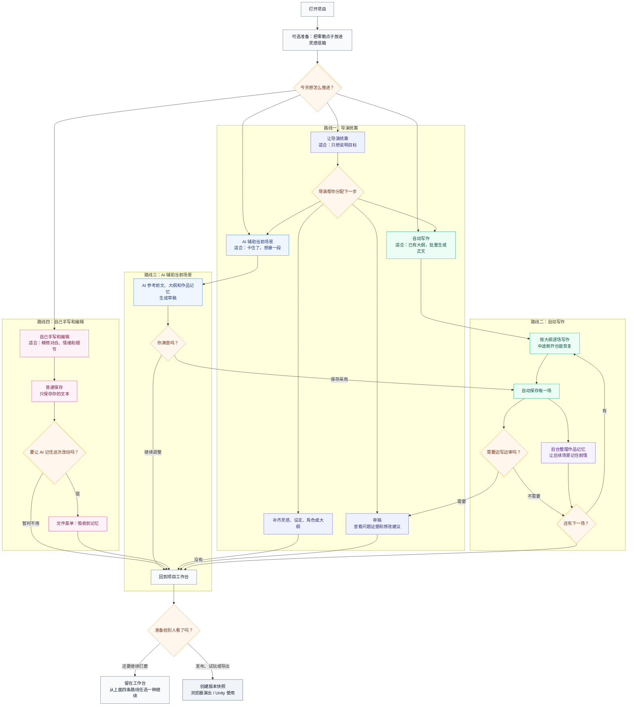
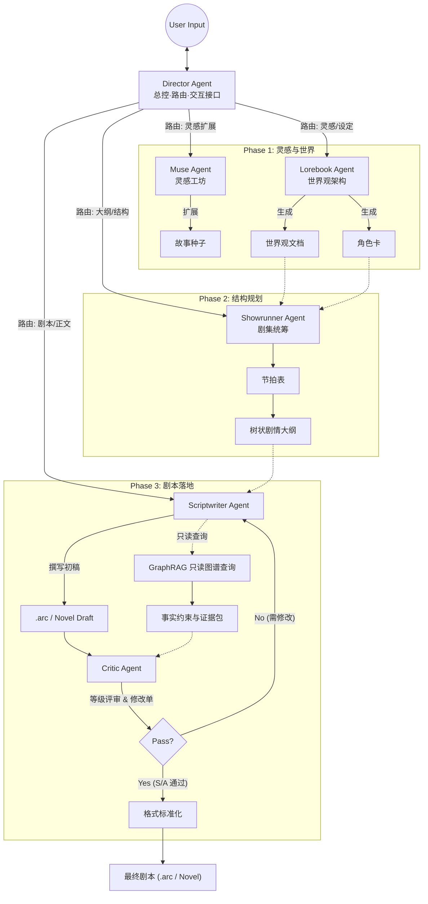
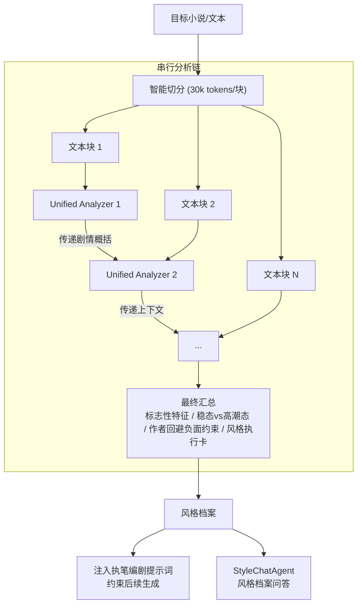
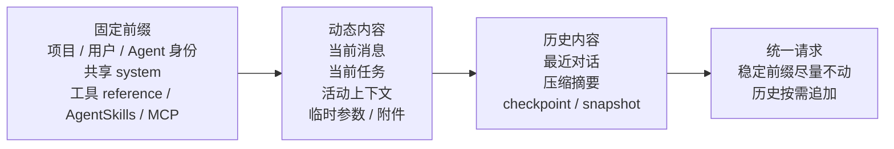
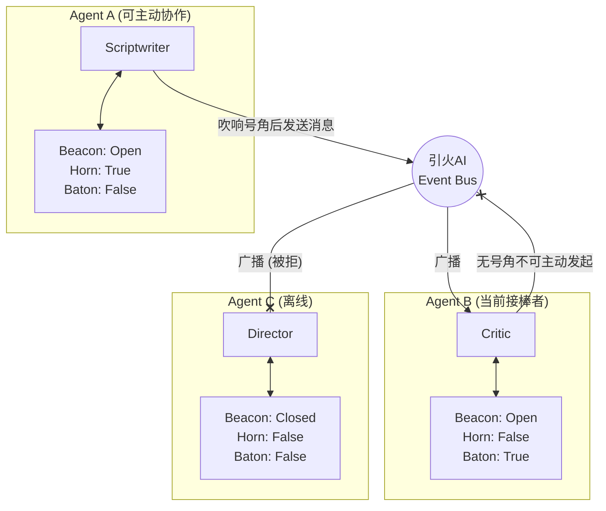

# SparkArcStudio

[简体中文](README.md) | [English](README.en.md) | [日本語](README.ja.md) | [한국어](README.ko.md)

**引火AI创作台（SparkArc Studio）** 是一条**多 Agent 自主创作流水线**：把星星灵感之火**编译**为完整、可运行的故事世界——创作小说与剧本，并驱动 WEB 演出 / Unity 引擎演出。

它打通了**灵感——设定——节奏——大纲——写文——校验——发布——分享——演出**的全链路：你负责灵感与决策，Agent 集群负责把它们变成可交付的作品资产。

> 📊 **工程概览**：9 个注册 Agent（7 位可委派专家 + 2 个系统内服务）· 56 个统一收口工具 · 三模态提示词协议 · 稳定前缀缓存工程 · 170+ 自动化测试文件 · 5 平台客户端 · 四语 UI · MCP 远程接入
>
> ⚡ **两步启动**：`git clone https://github.com/1deaaa/spark-arc-studio && cd spark-arc-studio && docker compose up -d --build` → 访问 `http://localhost:7788`
>
> 📢 **支持与关注**：如果本项目对你有所启发或帮助，请帮我们点个 **Star**（收藏项目防止迷路）和 **Watch**（选择 Custom -> Releases 订阅新版本更新）。作为一个独立开源项目，每一个 Star 和 Watch 都能极大地提升我们在社区中的能见度，对项目的持续迭代和长远发展至关重要，非常感谢你的支持！
>
> 🤝 **联合作者**：感谢 [ @wxwxwkai](https://github.com/wxwxwkai) 在宣发上的付出，没有这些关键工作，本项目不可能面世。

## 核心功能

### 1. 以人为本，自由掌控

引火AI 坚信，**灵感与情感是人类创作不可剥夺的核心尊严**。这是一切AI创作的前提。

无论是灵感迸发时的快速记录，还是精雕细琢时的逐字推敲，你可以自行决定AI介入的程度。
* **你我共舞[推荐]**: 你提供核心立意、关键场景、剧情节奏，AI **严格按你的要求构建整个世界**。你随时可以打断、修改、重写，AI 会立即适应你的新方向。
* **我说你写**: 仅需一首动人的歌词、一个模糊的想法、生活中的见闻，简单交代导演，然后就可以**关掉页面——引火AI的专家们会在后台为你通过缜密的工作流呈上完整的故事**。
* **我写你修**: 完美主义创作者的得力助手。高度可视化的友好工作流，AI只提供梳理、验证和建议。**你完全掌控每一个字，只让AI来当全局苦力、或扮演一个挑剔的读者打磨作品**。

没有质量的创作只能进垃圾桶。

* **长篇创作质量保障**：借助 **作品记忆池** 的实时状态追踪、**审稿人** 的工单报告、以及 **风格克隆** 的反 AI 腔调负向约束，实现了从**写前核设定、写中推逻辑、写后质检**的严格链路，在彻底释放创作者生产力的同时，保障了长篇叙事的质量。

* **长篇创作必须省钱**：引火AI 始终关注大模型请求的缓存命中率，尽量让模型重复利用已经读过的设定、大纲和前文。对于支持缓存的模型服务，命中缓存的内容比重新读取更便宜；作品越长、连续创作越多，越能减少不必要的 Token 花费。

* **专家由你定制**:每个专家**怎么写提示词**，**绑定什么模型**，完全由你决定。你只需要关心写作质量——专家们的底层基建，引火AI已经全部铺好。

* **风格克隆与反AI**: 只需上传作品，就可以启动分析集群**复刻你本人或著名作者创作者**独特的叙事声音、用词习惯与情感色彩。**有效解决了AI创作通篇高频词**的问题，大大**降低了创作的AI味道**。
* **语义检索与批量编辑**：**Agentic RAG+Graph RAG**驱动的自然语言检索、全局替换。你只需要知道一个概念、一个情节就可以精确检索。**角色改名、设定更新——让AI来干杂活**。

### 2. 创作者的IDE，用直觉交互

现在，你是总编剧。只需要**在聊天框**对**导演**说句话，它就可以驱动起一整个智能体创作团队，有条不紊地**与你合作**——或干脆**挂在后台由引火AI全权负责**，开始创作你的庞大世界观，用**多种强大的结构化编辑工具**帮你**自动完成全流程创作**。把**小说/剧本**分享给你的朋友，在**交互式演出端**让TA**沉浸于你的灵感**。

引火AI 致力于将专业的创作流，通过多Agent能力，承载于自然对话之上。

* **超友好、超专业的专业创作体验**：我们用形象的可视化组件将**创作的每一个节点呈现出来**，让创作者能够方便的、随心所欲地编辑。专业得像**写文的Cursor** ，但**没有复杂操作逻辑，所见即所得**。

* **告别手动编辑**：你不再需要编写复杂提示词来约束 AI 既要写大纲又要顾及世界观，你也不需要去到处复制各个Agent所输出的文本，现在一切由工作流安排妥当。导演 Agent 能听懂你的诉求，切分子任务，并精准分发给设定专家、文案策划或执笔编剧，他们**用工具帮你自动编辑**，让你既能享受到严格结构化文本的精准控制，又无需因此增加半点工作。

* **黑盒展开，白盒协作**：普通的 AI 工具往往是在黑盒中直接生成最终长文。而 引火AI 能在后台**自主流转**并向你展示每一步的推演过程，并向你**展示AI的思路**。如不满意，可以**指定专家**进行手术刀式的局部修改。生成不再是盲文抽卡，而是全流程可视的白盒创作。


### 3. 无界创作，不拘于时

灵感往往诞生于**电脑之外——地铁上、散步时，或是一次和朋友的——甚至和AI的闲聊中**。

* **“地铁时间” 碎片化创作**: 专为移动端适配，让你能单手操作，利用通勤的碎片时间审阅大纲、记录灵感或进行简单的剧情选择。高度的自动化让你可以在五分钟的地铁时间完成创作。
* **全平台支持**：支持所有常见平台，*windows、mac、linux、andriod、ios，电脑、平板、手机——都是你的专业Studio！*
* **MCP跨越空间**: 打破设备边界。通过 MCP，你的**手机上**的**RikkaHub**、电脑上的**Claude Code**、任何其他支持MCP的 AI 助手，**闲聊、谈心、调研的时候灵感爆发？只需要一句话，远程吩咐导演启动创作**，或仅发送至灵感信箱记录你的灵感。
* **无人值守自动撰写**: 一键启动 Auto-Write 管道，AI 按大纲逐章逐场景连续生成，**断连不断写**——关闭浏览器也不影响，重新打开即可恢复实时进度。支持暂停/续写/断点恢复，前端展示嵌套进度环。

### 4. 分享星火，展示世界

**AI倍速下，你心中描绘多年的主角可以登台演出了**。不是简单的分享文本，而是你创作的完整演出。

* **WEB演出端**：随时分享你的灵感。观众只需**点击链接**，即可进入剧本。
* **版本快照与导出**：支持一键创建版本快照，可按 `.arc` 互动剧本或纯文学小说两种格式导出，也可从快照一键恢复到工作区。
* **演出资产 AI 生成（已上线）**：背景、角色立绘与场景插图支持上传与在线生成，通过**风格 / 场景 / 角色 / 连续性四类一致性参考图**锁定画面风格，保证同一作品内立绘与背景风格统一；上传立绘可自动抠图，多厂商图像模型（OpenAI / Gemini / xAI 等）统一适配。
* **沉浸演出端**：Three.js 全屏氛围着色器 + 帧率自适应降级；小说模式自动切换纯净阅读器（翻页 / 滚动、字号、阅读进度）。演出资产随版本快照分发。
* **公开分享内容安全**：作品公开前由 AI 分片并发审核（Critic 合规模态），未通过不予公开；管理员可全局控制公开分享策略。
* **规划中功能**：

> 1. 允许自定义 Scriptwriter 功能，衍生出子 Agent（如日常剧情写手、物品设定写手等）
> 2. 用户自定义数据结构，由 Agent 生成对应解析组件在前端显示编辑，组件代码保存入库（LUI / GEN-UI 方向）
> 3. 风格克隆的图灵回测自动化闭环（回测评分规约已内置于分析提示词）

### 5. 工业生产，创作平权

让你剧本里的世界动起来——**生成的剧本可以轻松接入到Unity，驱动游戏引擎的剧情系统**，也可以自行扩展至虚幻、Godot等游戏引擎。相信随着AI的发展，以后**人人都有创作故事乃至创作游戏的权利**。

* **程序解耦**: 策划只需专注于文本与戏剧性，无需编写一行代码，即可控制演出、游戏行为并随时迭代文本。
* **蓝图系统**: 每个项目可配置专属的 `blueprint.json`，定义创作偏好、风格约束与流程参数，让 AI 在你的框架内创作，而非从零猜测。
* **Unity示例**: 提供简易的 **Unity SDK**。感受一键接入的简单，还可以参考**详尽的新手接入指南**。

## 谁适合使用

SparkArc 的核心用户是创作者，同时也覆盖作品体验、技术集成和自主运营。不同角色可从不同入口开始：

| 你是 | 推荐入口 | 主要用途 |
|---|---|---|
| 小说作者、编剧与个人创作者 | 桌面、网页或移动客户端 | 与 AI 协作完成灵感、设定、写作、校验与发布 |
| 创作团队与工作室 | 团队自部署实例 | 组织内部创作、模型接入与项目协作 |
| 读者、玩家与作品体验者 | 浏览器演出或 Unity 演出 | 体验已发布的互动作品 |
| 独立游戏开发者与技术集成者 | Unity SDK、导出资产与 API | 将剧本、事件与演出能力接入自己的项目 |
| 自部署者、运维者与贡献者 | Docker、源码、CI/CD 与开发文档 | 运营实例、扩展能力或参与开源建设 |

只想创作时，连接一个可用工作台即可；需要掌控数据、模型或团队协作时，再选择自部署；开发与集成入口则服务于技术用户。

---

引火AI 的架构严格按照文学、游戏、影视行业的标准流程设计：

| 阶段             | 职位对应                  | 引火AI怎么做                       | 功能描述                                                                                                 |
| :--------------- | :------------------------ | :--------------------------------------- | :------------------------------------------------------------------------------------------------------- |
| **0. 沟通调度**  | Director          | **导演**                      | 全局入口与上下文管理者。基于 LangGraph 多轮工具调用自主调度，可委派任务、触发自动撰写、检查进度，是直接面向用户的交互节点。                               |
| **1. 策划/创意** | Logline / High Concept    | **灵感种子**                      | 捕捉稍纵即逝的 Flash Idea，通过多维标签（风格/基调/视点）将其固化为故事种子。                            |
| **2. 世界观/设定**    | Story Bible / World Guide | **设定专家**                  | 确立物理法则、魔法体系、地理政治以及核心人物小传，确保后续创作的逻辑自洽。                               |
| **3. 节奏/结构**      | Beat Sheet / Treatment    | **文案策划**                | "救猫咪"还是"英雄之旅"？在此阶段确立故事骨架，划分幕结构，生成精确的节奏表。                             |
| **4. 撰写**      | Screenplay / Script       | **执笔编剧** | 最终的“笔”。在结构框架内填充血肉，处理场景描述、动作指导与角色对白；支持互动剧本与纯文学小说双态输出.|
| **5. 质量保证**  | Script Doctor / Coverage  | **逻辑审核 & 文风克隆** | 逻辑审核负责模拟苛刻的审稿人提供冲突或逻辑漏洞的专业反馈；文风克隆负责通过目标文风约束消除 AI 味高频词。GraphRAG 为只读图谱查询能力（`query` / `status`），与语义检索、作品记忆池按问题复杂度路由，重点增强跨章节因果与长期结构一致性。 |
| **6. 发布/演出**      | Implementation / Assets   | **浏览器演出/Unity SDK**                  | 剧本资产化。编译剧本为高性能运行时，驱动游戏内的对话系统、演出调度与任务触发。                                 |

## 创作者一图工作流

你可以把引火AI当成一个“可自动驾驶，也随时允许你接管方向盘”的创作台。日常使用时，你只需要在几种入口之间选择：把任务交给导演、启动自动写作、让 AI 帮你补当前场景，或完全自己手写。系统会在不打断你的情况下整理作品记忆；如果是你手动改过的内容，也可以自己决定要不要让 AI 记住这次改动。



## 详情目录

* [谁适合使用](#谁适合使用)
* [🚀 快速开始](#-快速开始)
* [系统架构](#系统架构)
  * [1. 智能体集群](#1-智能体集群)
    * [风格克隆集群](#风格克隆集群)
  * [2. 上下文结构与统一执行管线](#2-上下文结构与统一执行管线)
  * [3. 信标总线通信机制](#3-信标总线通信机制)
* [质量工程](#质量工程)
  * [互动剧本格式](#arc互动剧本格式示例)
  * [作品记忆池](#作品记忆池)
  * [小说模式](#小说模式)
  * [工程质量护栏](#工程质量护栏)
* [基础设施](#基础设施)
  * [1. 火柴Agent网关](#1-火柴agent网关)
  * [2. 数据库管理](#2-数据库管理)
  * [3. 多租户 SaaS](#3-多租户saas)
  * [4. 语义检索引擎](#4-语义检索引擎)
  * [5. CI/CD 自动化部署](#5-cicd-自动化部署)
* [全平台生态与架构](#全平台生态与架构)
* [📚 深入了解](#-深入了解)
* [开发者本人写在最后](#开发者本人写在最后)

---

## 🚀 快速开始

⚠️本项目服务端、客户端分离，使用前需要有可访问的服务端；桌面 Launcher 可以为个人用户自动准备本地服务端。

**客户端直接使用浏览器访问服务端的 URL 即可。推荐去 release 里面下载专门的桌面客户端。**
桌面客户端启动时会自动检测本机服务端接口，并可引导你一键下载、安装并启动本地后端。

为了方便大家体验，本人维护了一份服务端实例，如果你没有启动服务端，客户端会自动选中我的服务端，也可以注册进行体验。
**限于时间和资金，我无法保证稳定性。因此，这个测试实例可能会经常无法访问，请勿把重要数据放在上面。如有需要，务必自行部署。**

### 方式一：桌面三平台一键启动（推荐新手）

考虑到 Docker 的资源负载和配置时可能遇到的问题，SparkArc 为 Windows / macOS / Linux 桌面用户提供两条明确分离的一键启动路径：Release Launcher 面向普通使用者，源码脚本面向自部署者与开发者。

**环境要求**：

- Windows：Windows 10 或更高版本（首发版本即可）。
- macOS / Linux：便携 Python 的首次准备仍需要系统提供 `bash`、`curl`、`tar`；常见桌面发行版与新版 macOS 默认具备这些基础工具。
- **从 GitHub Release 安装桌面 Launcher 的用户不需要安装系统 Git 或 Node.js。**Launcher 内嵌 Git 实现，并在用户目录维护受管 Node.js。
- 手动 clone 源码、运行 `start.bat` / `start.sh` 的用户仍需要系统 Git（用于 clone）和 Node.js 20+（用于构建前端）。这条路径不会被 Launcher 自动更新或覆盖。

#### 使用方法

推荐新手直接下载 GitHub Release 中的桌面客户端：

1. 打开桌面客户端。
2. 如果本机没有后端，launcher 会提示你“启动本地后端”。
3. 点击后会自动从 `main` 下载受管源码到 `~/.sparkarc/sparkarc-server`；Launcher 只启动这个带受管标记的固定目录。
4. 首次运行会自动准备受管 Node.js、便携版 Python（约 40MB）并安装依赖；不会修改系统 PATH，也不要求安装 VS Code、Git 或 Node.js。
5. 后端就绪后，launcher 会自动连接 `http://localhost:6688` 并进入工作台。它只更新自己创建且带有受管标记的 `main` 工作树，不会覆盖你的 `dev`、手动 clone 或本地改造目录。
6. Launcher 会检查 `main` 是否有新提交；发现更新时由用户选择“更新并启动”，不会静默切换运行中的代码。用户数据、运行时缓存和前端产物会保留。
7. Launcher 壳本身直接检查 GitHub Release。API 受限时会回退到 GitHub 的标准 Release 跳转页，并自动尝试可用镜像；首期只打开对应下载页，不另行维护自定义更新清单。

Launcher 不读取手动源码目录，也不探测安装包同级目录。直接运行源码中的 `start.bat` / `start.sh` 只启动当前源码，不会改变 Launcher 的 APP 数据目录。

也可以先克隆项目，再直接运行根目录脚本：

```bash
git clone https://github.com/1deaaa/spark-arc-studio
cd spark-arc-studio
```

- Windows：双击 `start.bat`
- macOS / Linux：运行 `bash start.sh`

之后再次启动，脚本检测到部署标记会**跳过安装，直接启动**。

访问地址：**<http://localhost:6688>**，或前往release里面下载客户端（推荐）
手机端只需访问**<http://192.168.x.x（你的局域网IP）:6688>**即可
如想远程访问，可以自行了解内网穿透技术（如果你有服务器，应该也不会使用这种方法部署吧~~~）。

> 💡 **零污染设计**：脚本启动时，便携 Python 和依赖产物均在 `server/.runtime/python/` 内；launcher 自动下载时，后端副本位于 `~/.sparkarc/sparkarc-server`。删除对应目录即可还原。
> 💡 **幂等安全**：脚本内置版本检测与部署标记，重复运行不会重复下载或安装。
> 💡 **pip 缓存唯一例外**：pip 下载缓存默认写入用户级缓存目录（Windows 通常为 `%LOCALAPPDATA%\pip\Cache\`），不影响系统。如需清理可执行 `pip cache purge`。
> 💡 **更新边界**：Launcher 受管部署固定跟踪 `main`；源码路径由你自己决定分支和 `git pull` 时机。完整的受管部署与网络回退说明见 [Launcher 本地部署管理器](docs/project/local-deployment-manager.zh-CN.md)。


### 方式二：Docker 一键部署（推荐）

最省心的跨平台部署方式，只需 2 步：

```bash
# 1. 克隆项目
git clone https://github.com/1deaaa/spark-arc-studio
cd spark-arc-studio
# 2. 启动服务
docker compose up -d --build
```

服务启动后访问：**<http://localhost:7788>**

> 💡 **端口区分**：Docker 环境使用 `7788`，裸机环境使用 `6688`，便于同时运行（部分情况下并行调试）和环境区分（生产环境**严禁同时运行以避免可能的数据冲突**）。
> 💡 **数据持久化**：用户数据和数据库会自动保存在宿主机 `server/` 目录中，重启容器不会丢失。
> 💡 **主密钥位置**：`LLM_KEY` 默认写入 `server/llm/agen_matchbox/.env`，无需单独创建 `server/.env`。

然后重新创建容器：

```bash
docker compose up -d --build --force-recreate
```


#### 🔄 拉取新版本后的正确更新方式（非常重要）

请不要只执行 `docker compose restart`。这只会重启旧容器，不能保证新代码生效。

每次 `git pull` 后，请固定执行：

```bash
# 1) 拉取代码
git pull --ff-only

# 2) 重新构建并替换容器（必须）
docker compose up -d --build --force-recreate

# 3) 可选：查看最近日志确认启动成功
docker compose logs --tail=120 sparkarc
```

该流程会确保：

1. 镜像内最新 Git 代码一定被重新构建。
2. 启动时会把受 Git 管理的文件同步回挂载目录，避免旧持久化文件遮蔽新版本。
3. 用户数据库与个人数据（如 `*.db`、`_userdata`、`.env`）继续持久化，不会被覆盖。
4. 本地嵌入所需的 GGUF 模型、llama.cpp 运行包与分词器缓存会持久化到 `server/.runtime`（CI 部署为 Docker 运行时缓存卷），镜像重建后无需重新下载。


### 方式三：本地裸机开发环境

配置完成后VS Code 按F5启动，同样非常便捷。适合**不想用Docker**或者二次开发，请按以下步骤配置：

1. **初始化 Python 环境**

   ```bash
   # 1. 创建并激活 Conda 环境（先确保你部署好了miniconda或anaconda）
   conda create -n sparkarc python=3.13 -y
   conda activate sparkarc

   # 2. 安装后端依赖（依赖清单在 server 目录）
   pip install -r server/requirements.txt
   ```

2. **构建前端界面**

   ```bash
   # 返回项目根目录后进入 client
   cd client
   npm install
   npm run build
   ```

3. **F5启动服务**

  如果前置操作没有报错，直接按下F5即可启动服务端
  服务启动后访问：**<http://localhost:6688>*

#### 可选：开启注册人机验证（Cloudflare Turnstile）

引火AI 支持在注册阶段接入 Cloudflare Turnstile。它只保护“注册”入口：前端显示 Turnstile 组件并取得 token，后端在创建用户前调用 Cloudflare `siteverify` 接口验证 token。

在项目根目录创建或编辑 `.env`，加入：

```env
SPARKARC_REGISTRATION_VERIFICATION_ENABLED=1
SPARKARC_REGISTRATION_VERIFICATION_PROVIDER=turnstile
SPARKARC_TURNSTILE_SITE_KEY=你的 Turnstile Site Key
SPARKARC_TURNSTILE_SECRET_KEY=你的 Turnstile Secret Key
```
说明：

- `SPARKARC_TURNSTILE_SITE_KEY` 是公开站点密钥，会通过 `/api/auth/verification-config` 发给前端。
- 也可以在管理员后台直接保存 Turnstile 配置；后台写入的是服务端持久化数据目录中的运行时 `.env`，Docker 重建后不会丢失。
- `SPARKARC_TURNSTILE_SECRET_KEY` 是私钥，只在后端使用，不会返回给前端。
- **如果没有配置 site key 或 secret key，注册验证默认关闭**，不会影响自部署开发者首次注册。
- 如果你后续想换成 Google、腾讯云等验证平台，保持注册路由不变，扩展 `server/core/verification.py` 的 provider 即可。


### 自部署时如何访问：浏览器与客户端

引火AI 的后端会直接托管前端页面。自部署完成后，最简单的访问方式就是打开浏览器访问你的后端地址：

- Docker 部署：`http://localhost:7788`
- 本地裸机启动：`http://localhost:6688`
- 远程服务器部署：`http://你的服务器地址:端口`

GitHub Release 中提供的桌面客户端会优先探测本机后端（`6688` / `7788`），也可以通过 launcher 启动本地后端。移动端客户端无法在手机上本地部署后端，请在登录前把服务器地址改成你自己的实际地址。默认地址可能指向维护者托管的官方实例，不适合私有部署用户长期使用。

常见填写方式：

- 桌面端访问本机后端：`http://localhost:6688` 或 `http://localhost:7788`
- 手机访问同一局域网内的电脑：`http://电脑局域网IP:6688` 或 `http://电脑局域网IP:7788`
- 远程私有部署：填写你的服务器公网域名/IP 与端口

如果你希望在手机、平板或外地设备上访问自己的私有实例，可以自行购买云服务器部署；也可以用更简单的方案，把本机服务通过内网穿透工具暴露给自己的设备。无论采用哪种方式，请自行做好账号、HTTPS、访问控制、防火墙、模型 Key 与数据备份配置。

> 💡 如果你的私有实例开放公网注册，建议同时配置 HTTPS、注册人机验证、防火墙/反向代理限流、备份策略，并妥善保管 `LLM_KEY` 与各模型平台 Key。

#### MCP 客户端接入

登录后可在桌面仪表盘或移动端 AI 管理页面打开「MCP 连接服务」。同一张配置卡会为统一 MCP 服务生成一个 `spark-arc` 配置，地址为 `/api/mcp/`；控制工具在统一入口下使用 `control_` 前缀。`/api/mcp/control/` 仍作为已有客户端的兼容入口保留。客户端传输类型应选择 Streamable HTTP（`"type": "http"`）。完整配置、工具清单与 Director 工单流程见 [MCP 接入指南](docs/project/mcp-integration.zh-CN.md)。

---

## 系统架构

### 1. 智能体集群

引火AI 不依赖单一的大模型，而是构建了一个分工明确的智能体集群。每个 Agent 都有独立的人设、提示词工程和模型配置。

> 💡 **国际化**：Agent 注册表（`registry.py`）原生支持 `zh-CN` / `en-US` / `ja-JP` / `ko-KR` 四语，前端通过 i18n 映射、后端通过 locale 解析函数（`_resolve_i18n_field`）按请求 locale 提取对应字段。新增语言只需在每个 Agent 条目中加一组翻译。

#### A. 调度者

* **Director Agent (导演)**：
  * **职责**：全局入口与上下文管理者。基于 **LangGraph SupervisorGraph** 实现多轮工具调用自主调度——通过 `delegate_task` 委派专家、`trigger_auto_write` 触发无人撰写、`check_scriptwriter_status` 查询进度，取代了早期的规则式意图识别方案。它负责维护用户会话的连贯性，记录关键决策，并作为“总线”的默认接收端。
  * **核心代码**：`agent_director.py` + `director_graph.py`（LangGraph SupervisorGraph 定义）

#### B. 创意核心

* **Muse Agent (灵感)**：
  * **职责**：创意的起点。捕捉稍纵即逝的灵感火花，通过多维标签（风格/基调/视点）将其固化为故事种子，并可自动扩展为更完整的创意概念。支持通过 MCP 从外部 AI 助手接收灵感。
* **Lorebook Agent (世界观、角色)**：
  * **职责**：从零构建世界观。它能根据简单的种子（Seed）生成详尽的地理、历史、魔法/科技体系，并批量生成与世界观契合的角色卡（Character Sheets）。
* **Showrunner Agent (梗概、节奏、大纲)**：
  * **职责**：宏观叙事把控。它负责生成**节拍表 (Beat Sheet)** 和 **树状剧情大纲 (Tree Outline)**，确保故事结构符合“救猫咪”或“英雄之旅”等经典叙事模型。
* **Scriptwriter Agent (执笔编剧)**：
  * **职责**：微观场景落地。它是唯一的“写手”，负责将大纲转化为具体的剧本正文。支持**双态输出**：`.arc` 互动剧本格式（含对话分支、行为指令、场景跳转）与纯文学小说格式（Markdown）。内置**构思链 (Conception Chain)** 机制，在输出正文前会先生成 `<conception>` 标签进行逻辑推演。

#### C. 质量保证

* **Style Agent**（风格克隆子集群）
  * **职责**：反AI，通过模仿指定作家甚至你本人的文风，来确保大模型在创作的时候避开AI常使用的高频词组，**最大化降低AI味道**。
  * **子集群结构**：由 **UnifiedStyleAnalyzer**（统一串行分析）与 **StyleChatAgent**（风格档案问答交互）协作完成。详见[风格克隆集群](#风格克隆集群)章节。
* **Critic Agent (逻辑审核)**：
  * **职责**：模拟严苛的审稿人。它不直接修改文本，而是审查剧本/小说片段中**读者可感知的 AI 味残留、对白失真、文学承载不足、逻辑与人设问题**，并输出结构化的审稿意见。
  * **工作模式**：既可在聊天面板中自然语言对话，也可在 ScriptWriter 右侧面板手动触发结构化审查。
  * **输出协议**：使用 **S / A / B / C / D** 五档等级，而不是数字分数；同时输出原文证据、命中问题与 `fix_ticket` 风格修改单，便于后续返工。
  * **模型策略**：优先利用大模型的判别与归因能力，把它当成 **LLM Judge / Editor**，而不是训练一个只会给概率分数的专有分类器。

* **GraphRAG Tool（只读图谱查询）**：
  * **职责**：把项目内世界观、角色、大纲与剧本片段转成可检索的关系图谱，在写作或审稿时返回可执行的事实约束与原文证据。
  * **当前状态**：AI 端仅保留 `query` / `status` 只读操作，构建与重建收归设置页手动触发；默认挂载给 Director / Scriptwriter / Critic / Showrunner（连续性工具组）。简单事实问题优先语义检索，最近状态优先作品记忆池，跨章因果、关系演变、知情边界与长期线程才进入 GraphRAG。
  * **质量价值**：重点增强跨章节一致性、角色关系稳定性与设定回收能力，降低长线写作中的“吃书”。完整定位、适用边界与整改路线见[长篇叙事 GraphRAG 定位与整改方案（2026）](docs/project/narrative-graphrag-optimization-2026.zh-CN.md)。

#### Critic 审核机制

Critic 回答的不是"这段是不是 AI 写的"，而是"**这段文字哪里会让读者觉得像模型在完成任务**"。它输出 `S/A/B/C/D` 五档等级 + 原文证据 + `fix_ticket` 修改单，默认不直接改写正文，保留创作者主导权。

> 📗 完整的四条核心机制与"为什么用 LLM 而非 ML 模型"论证，请参阅 [架构深度文档 §6](docs/project/architecture.md#6-critic-审核机制完整版)

#### 协作数据流



#### Agent 三模态调用协议

每个专家 Agent 的提示词严格区分三种调用模态，通过同一 `yaml` 的三个顶层字段承载，保证"手动面板""用户聊天""导演委派"三条路径互不串味：

| 模态 | YAML 字段 | 输出特征 |
| :--- | :--- | :--- |
| **专有工作模式** | `system` + `user` | 严格结构化，可被解析器直接落盘 |
| **用户交互模式** | `chat_system` | 自然对话、可发散、不强制格式 |
| **导演委派模式** | `pipeline_system` | 严格结构化 + 工具落盘 + 向导演简报 |

> 📗 完整的运行态逻辑、`pipeline_system` 写法硬约束、工具 reference 机制与新增 Agent 自检清单，请参阅 [架构深度文档 §2](docs/project/architecture.md#2-agent-统一调用管线) 及 [AGENTS.md §4.5](AGENTS.md)


#### 风格克隆集群

引火AI 最具技术深度的模块——由 **UnifiedStyleAnalyzer（统一分析器）** 串行接力分析 + **StyleChatAgent（风格档案问答）** 组成，捕捉人类作者微妙的文风并生成**可执行的风格档案**，用于约束后续生成、消除 AI 味高频词。

- **串行分析**：长篇小说按 30k tokens 切块，逐块进行 **5 维度全量分析**（思维与认知指纹 / 语言体感 / 情绪处理 / 感官与注意力 / 人际场域），块间传递剧情概括保持上下文，避免碎片化检索的上下文丢失。
- **可执行产出**：每条结论必须是"指令而非观察"，并附脱敏短例举证；最终汇总产出标志性特征、稳态 vs 高潮态语体、**作者回避负面约束（禁忌清单）** 与 10-15 行**风格执行卡**，直接注入执笔编剧的提示词。
- **图灵回测评分规约**：风格档案附带 `S/A/B/C/D` 五档模仿回测评分标准，用于人工核验与后续自动化回测（自动化闭环在路线图中）。

#### 工作流：串行深度分析



> 📗 串行分析细节与负向约束机制的完整说明，请参阅 [架构深度文档 §7](docs/project/architecture.md#7-风格克隆集群完整版)


---

### 2. 上下文结构与统一执行管线

SparkArc 的多 Agent 架构不是“多个提示词并列调用”，而是一套统一执行基础设施。系统会尽量让同一平台、同一模型、同一 Agent 的连续请求保持稳定前缀：项目 / 用户 / Agent 身份、共享 system、工具 reference、AgentSkills / MCP 能力说明尽量不变；当前消息、活动上下文、附件与临时参数放在后段。这样上游前缀缓存更容易命中，同一模型在 SparkArc 里连续工作时通常成本更低、响应更快。



* **固定内容**：身份、角色、共享系统提示、工具 reference、协议骨架。
* **动态内容**：当前消息、目标、活动上下文、附件、临时参数。
* **历史内容**：最近对话、压缩摘要、checkpoint / snapshot。
* **实际收益**：DeepSeek V4 flash max 实测连续导演对话中，第二轮上游缓存命中 token 达到 `10752`，命中率约 `94.5%`。

当完整请求接近当前模型配置的上下文上限时，系统会自动触发创作型压缩，并在聊天界面实时显示压缩状态。压缩只替换后续模型请求使用的运行时历史视图：用户与助手的原始消息仍完整保存在当前用户、项目、Agent 与聊天房间内；摘要证据不足时，Agent 可通过受服务端房间边界约束的 `search_chat_history` 工具按需回查原文。若稳定 system 与当前请求本身已经放不进短窗口，系统会明确提示更换上下文更大的模型，不会静默裁掉用户约束。

这套机制属于**持久化的聊天短期上下文**，不构造跨项目用户画像，也不等同于记录剧情事实的 StoryMemory。完整预算、checkpoint 事务、编辑失效、检索权限及前端事件协议见[聊天上下文管理](docs/project/context-management.zh-CN.md)。

> ⚠️ **缓存失效提醒**：更换模型或平台、修改专家提示词 / `pipeline_system` / `tool_rules`、调整工具绑定、改变语言策略或部分全局参数，都会改变稳定前缀并导致上游缓存重新建立。
> 
> 当前聊天窗口下方显示的缓存命中 token 只统计该窗口所属 Agent 的 `context_window_stats`。导演委派产生的子任务会启用新的 Agent、工具集和上下文前缀，命中率不应混入当前窗口；完整 task 级 `llm_usage` 仍保留全链路汇总，供后台排查成本使用。

* **上下文拼接**：`communication.py` 构造稳定 system 前缀，`prompt_layout.py` 将当前编辑区、附件现场与本轮用户请求放入后段，`context_budget.py` 负责历史预算、压缩与工具循环再预算。
* **统一执行协议**：典型专家 Agent 复用 `SparkBaseAgent` 与 `SparkAgentExecutor`，以 `build_context -> execute -> write_result` 收口业务入口；聊天与导演委派统一走 `chat_stream(skip_tool_confirmation)`。
* **长上下文处理**：附件、超长世界观等“全文放不下”的长文档走统一滑窗底座——切分落盘 + 全局地图 + 双检索定位（语义/正则均可 `scope=["attachment"]` 限定到附件并直达分块）+ 滑窗按需读 + 线索账本（读一片记一笔，跨轮沉淀）。模型永远只看到“地图 + 账本 + 当前一个窗口”，无附件房间零干扰。详见[长上下文处理](docs/project/long-context.zh-CN.md)，阈值见[阈值总览](docs/project/longread-thresholds.zh-CN.md)。
* **统一工具生态**：56 个工具按域分组注册于 `server/agents/tools/registry.py`，再由 `agent_tools.py` 作为公共门面导出，按 Agent 分工绑定；Skill 工具与聊天历史检索采用**条件注入**（仅在已安装 Skill / 存在聊天房间时挂载），保护稳定前缀不被无关工具污染。剧本、大纲、设定等局部替换统一复用 `_apply_patch`，Token 切分与语义分块也复用公共底座。
* **AgentSkills 与 MCP**：AgentSkills 通过 `search_skills` / `read_skill` / `read_skill_reference` 作为写作质量参考按需读取，不自动污染 system 前缀；MCP 统一挂载在 `/api/mcp/`，灵感工具保留原名，控制工具使用 `control_` 前缀。`/api/mcp/control/` 仅作为旧客户端兼容入口保留，写盘仍经既有 Agent 工具管线执行。
* **前端映射**：Agent 名称、描述、徽标和主题色以 `server/agents/registry.py` 为真相源；工具调用 UI 元数据由后端 `build_tool_stream_event` 注入，前端 `chatStore` 统一消费并渲染。
* **执行纪律（说了 ≠ 做了）**：导演委派必须以**真实落盘回执**（`complete_pipeline_step`）交差——只输出草稿不落盘会被打回重做；导演**进度板**（work_tracker）持久化任务清单并强制委派绑定任务条目；同工具连续失败触发熔断。多 Agent 协作"有账可对、有据可查"。
* **可靠性底座**：模型流空闲看门狗（首活动截止 + 单轮重试，不放大用户等待）；聊天 / Auto-Write / 后台构建三类崩溃恢复（interrupted 收口保进度、游标续写、双事件取消下部分结果保存）；上下文压缩不拆散工具链历史（ToolCall / ToolMessage 成对保留）。
* **写前核设定**：导演委派执笔编剧时自动组装**场景交接包**——大纲场景契约 + 作品记忆池实时人物状态、关系、开放线索与修订工单；写作上下文按"最近场景全文 + 跨章尾声 + 梗概节拍表"三圈策略组装，直接支撑长篇连贯性。

> 📗 更完整的上下文结构、缓存命中显示、Agent 职责表、AgentSkills/MCP 边界与工具注册细节，请参阅 [架构深度文档 §2-§3](docs/project/architecture.md#2-agent-统一调用管线)。

### 3. 信标总线通信机制

为了解决多 Agent 之间复杂的水平交互问题，引火AI 设计并实现了**信标总线**。这是一种带权限控制的消息路由架构，使用“信标 / 号角 / 旗帜”三件套来模拟真实协作中的“是否可见”“是否可主动发话”“当前任务在谁手里”。

> ⚠️ **当前状态**：信标总线的完整基础设施均已实现并可通过 UI 操作，但目前 Agent 间的水平自主通信为**预留能力**——评估发现，**主流模型尚不完全具备处理多轮、多角色、长交互的能力**。当主流模型模型复杂推理能力、注意力达到要求时，本机制将正式启用，**通过开启水平交互，实现创作效率与质量的二次飞跃**。

#### 核心机制：信标 / 号角 / 旗帜

每个 Agent 拥有独立的三件套：**信标**（是否可见/可触达）、**号角**（能否主动发话）、**旗帜**（当前任务链在谁手里），三者拆开可见性、主动通信权和任务归属，降低多 Agent 集群的上下文心智负担。

#### 交互拓扑图



> 📗 完整的三件套定义与应用场景，请参阅 [架构深度文档 §8](docs/project/architecture.md#8-信标总线核心机制完整版)

#### 导演调度 vs 信标协作（垂直与水平协作）

引火AI 中存在**两套独立且职责不同的通信机制**：

- **导演调度**（垂直）：Director 基于 LangGraph 多轮工具调用自主调度，不受信标限制，可直接实例化 Agent 并调用。
- **信标协作**（水平）：Agent 间自主通信受信标/号角/旗帜共同约束，防止广播风暴与死循环。

> 📗 完整的对比表、交互模式示意图及设计理由，请参阅 [架构深度文档 §1](docs/project/architecture.md#1-导演调度-vs-信标协作双系统对比)


---

## 质量工程
引火AI致力于**尽可能地解放AI最大的潜力**。为此，我们设计许多独特的质量工程。
我们定义了一种兼顾**人类可读性**与**机器解析能力**的混合格式 —— **ARC**。它结合了 Markdown 的流畅阅读体验与 XML 的严谨逻辑结构，能让你在方便编辑的同时，让AI也能解放最大的创作潜力。
基于严谨的调查研究，**最大化的保全了大模型在超长结构化文本创作时的创作文学质量。** 这是本数据格式最大的价值。

### ARC互动剧本格式示例

```markdown
# 场景标题：最后的告别
@guide 任务指引：陪她走完最后一段路
@intro 场景初始化描述...

[-1]
这里是旁白区域。落日将街道拉得极长，梧桐树影斑驳。

[0]
还记得这里吗？

[1]
老爷爷……糖……

<choice>
  <opt text="指着远处的校门口">
    [0]
    你看，那是我们第一次见面的地方。
    @next 场景_回忆
  </opt>
  
  <opt text="保持沉默">
    [-1]
    沉默在空气中蔓延。
    @act system:AddMood(-5)
  </opt>
</choice>
```
此格式最终会编译为高性能、零错误的数据库，驱动演出。
我们默认不给AI撰写函数节点的权限，保证AI专注创作。**待模型能力提升后，再逐步开放。**

> 📗 完整的解析策略细节，请参阅 [架构深度文档 §9](docs/project/architecture.md#9-arc-格式解析策略)

### 作品记忆池

长篇创作最怕两件事：一是世界观和角色设定频繁被临时剧情改乱，二是后续章节忘记前面已经发生过的事。引火AI 把这两件事分开处理：

- **作品记忆池**记录已经保存过的剧情事实，例如角色最近出场、当前状态、人物关系、开放线索、必须保持的事实和原文证据。
- 自动写作或 AI 辅助写作保存后，系统会在后台整理记忆；手写内容则可以通过文件菜单手动“吸收到记忆”。
- 记忆池**只负责诚实整理事实和证据，不替你决定剧情该怎么写**。真正的文学表达、伏笔回收方式和人物弧光仍由执笔编剧根据大纲、设定和**你的意图**完成。

这样设计是为了让长篇作品既能保持“作品圣经”的稳定，又能让后续场景记住真实写过的前情，而不把每次小改动都变成一次危险的全局设定重写。

### 小说模式

除了互动剧本格式，引火AI 还支持**纯文学小说**输出模式。当项目切换为小说模式时：

- 专家们将使用更符合小说的文学风格
- 演出端自动切换为纯净专注的小说阅读器
- 剧本编辑器自动切换为小说视图

两种模式共享同一套世界观、角色、大纲和节拍表，仅在最终输出格式上分化。

### 工程质量护栏

- **自动化测试**：服务端 96 个测试文件（24 个业务领域目录 + 10 个基础建筑契约测试 + 火柴网关独立套件）+ 前端 81 个测试套件（含架构 / 性能 / 集成分层），基础建筑测试禁止调用真实大模型，只守护统一管线协议。
- **CI 质量门**：i18n 严格校验（CJK 硬编码扫描工具链）、类型检查、前后端单测、双端构建、Docker 构建逐级把关。
- **运行态取证**：可开关的请求级 JSON 取证（runtime_capture），用于审计真实上下文布局与工具调用闭环，支撑缓存命中与质量评测。
- **内容安全**：公开分享前 LLM 合规审核（30k 分块并发、不过不公开）；ARC 安全净化器在进模型前剥离控制指令与插画提示词（防提示词注入）；工具事件敏感键脱敏。


---

## 基础设施

为了这个庞大平台的稳定性，引火AI搭建了许多功能完备的基础设施。它们都考虑了通用性，你可以**轻松地迁移到你自己的项目上**。**我希望我的工作可以帮到更多想在这个浪潮中做点东西的开发者**。

### 1. 火柴Agent网关

底层由火柴Agent网关统一接管，它是面向 Agent 开发的独立大模型网关。组件严格执行接口抽离，可部署在其他项目。具备自带 GUI 界面、极细颗粒度的双口径配额计费、限流等全链路功能。

网关**兼容 Open AI 协议**，并支持自动将常见的推理字段统一为推理流，确保最佳的流式体验。

核心能力概览：

- **双通道设计**：强管理通道（默认业务通道）+ 轻量直连通道（旁路能力）
- **灵活托管模式**：系统托管 / BYOK / 混合模式，站长自由决定商业模式
- **多口径配额与账单**：`sys_paid` / `self_paid` 独立流控，周期性限流 + 总量封顶
- **精准 Token 估算**：基于 `tiktoken` + 动态 CJK 修正系数，确保计费精准
- **多用途槽位**：Fast（快速）/ Reason（推理）/ Main（默认），按任务复杂度路由模型

> 📗 完整的双通道设计、接入链路、槽位配置与推理流兼容细节，请参阅 [火柴Agent网关完整指南](server/llm/agen_matchbox/README.md)


### 2. 数据库管理

引火AI默认使用SQLite与高性能的向量数据库LanceDB作为本地无需部署的数据库方案。
业务数据库可以通过**开关一键切换到PostgreSQL**获得大用户量生产级性能；项目级语义向量索引默认使用 LanceDB，与业务库解耦。

#### 自动迁移

引火AI 内置了**启动期自动迁移**能力，确保用户拉取新代码后无需手动升级数据库即可运行。

#### 🚑 首先，把救命方法写最前面

自动迁移机制尽可能地考虑了各种极端情况，但仍然无法避免数据库版本错误的可能。
我们无法避免开发者（当然也包括我本人）在开发过程中犯的错。
但有一点可以保证，那就是数据安全。如果出现了数据库相关报错，**不要惊慌，你的数据是完好无损的**。
请把定义表结构的 models和出错的数据库文件复制出来。

1. 把 models 和数据库文件 给 AI代码助手，并**备份一份数据库文件**。
2. 告诉 AI 使用 SQL 语句，根据migrations记录同步数据库文件到 Models 最新版本。必须保证数据安全。（由于数据库密钥数据采用加密存储，所以无需担心 AI 泄露）
3. 把数据库文件覆盖回去
4. 重启后端，结束

#### 核心特性

1. **多数据库分支**：`users.db` 与 `llm_config.db` 采用独立 `version_locations`，互不干扰
2. **启动自动升级**：如果上游更新数据库格式，启动时使用 Alembic API 直接升级；已是最新时自动跳过
3. **最早阶段执行**：迁移在应用生命周期最前面完成，避免业务初始化占用数据库锁
4. **临时库生成迁移**：生成脚本基于迁移链构造临时 DB，不再受开发机真实 DB 污染
5. **智能重命名检测**：自动识别字段重命名并询问确认
6. **危险操作拦截**：`DROP COLUMN` / `DROP TABLE` 强制交互确认
7. **孤儿版本自愈**：迁移链被打断时保守补缺失表/列并对齐版本号，默认不删除额外结构
8. **head 漂移保护**：版本号已是 head 但缺字段时直接报错，避免悄悄吞掉应提交的 migration

> 📗 完整的开发者工作流、迁移接入指南与清理历史风险说明，请参阅 [数据库自动迁移完整指南](docs/project/database-migration.md)


### 3. 多租户SaaS

**你完全可以把引火AI部署给自己的团队成员或者朋友使用。**
系统采用基于角色的访问控制，并通过自动化机制简化初始配置。

* **首位管理员**：系统会自动将**第一个注册的用户**设为管理员，拥有修改系统模型平台的权限。
* **默认权限**：除首位用户外，所有新注册的用户默认为普通用户 (`is_admin = 0`)。
* **权限授予**：首位管理员可通过 UI 界面中的"管理中心"授权其他用户成为管理员。
* **运营闭环**：点数账本与按模型定价、兑换码发放、额度发放活动（幂等补发 / 撤销语义）、用户反馈工单与系统公告——自部署即获得完整的多租户运营能力。

---

### 4. 语义检索引擎

引火AI 内置了项目级语义检索引擎，为导演 Agent 提供**正则搜索 + 语义搜索**双模式检索能力，并支持基于搜索结果的文本替换。

#### 产品能力

- **双模式检索**：`search_project` 正则搜索支持精确模式匹配，`semantic_search` 语义搜索基于向量相似度理解内容含义，两者结果格式统一、均可作为 `replace_from_search` 的输入
- **项目级开关**：每个项目独立启用/禁用，启用时自动测试嵌入模型可用性，失败时给出明确指引
- **默认启用**：支持配置新项目是否默认启用语义检索
- **自动索引更新**：项目内容变更后，下次搜索时自动检测文件哈希变化并增量重建索引

#### 技术架构

- **向量化管线**：基于 LanceDB 本地向量库构建，通过火柴网关获取用户配置的 Embedding 模型，支持任意 OpenAI 兼容嵌入 API
- **懒构建 + 哈希增量**：首次搜索时自动构建索引，后续通过 MD5 文件哈希比对检测变更，未变更时复用已有索引
- **分块策略**：`SemanticChunker` 按语义边界切分项目文本，保留叙事定位（`narrative_ref`）、行号范围等元数据
- **中文项目名兼容**：LanceDB 表名通过 MD5 哈希转换，解决中文项目名不符合命名规范的问题
- **批量向量化**：按 batch_size=50 分批调用嵌入 API，适配主流模型的批量限制
- **可选本地嵌入引擎**：零外部 API 的本地向量化——自动下载 llama.cpp 运行包与 GGUF 嵌入模型（含镜像回退），本地进程托管与健康诊断，开箱即用

---

### 5. CI/CD 自动化部署

引火AI 内置了完整的 CI/CD 流水线，支持代码推送后**全自动构建镜像、测试并部署**，无需任何手动干预。

流水线以 **Gitea Actions 与 GitHub Actions** 双生态交付（含桌面 / Android 发布流水线与 Gitee Release 同步），可低成本迁移到其他 CI 平台。

流水线阶段：**检出代码 → 构建镜像 → 测试（预留） → 部署 → 清理**

> 📗 完整的 Runner 配置、CI Secret、GitHub Actions 迁移说明，请参阅 [CI/CD 自动化部署完整指南](docs/project/cicd-deployment.md)


---

## 全平台生态与架构

### 组件逻辑布局解耦

为了实现**地铁五分钟**的无缝体验，引火AI 采用分离架构：

* **Business Logic (Composables)**: 所有的核心业务逻辑被封装在独立的 Composable 函数中（共 26 个），不依赖具体 UI。关键 Composable 包括：
  - `useSynopsisLogic` / `useScriptWriterLogic` — 梗概与编剧
  - `useWorldLogic` / `useStyleLogic` / `useStructureLogic` — 世界观、风格、结构
  - `useAIModelManager` / `useAIPlatformManager` / `useAIEmbeddingManager` — 模型与平台管理
  - `useAgentRegistry` / `useChatActions` / `useAdminLogic` — Agent 注册、聊天与管理
  - **项目正在往LUI的方向演进。不久的以后，你的每一句话，都可以开启一个复杂的创作流。**
* **流式基础设施层**：前端统一通过 `streamingRuntime.ts` 的 `createStreamingTask` 托管所有业务流式任务（SSE / 文本 / NDJSON 三协议读取器、思考流统一解析、可取消与统计），配合 `loadingStats.ts`（全局遮罩统计）、`eventBus.ts`（事件总线）、`GlobalLoading.vue`（全局加载 UI）形成完整的流式消费闭环。聊天流支持断线恢复与 `afterSeq` 游标回放，刷新不丢流；聊天流与业务任务流两条主链路独立运行，互不干扰。

* **全尺寸屏幕适配**:
  * **Desktop Views**: 针对宽屏优化的复杂工作台，提供多列布局与详细控制面板。
  * **Mobile Views**: 针对竖屏优化的流式交互界面，强调阅读体验与快速操作。大部分核心视图（梗概、结构、世界观、风格分析等）均提供独立移动端视图，编剧台（ScriptWriter）在移动端提供轻量工作台，复杂精修仍推荐桌面端。

### Tauri 2 跨平台构建

前端已接入 Tauri 2，Windows / Linux / macOS / Android / iOS 的完整“傻瓜化”构建教程请查看 [docs/tauri/tauri2-all.md](docs/tauri/tauri2-all.md)。

简易发布速查（进入项目根目录后 `cd client`）：

1. 安装依赖：`npm install`
2. 桌面端（Windows / Linux / macOS）：`npm run tauri:build`
3. Android：`npm run tauri:android`
4. iOS：`npm run tauri:ios`
5. 本地调试（桌面端）：`npm run tauri:dev`

注意事项：

* **macOS / iOS** 需要在 macOS 设备上编译与签名。
* **Android** 需要安装 Android Studio，并配置好 SDK / NDK 环境。
* **构建产物** 会自动同步到项目根目录的 `app-build/` 下并按平台区分。

### Unity 游戏引擎集成（BETA）

> Unity SDK (`SparkArc.Unity`) 目前作为独立模块位于 `presenter/UnitySDK`，旨在为独立游戏开发者提供开箱即用的剧情解决方案。**当前为 BETA**：已覆盖对话树、分支跳转、场景条件求值、状态存档与效果回写、属性化行为派发（含 Editor 行为清单导出器），并附 MinimalRuntime 示例工程、运行时冒烟探针与两份接入文档。

#### 全流程数据管线

1. **创作端**: 策划完成剧本创作，导出标准化的 `.arc` 文件或 `stories.db` SQLite 数据库。
2. **资产层**: 将数据库文件放入 Unity 项目的 `StreamingAssets` 目录。
3. **运行时**:
    * **StoryRepository**: 游戏启动时自动加载并缓存剧本数据。
    * **DialogueManager**: 核心驱动器。解析当前的 Story Node，处理文本显示、选项分支跳转。
    * **Event System**: 剧本中的 `@act` 行为指令通过统一的 `OnActionTriggered(string func, string[] args)` 事件广播，开发者在业务层注册对应处理器（如播放动画、添加任务），无需修改对话系统代码。

通过这套管线，开发者可以实现灵活的剧情迭代——修改剧本无需重新编译代码，运行时手动调用重载方法即可刷新数据库。

---

## 本地化与语言政策

- UI 支持语言：`zh-CN`、`en-US`、`ja-JP`、`ko-KR`
- 前端语言可在设置中即时切换
- Agent 系统提示词的语言策略：

1. 默认优先使用当前 locale
2. 仅当用户主动使用其他语言或明确要求切换时才切换

前端贡献规范：避免硬编码用户可见文案，使用 Vue I18n。

---

## 仓库指南

- 主要贡献指南：`.github/CONTRIBUTING.md`（英文）
- Agent 约束与架构规范：`AGENTS.md`
- Agent 语言方针与开发规范：[AGENTS.md](AGENTS.md)

---

## 📚 深入了解

| 文档 | 内容 |
| :--- | :--- |
| [架构深度文档](docs/project/architecture.md) | 导演调度 vs 信标协作对比、Agent 三模态完整协议、Critic 审核机制、风格克隆集群、信标总线核心机制、ARC 解析策略、工具注册表、流式基础设施层、稳定前缀契约、前端恢复契约、MCP 挂载顺序 |
| [聊天上下文管理](docs/project/context-management.zh-CN.md) | 自适应预算、自动压缩、原始历史持久化、checkpoint 事务、按需原文检索与 StoryMemory 边界 |
| [长上下文处理](docs/project/long-context.zh-CN.md) | 附件与超长世界观的滑窗底座：切分落盘、全局地图、双检索定位、按需读窗、线索账本、前缀缓存布局 |
| [滑窗阈值总览](docs/project/longread-thresholds.zh-CN.md) | 所有长文本阈值的定义位置、默认值与作用范围 |
| [长篇叙事 GraphRAG 定位与整改方案（2026）](docs/project/narrative-graphrag-optimization-2026.zh-CN.md) | GraphRAG 适用边界、只读运行态、混合召回与查询路由、叙事图升级与增量构建路线 |
| [上下文压缩策略对照](docs/project/context-compaction-comparison.zh-CN.md) | Codex、OpenCode 与 SparkArc 上下文压缩策略的源码级对照 |
| [客户端热更新与版本治理](docs/project/client-runtime-update-strategy.zh-CN.md) | 浏览器端与 Tauri 客户端的前端版本独立发布与壳层升级策略 |
| [Launcher 本地部署管理器](docs/project/local-deployment-manager.zh-CN.md) | Release Launcher 受管 `main`、系统 Git/Node 边界、网络回退、数据保护与更新流程 |
| [火柴Agent网关指南](server/llm/agen_matchbox/README.md) | 双通道设计、接入链路、槽位配置、推理流兼容 |
| [数据库自动迁移指南](docs/project/database-migration.md) | 开发者工作流、迁移接入指南、清理历史风险 |
| [CI/CD 部署指南](docs/project/cicd-deployment.md) | Runner 配置、CI Secret、GitHub Actions 迁移 |
| [AGENTS.md](AGENTS.md) | Agent 开发规范、新增 Agent 自检清单、提示词协议 |
| [语义检索引擎](#4-语义检索引擎) | 双模式检索、项目级开关、懒构建+哈希增量、LanceDB 向量存储 |
| [LEGAL/README.md](LEGAL/README.md) | 法律与运营声明统一入口 |

---

## 法律与运营声明

为便于说明官方实例、第三方部署、内容治理、隐私处理与知识产权边界，仓库根目录新增了 [`LEGAL/README.md`](LEGAL/README.md) 作为统一入口。

当前中文法律与运营文档包括：

- [`LEGAL/LicensePolicy.zh-CN.md`](LEGAL/LicensePolicy.zh-CN.md)
- [`LEGAL/TrademarkPolicy.zh-CN.md`](LEGAL/TrademarkPolicy.zh-CN.md)
- [`LEGAL/TermsOfService.zh-CN.md`](LEGAL/TermsOfService.zh-CN.md)
- [`LEGAL/PrivacyPolicy.zh-CN.md`](LEGAL/PrivacyPolicy.zh-CN.md)
- [`LEGAL/OfficialInstancePolicy.zh-CN.md`](LEGAL/OfficialInstancePolicy.zh-CN.md)
- [`LEGAL/ThirdPartyOperatorNotice.zh-CN.md`](LEGAL/ThirdPartyOperatorNotice.zh-CN.md)
- [`LEGAL/ContentPolicy.zh-CN.md`](LEGAL/ContentPolicy.zh-CN.md)
- [`LEGAL/EvidenceAndIPCompliance.zh-CN.md`](LEGAL/EvidenceAndIPCompliance.zh-CN.md)

说明：

- 仓库级法律文件用于公开证据、站内复用和第三方部署参考。
- 站内 ToS 接口按 `?lang=` 优先读取 `LEGAL/TermsOfService.{lang}.md`，缺失时回退读取 `server/data/TermsOfService.md`；`LEGAL/TermsOfService.zh-CN.md` 同时作为第三方部署参考模板保留。
- 第三方部署者在向公众提供服务前，应按自身情况补充运营主体、域名、备案/许可、投诉邮箱与隐私信息。

## 品牌与商标声明

SparkArc 是本项目的官方名称与标识。

本项目代码基于 AGPL-3.0-only 开源，但 **"SparkArc" 名称、Logo、品牌视觉及相关标识不包含在代码授权范围内**。

任何基于本项目的部署、修改版或分发版，均不得暗示与原项目存在官方、授权、代理或合作关系。

火柴 Agent 网关（`server/llm/agen_matchbox`）是独立可复用组件，按该目录内 `LICENSE` 以 Apache-2.0 单独授权；根项目其他部分除非另有说明，按 AGPL-3.0-only 授权。

---

## 赞助与商业合作

如果您是模型API 聚合平台，欢迎查看我们的 [**赞助与合作指南**](.github/SUPPORT.md)。我们提供了极具流量价值的“默认配置下发”等方案，以互惠您赞助的开发与测试 API 额度。**我们需要赞助来维持项目的高速迭代。**

---

## 开发者本人写在最后
本项目的初版，从设计、开发、到测试，全程由我们两人完成，所以难免有许多瑕疵。我们平时时间较为紧张，维护工作可能不会那么的及时，欢迎各位佬积极参与维护。

这个项目最早是工作室内部用于游戏剧情系统开发使用。

**因为AI已经通过MCP、skills等极大的加速了游戏开发的大部分流程，曾经一个人的游戏梦，现在再也不是遥不可及。**

**设计它，初衷是补全AI游戏开发的一块非常重要、AI尚不擅长的拼图——剧情系统**。

后来打算潜心沉淀，便把这个项目作为Agent前沿技术的试验田，让它能够先有用户，后续再听取反馈慢慢迭代到游戏引擎上。

除非不可抗力，我会保持 引火AI 长期开源。无论未来新增什么功能，维护者都会优先同步到公开仓库。

我欢迎个人、创作者、小团队和工作室自部署 引火AI，用于个人创作或内部协作。也欢迎大家以 Issue、PR、文档、工作流、教程等方式共同建设生态。

引火AI 基于 AGPL-3.0-only 发布。你可以在遵守 AGPL-3.0 的前提下运行、复制、修改、部署和分发本项目。若你修改 引火AI 并通过网络向他人提供服务，应按 AGPL-3.0 要求向该服务用户提供对应版本的完整源码（欢迎贡献回本项目），并保留版权、许可证和来源声明。

我本人亦受协议约束，欢迎各位贡献者、部署者和社区成员一起维护 引火AI 的开放生态。

引火AI 的官方实例仅由 1deaaa / AIdeaStudio 独立运营。官方实例未来可能以公益、赞助、付费额度、托管服务或其他方式维持项目持续开发。

我也希望每一位贡献者、部署者和社区成员都保留这种意识：**引火AI 的开放不是为了让人闭源套壳、抹去来源、拿社区成果单向牟利**。**请一起维护 AGPL 赋予我们的权利**：**保留署名与许可**，按要求**公开对应源码**，**标明修改与来源**，尊重品牌和官方实例边界。

**合规自部署、内部使用、学习研究、贡献生态都被欢迎；规避 AGPL、白标冒充或把第三方运营风险转嫁给社区的行为不被接受。**

维护者不向第三方授予闭源商业化、白标运营、品牌代理、官方联名、商标使用或 AGPL 豁免授权。任何第三方部署、修改、分发或运营 引火AI，均必须遵守 AGPL-3.0，并自行承担其用户、内容、模型接入、支付、点数、兑换码、客服、合规和法律责任。

**实际运营者和其用户产生的任何生成式内容的合规问题均与本人无关**。在此也提醒对公众开放服务的各位站长：**务必谨慎处理匿名分享、内容审核、实名要求、日志留存与模型合规问题**。

<!-- 本次提交的 AI 协作者信息记录在 Git trailers 中。 -->
