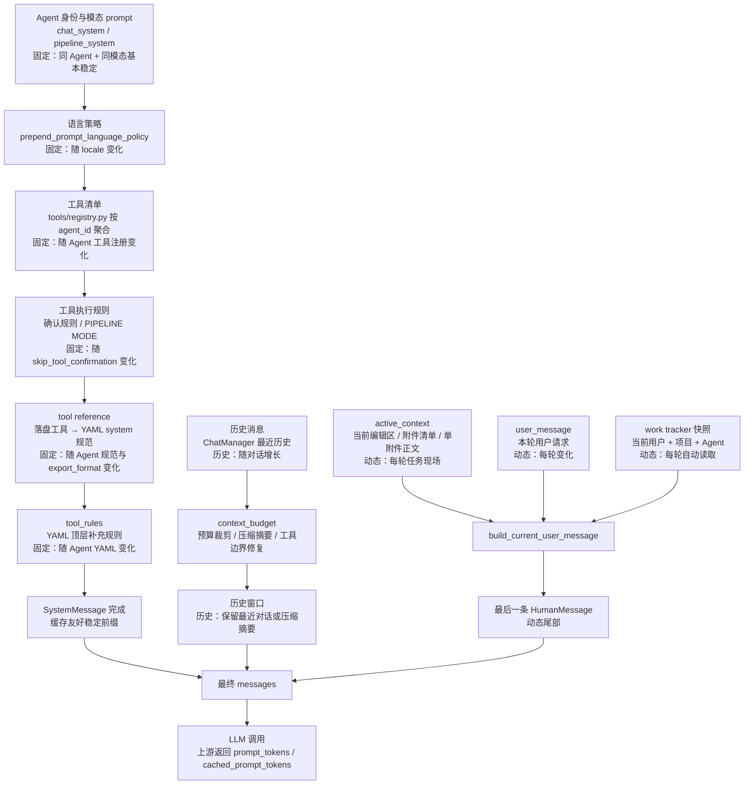
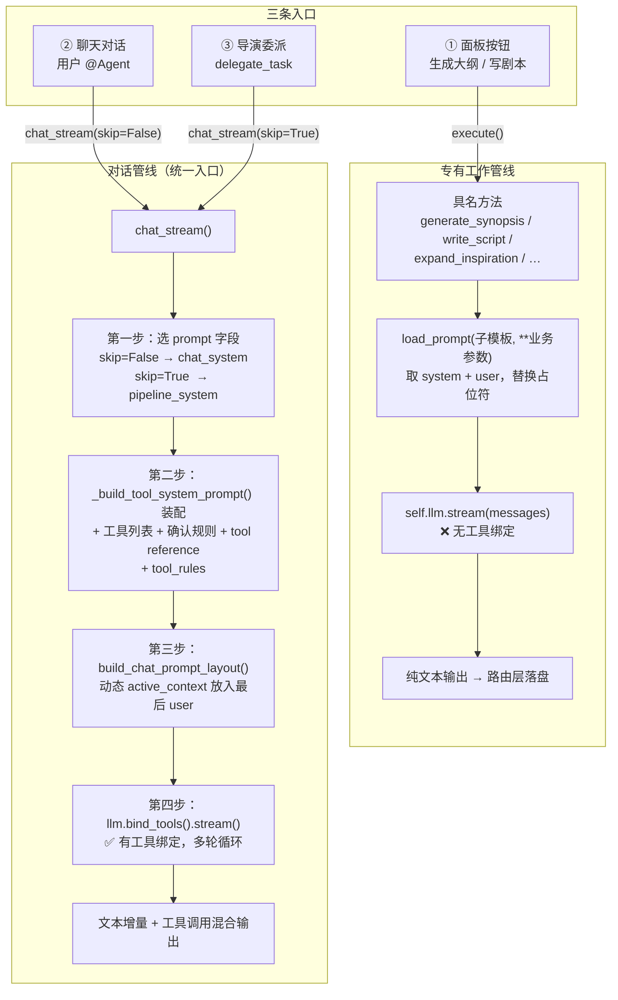
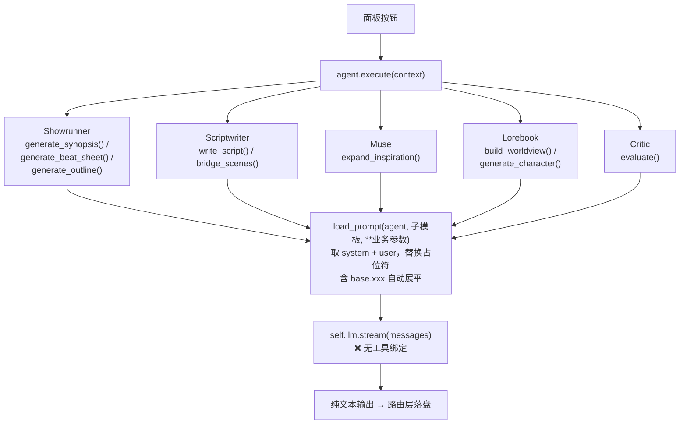
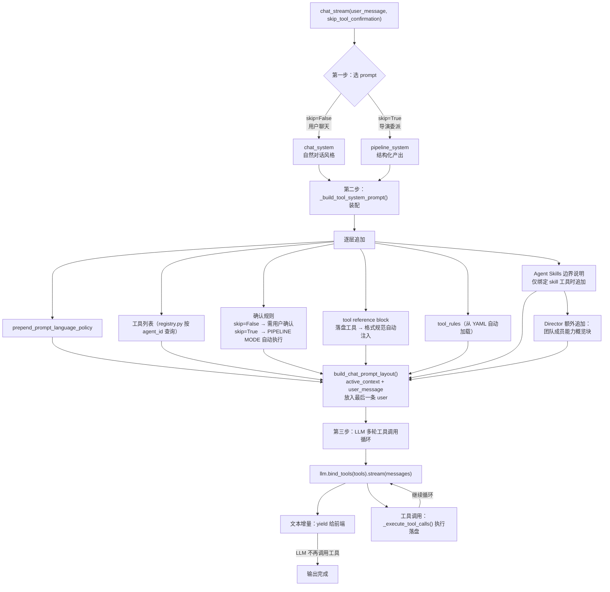
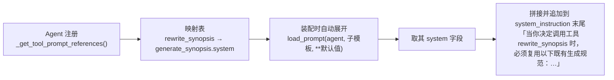
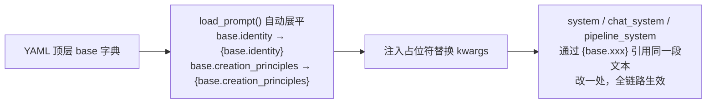
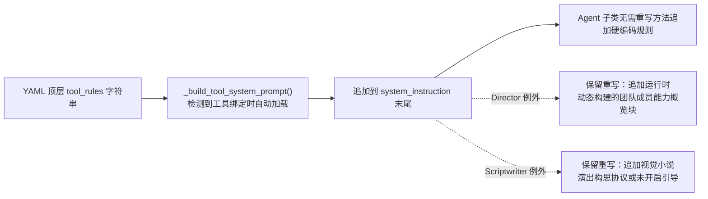
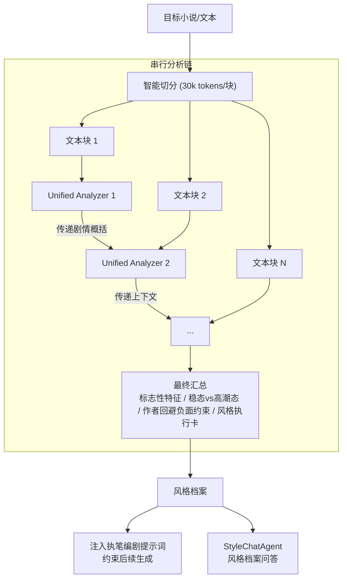
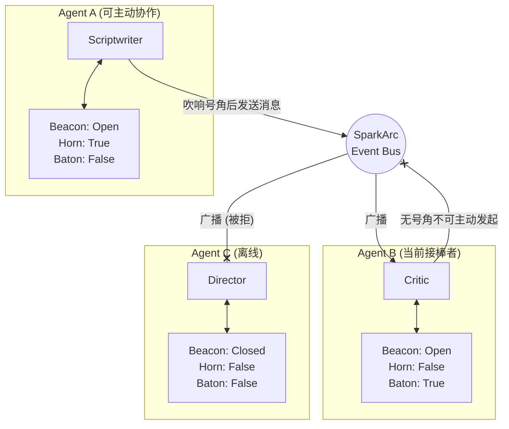

# SparkArc 架构深度文档

本文档包含 SparkArc 架构的深度技术细节。README 中仅保留概述，完整内容在此展开。

---

## 1. 导演调度 vs 信标协作——双系统对比

SparkArc 中存在**两套独立且职责不同的通信机制**，它们共同构成完整的 Agent 治理体系，而非功能冗余。

### 1.1 导演调度机制（Director Orchestration）

Director Agent 基于 **LangGraph SupervisorGraph** 实现多轮工具调用自主调度，取代了早期的规则式意图识别方案。

#### 调度工具集

> 真相源：`server/agents/tools/registry.py` 的 `DIRECTOR_BASE_TOOLS`。下表与代码保持一致；
> Skill（`search_skills` / `read_skill` / `read_skill_reference`）与聊天历史（`search_chat_history`）
> 为条件追加工具，不计入固定调度集，详见 §3.1。

| 工具名 | 功能 | 说明 |
| :--- | :--- | :--- |
| `list_chapters` | 查看项目章节结构 | 理解全局结构后决定分派 |
| `read_chapter_scene` | 读取具体场景内容 | 精确了解当前进度 |
| `read_chapter_outline_raw` | 读取原始大纲文本 | 获取原始规划信息 |
| `delegate_task` | 委派任务给专家 Agent | 核心调度动作，返回 Sentinel 交由 LangGraph 拦截 |
| `organize_scenes_to_chapter` | 整理场景到章节 | 复用 Scriptwriter 章节整理能力 |
| `work_tracker` | 工作进度追踪 | 仅负责创建或增量更新任务板；当前板面由系统自动注入消息尾部 |
| `trigger_auto_write` | 触发无人值守自动撰写 | 启动 Auto-Write 管道 |
| `check_scriptwriter_status` | 查询自动撰写进度 | 检查 Auto-Write 状态 |
| `update_project_story_tags` | 更新项目创作参数 | 维护故事主题参数 |
| `search_project` | 正则搜索全项目文本 | 快速定位关键词/模式 |
| `semantic_search` | 语义搜索项目文本与附件 | 按语义相关性检索内容 |
| `replace_from_search` | 基于搜索结果替换文本 | 批量修改命中片段 |
| `story_memory_tool` | 只读故事记忆 | 查询实时故事状态，不提供剧情方案 |
| `graph_rag_tool` | 只读图谱查询 | 仅 `query` / `status`，构建与重建收归设置页手动触发 |
| `web_search` | 联网搜索外部公开信息 | 查询不熟悉的现实知识 |
| `read_attachment_chunk` | 按需读取聊天附件分片 | 兼容入口，内部转调 `read_longread_window` |
| `read_longread_window` | 按窗口号读长文档 | 附件滑窗底座的统一读口 |
| `describe_longread_source` | 查看长文档地图 | 开局先看地图，再决定读哪几个窗口 |
| `note_window_clues` | 记录窗口线索 | 读一片记一笔，只追加不改写 |
| `read_worldview_window` | 按窗口号读世界观 | 只读世界观逻辑切片视图，不复制不双写 |

#### LangGraph 调度流程

Director 的 `delegate_task` 不再同步调用目标 Agent 的 `chat()`，而是返回 Sentinel 字符串，由外层 `DirectorGraph` 拦截并路由到 `sub_agent_node` 执行 `chat_stream()`，以暴露完整的内层状态流。

核心代码：
- `server/agents/director_graph.py` — SupervisorGraph 定义
- `server/agents/agent_director.py` — DirectorAgent 类

### 1.2 信标协作机制（Beacon Bus）

信标总线是带权限控制的消息路由架构，使用"信标 / 号角 / 旗帜"三件套模拟真实协作中的可见性、主动通信权和任务归属。

| 维度 | 导演调度机制 | 信标协作机制 |
| :--- | :--- | :--- |
| **设计目标** | 响应用户请求，快速分发任务 | 控制 Agent 之间的自主协作边界 |
| **触发源** | 用户输入（外部） | Agent 自身的业务逻辑（内部） |
| **信息流向** | 垂直（自上而下） | 水平（对等） |
| **受信标限制** | ❌ 不受限 | ✅ 受信标/号角/旗帜共同约束 |
| **核心代码** | `agent_director.py` + `director_graph.py` | `communication.py` |

### 1.3 为何需要两套系统

1. **垂直指令流 (Director → Agent)**
    - 当用户说"帮我写一段对话"，Director 必须**立即、无障碍地**将任务分发给 Scriptwriter。
    - 如果 Scriptwriter 的信标是关闭的（比如正在执行另一个长任务），用户的请求不应该被拒绝。
    - 因此，Director 拥有"上帝权限"：可以直接实例化 Agent 并调用 `chat()` 方法，绕过信标检查。

2. **水平协作流 (Agent ↔ Agent)**
    - 如果 Scriptwriter 在写作过程中想要咨询 Lorebook 获取设定，这属于**自主协作**。
    - 如果没有限制，可能出现 A→B→C→A 的死循环调用，或者多个 Agent 同时广播导致消息风暴。
    - 因此，信标机制强制介入：发起方必须先拥有"号角"，接收方必须开启"信标"，"旗帜"则用于表达当前这条任务链归谁推进。

---

## 2. Agent 统一调用管线

SparkArc 所有 Agent 的所有调用——无论是面板按钮、聊天对话还是导演委派——最终都汇入**同一条管线**。理解这条管线，就理解了整个 Agent 体系的运行方式。

### 2.0 聊天上下文结构与缓存前缀策略

聊天链路的上下文拼接收口在 `server/agents/prompt_layout.py` 与 `server/agents/context_budget.py`。核心目标是：**把高复用、低变化内容尽量放在消息前缀，把本轮易变内容放到最后一条 user message**，让上游模型的 prompt cache 尽可能稳定命中。

稳定前缀主要由以下部分组成：Agent 模态 prompt、语言策略、工具清单、工具确认规则、tool reference、tool_rules。历史消息和压缩摘要位于中段；本轮 `active_context`、附件现场和用户请求统一塞入最后一条 user message。这样做的效果是：用户在同一个 Agent、同一个模态下连续工作时，系统段和工具协议段不会因为编辑区内容变化而整体漂移；接入 AgentSkills 也不会默认破坏前缀，因为 Skill 内容不会自动灌入 system 前缀，只有模型显式调用 `search_skills` / `read_skill` 后才作为工具结果进入后续历史。

需要注意的边界：

- `web_search` 的日期锚点会随日期变化，是少量必要动态内容；它只影响绑定了 `web_search` 的 Agent。
- Director 的团队成员能力概览由 registry 运行时构建，随 Agent 注册表变化而变化。
- 单附件全文、当前编辑器上下文、多附件清单都属于动态尾部，不应提前塞入 system。
- Director 与 Scriptwriter 的持久任务板由系统在每次模型请求前自动读取，并追加到最后一条 user message 的末尾。`work_tracker` 是更新专用工具，不提供 `read`；Agent 不应为了了解板面额外调用工具。
- 多轮工具循环会调用 `rebudget_existing_messages`，并用附件分片滑窗折叠旧 `read_attachment_chunk` 结果，避免历史膨胀。
- 更换模型 / 平台、修改专家 prompt / `pipeline_system` / `tool_rules`、改变工具绑定、语言策略或部分全局参数，都会改变稳定前缀并导致上游缓存重新建立。
- 前端在消息下方展示 `context_window_stats`。完成后，后端只从 `llm_usage.by_agent[当前窗口 agent_id]` 合并当前 Agent 的缓存命中 token；为 0 时不显示。`llm_usage` 顶层是整个 chat task 的全链路汇总，可能包含导演委派的子 Agent，只用于后台成本诊断，不作为当前窗口缓存命中率。

任务板存储按 `user_id + project_name + agent_id` 隔离。任务条目的 `id` 仅用于 `edit`、`delete`、`set_status` 等增量操作稳定定位某一项，避免任务重排或同一任务板内的并行更新误伤其他条目；它不是项目隔离键，也不是 Auto-Write 后台任务的恢复 ID。前端任务板 API、Director 的流程护栏和后台恢复直接调用 `agents/work_tracker.py`，不通过 LLM 的工具读取链路。

### 2.1 一张图看懂：三条入口，一条管线

**核心洞察**：入口②和入口③走的是**同一段代码**（`chat_stream`），唯一的区别是 `skip_tool_confirmation` 参数——它同时控制了**选哪段 prompt** 和**工具是否需确认**。

### 2.2 专有工作管线：面板按钮 → 直接生成

当用户点击"生成大纲""写剧本""扩展灵感"等面板按钮时，走这条管线。

**特征**：无工具、纯生成、结构化输出。

每个 Agent 的子模板清单：

| Agent | 子模板 | 用途 |
| :--- | :--- | :--- |
| Showrunner | `generate_synopsis` / `generate_beat_sheet` / `generate_outline` | 梗概 / 节拍表 / 大纲 |
| Scriptwriter | 顶层 `system`（arc）/ `generate_novel`（novel）/ `bridge` | 剧本 / 小说 / 过渡 |
| Muse | 顶层 `system` | 灵感扩展 |
| Lorebook | 顶层 `system` / `generate_characters` / `rewrite_worldview` | 世界观 / 角色 / 重写世界观 |
| Critic | 顶层 `system` | 结构化评审 |

### 2.3 对话管线：聊天与委派共用

当用户在聊天气泡中 @Agent，或导演通过 `delegate_task` 委派任务时，走这条管线。

**特征**：有工具、LLM 自主决策是否调用、多轮交互。

**两种模式的唯一差异**：

| | 用户聊天 (`skip=False`) | 导演委派 (`skip=True`) |
|:---|:---|:---|
| Prompt 字段 | `chat_system` | `pipeline_system` |
| 工具确认 | 必须先向用户说明计划，获同意后才调用 | 直接调用，无需确认 |
| 输出风格 | 自然对话，可发散 | 结构化产出 + 工具落盘 + 向导演简报 |
| 触发路径 | 聊天气泡 → `chat.py` | Director → `delegate_task` → `sub_agent_node` |

### 2.4 Tool Reference：格式规范的自动注入

**问题**：`pipeline_system` 必须让 LLM 产出结构化内容，但格式规范（字段列表、Markup schema 等）已经写在 `system` 里了——两段 prompt 在代码中互斥选择，LLM 看不到另一段的内容。

**解法**：`_build_tool_prompt_reference_block()` 在装配阶段自动把格式规范注入。

这样 `pipeline_system` 只需写极简三件套（调工具 + 一步到位 + 向导演简报），格式规范由 tool reference 机制自动带入，**零重复、零漂移**。

| Agent | 落盘工具 | tool reference 映射 |
| :--- | :--- | :--- |
| Muse | `rewrite_inspiration` | → yaml 顶层 `system` |
| Lorebook | `rewrite_worldview` / `patch_worldview` / `rewrite_all_characters` | → `rewrite_worldview.system` / `patch_worldview.system` / `generate_characters.system` |
| Showrunner | `rewrite_synopsis` / `rewrite_beat_sheet` / `rewrite_outline` | → 各子 prompt 的 `system` |
| Scriptwriter | `create_or_rewrite_script` | → 顶层 `system`（arc）或 `generate_novel.system`（novel），按当前 `export_format` 动态切换 |
| Critic | **无落盘工具** | `pipeline_system` 内嵌产出规范摘要 |

### 2.5 YAML 共享机制：`base` + `tool_rules`

**`base` 字段**——消除三段 prompt 之间的重复书写：

**`tool_rules` 字段**——工具补充规则的自动加载：

> 例外说明：除 Director 的团队成员能力概览块外，Scriptwriter 保留
> `_build_tool_system_prompt` 重写，仅用于追加视觉小说演出构思协议
> （项目开关开启时）或未开启时的状态引导说明，不改变工具装配主流程。
> 此外 `scriptwriter.yaml` 顶层还有 `autonomous_tool_rules`，专供 Auto-Write
> 单循环（`scriptwriter_prewrite.py` 经 `tool_rules_key="autonomous_tool_rules"` 加载），
> 与聊天/委派模式的 `tool_rules` 互不干扰。

### 2.6 各 Agent 完整调用速查

| Agent | 负责范围 | 专有工作管线（面板按钮） | 对话管线工具 |
| :--- | :--- | :--- | :--- |
| **Director** | 总入口与调度中枢：拆任务、读项目、委派专家、触发 Auto-Write | ❌ 无（纯对话入口） | `delegate_task` + 读取工具 + 自动化工具 + 搜索工具 + 团队概览 |
| **Showrunner** | 文案策划，兼具三类职责：梗概策划、节拍表设计、分章/分集大纲组织 | `generate_synopsis` / `generate_beat_sheet` / `generate_outline` | `rewrite_synopsis` / `rewrite_beat_sheet` / `rewrite_outline` + patch 系列 |
| **Scriptwriter** | 执笔编剧：正文、场景、对白、续写、章节整理与局部补丁 | `write_script`(arc/novel) / `bridge_scenes` / `feedback` | `create_chapter` / `create_or_rewrite_script` / `organize_scenes_to_chapter` / `patch_script` / `work_tracker` / 读取工具 |
| **Critic** | 评审专家：AI 味、对白自然度、文学承载、逻辑与人设一致性审核 | `evaluate` | 共享读取工具 + `graph_rag_tool` + AgentSkills 工具；无落盘工具 |
| **Muse** | 灵感种子：灵感扩展、灵感库读取、灵感绑定与外部资料检索 | `expand_inspiration` | `rewrite_inspiration` / `list_inspirations` / `read_inspiration` / `bind_inspiration_to_current_project` / `web_search` |
| **Lorebook** | 设定专家：世界观、角色档案、人物关系、背景百科与设定补丁 | `build_worldview` / `generate_character` | `rewrite_worldview` / `rewrite_all_characters` / `update_character` / `patch_worldview` |
| **Style** | 文风克隆：长文本风格分析、风格档案、负向约束与文风迁移 | 风格分析子集群 | 无聊天工具绑定 |
| **Utility** | 系统内部工具：上下文压缩、附件预处理等基础能力 | 内部调用 | 不进入聊天入口 |

### 2.7 新增 Agent 自检清单

**本清单的唯一真相源是 [AGENTS.md §4.6](../../AGENTS.md)，此处仅保留速览；两处表述不同步时，一律以 AGENTS.md 为准。** 速览要点：

1. 业务专家 `prompts/<agent>.yaml` 三模态齐全（`system` / `chat_system` / `pipeline_system`）；系统内部 `utility.yaml` 等模板豁免本条。
2. 有落盘工具：注册 `_get_tool_prompt_references()` 绑定格式规范，`pipeline_system` 保持极简三件套；无落盘工具：`pipeline_system` 内嵌产出规范关键摘要。
3. 多模态共享片段提取到 YAML `base` 字段；工具补充规则写入 `tool_rules` 字段，Python 侧不得硬编码业务规则（Director / Scriptwriter 两处例外见 AGENTS.md）。
4. `SparkAgentExecutor` 的 `build_context` / `execute` / `write_result` 协议完整实现；落盘工具在 `server/agents/tools/*` 按域实现并统一注册于 `tools/registry.py`，经 `agent_tools.py` 门面导出。
5. 新增回归覆盖三模态分别命中，放入所属领域测试目录。

贡献者请参阅 [AGENTS.md](../../AGENTS.md) 查看完整协议。

---

## 3. Agent 工具注册表

### 3.0 统一门面与内部拆分

SparkArc 的工具层采用“统一门面 + 内部按域拆分”的结构：

- `server/agents/agent_tools.py`：唯一公共入口。外部调用、测试兼容导出、`get_tools_for_agent` / `TOOLS_BY_NAME` 访问都继续经这里完成。
- `server/agents/tools/*`：按业务域承载具体 schema 与实现，例如 `muse.py`、`lorebook.py`、`showrunner.py`、`scriptwriter.py`、`shared_read.py`、`delegation.py`、`automation.py`、`search.py`、`research.py`、`attachment.py`、`web_search.py`。
- `server/agents/tools/registry.py`：内部唯一注册真相源，负责工具分组、`ALL_TOOLS`、`TOOLS_BY_NAME` 与 `get_tools_for_agent` 聚合。

强约束：

- 不允许在 `tools/registry.py` 之外再造第二套工具注册表或 Agent→工具映射。
- 工具实现不得直接反向依赖 `server/agents/routes/*` 私有实现；通用能力应先下沉到公共层。

### 3.0.1 公共工厂与服务层

为避免工具层和调度层反向依赖路由私有函数，本轮重构补入三类公共层：

- `server/agents/agent_factory.py`：统一 Agent 实例化入口，供聊天路由、导演图和委派工具复用。
- `server/agents/project_content.py`：承载项目内容读取服务（如 `load_worldview`）。
- `server/agents/auto_write_service.py`：承载 Auto-Write 后台启动与状态读取服务。

### 3.1 各 Agent 工具分配

> 真相源：`server/agents/tools/registry.py`（`get_tools_for_agent`）。
> 下表为各 Agent 固定工具集；`search_skills` / `read_skill` / `read_skill_reference`
> 仅在用户已安装有效 Skill 时条件追加，`search_chat_history` 仅在房间上下文存在时
> 条件追加，两者都不改变稳定前缀；`pipeline_mode=True` 时另给四个流水线 Agent
> 追加 `complete_pipeline_step`。

| Agent | 固定工具列表 |
| :--- | :--- |
| **Director** | `list_chapters`, `read_chapter_scene`, `read_chapter_outline_raw`, `delegate_task`, `organize_scenes_to_chapter`, `work_tracker`, `trigger_auto_write`, `check_scriptwriter_status`, `update_project_story_tags`, `search_project`, `semantic_search`, `replace_from_search`, `story_memory_tool`, `graph_rag_tool`, `web_search`, `read_attachment_chunk`, `read_longread_window`, `describe_longread_source`, `note_window_clues`, `read_worldview_window` |
| **Muse** | `rewrite_inspiration`, `list_inspirations`, `read_inspiration`, `bind_inspiration_to_current_project`, `web_search` |
| **Lorebook** | `rewrite_worldview`, `rewrite_all_characters`, `update_character`, `create_character_relation`, `patch_worldview`, `web_search` |
| **Showrunner** | 结构工具：`rewrite_synopsis`, `rewrite_beat_sheet`, `rewrite_outline`, `patch_synopsis`, `patch_beat_sheet`, `patch_outline`, `read_worldview`, `read_character`, `read_synopsis`, `read_beat_sheet`；连续性工具：`list_chapters`, `read_chapter_scene`, `read_chapter_outline_raw`, `story_memory_tool`, `graph_rag_tool`, `search_project`, `semantic_search` |
| **Scriptwriter** | `prepare_script_creation`, `create_chapter`, `create_or_rewrite_script`, `batch_rename_chapters`, `batch_rename_scenes`, `batch_update_story_metadata`, `rename_chapter`, `rename_scene`, `reorder_chapters`, `reorder_scenes`, `organize_scenes_to_chapter`, `patch_script`, `read_worldview`, `read_character`, `read_synopsis`, `read_beat_sheet`, `search_project`, `semantic_search`, `work_tracker`, `update_project_story_tags`, `story_memory_tool`, `graph_rag_tool` + 共享读取 `list_chapters`, `read_chapter_scene`, `read_chapter_outline_raw` |
| **Critic** | `list_chapters`, `read_chapter_scene`, `read_chapter_outline_raw`, `story_memory_tool`, `graph_rag_tool` |
| **Style** | 无绑定工具（通过子集群内部流程执行） |

### 3.2 只读与受限工具

| 工具 | 状态 | 说明 |
| :--- | :--- | :--- |
| `graph_rag_tool` | 只读运行态，默认挂载给 Director / Scriptwriter / Critic / Showrunner（连续性工具组） | AI 端仅保留 `query` / `status` 两个只读操作，查询模式支持 `local` / `global` / `drift`，输出模式支持 `answer` / `writing_guardrails`；构建与重建已收归设置页手动触发，避免 AI 在聊天链路中私自触发昂贵的图谱构建。若图谱未构建、已过期或正在构建，工具返回明确的未就绪提示并引导用户到「设置 → 项目检索索引」刷新 |
| `capture_inspiration` | MCP 专用 | 列入 `MCP_ONLY_TOOLS`，仅通过 MCP Server 暴露，不挂载到任何聊天 Agent |

> GraphRAG 在长篇叙事中的定位、适用边界与后续整改路线，见
> [长篇叙事 GraphRAG 定位与整改方案（2026）](narrative-graphrag-optimization-2026.zh-CN.md)：
> 简单事实问题优先 `semantic_search`，最近状态与开放线索优先 `story_memory_tool`，
> 跨章因果、关系演变、知情边界与长期线程才进入 GraphRAG；图谱只做导航、聚合与约束，
> 不做脱离原文的第二真相源。

### 3.3 AgentSkills 与 MCP 兼容层

SparkArc 同时兼容两类外部生态，但两者边界不同：

- **AgentSkills**：面向写作质量参考。用户或管理员通过 `/api/agents/skills` 上传 `SKILL.md` 或从 URL 导入，后端存入用户域 / 全局域索引。导入时只保留文本与允许目录，并生成 `QUALITY_ADAPTER.md`；脚本、工具、安装命令、MCP 运行时说明会被忽略或剥离。聊天 Agent 只通过 `search_skills` / `read_skill` / `read_skill_reference` 按需读取，读取视图明确声明不得改变系统输出格式、工具协议、字段结构或落盘规则。
- **统一 MCP 服务**：面向外部客户端提供灵感写入/查询、项目查询和 Director 工单能力。FastMCP 统一入口挂载在 `/api/mcp/`；灵感工具保留 `capture_spark` / `list_sparks` 原名，控制工具统一使用 `control_` 命名空间。内部写入真相源 `capture_inspiration` 列入 `MCP_ONLY_TOOLS`，不挂载给聊天 Agent。
- **控制兼容入口**：`/api/mcp/control/` 继续挂载原 `spark_control` 服务，为已有客户端保留未加前缀的控制工具名。新客户端不需要配置该入口。写盘任务统一经 `control_submit_director_task`（兼容入口为 `submit_director_task`）进入 Director 与既有 Agent 工具管线。工单按用户持久化并校验所有权，项目名统一经过 `core.utils.validate_project_name`；兼容子路径必须先于 `/api/mcp` 父路径注册。
- **共同鉴权与配置**：统一入口与控制兼容入口共用 `McpAuthMiddleware`、用户 MCP API Key 和 Streamable HTTP 装配。桌面仪表盘与移动端 AI 管理复用 `MCPConnectCard` 生成单服务配置，并在文本配置中显示兼容地址，详细接入方式见 [MCP 接入指南](mcp-integration.zh-CN.md)。
- **外部 MCP 搜索**：`web_search` 内部通过 Exa MCP Streamable HTTP 调用外部搜索服务，但它在 SparkArc 内仍表现为普通工具，统一经 `tools/registry.py` 分配给需要联网知识的 Agent。

AgentSkills 对 prompt cache 的影响是受控的：Skill 内容不是固定 system 前缀的一部分，只有被工具读取后才作为工具结果进入后续上下文。也就是说，安装 Skill 不会改变同一 Agent 的稳定前缀；使用某个 Skill 会改变本轮及后续历史，这是符合预期的动态内容。

### 3.4 Scriptwriter 三模式工具授权

| 模式 | 授权工具 |
| :--- | :--- |
| **手动 Compose** | 无工具，纯生成调用（`write_script_stream` token 流 + `on_delta/on_stats` 打字机；这是唯一有逐字流的链路） |
| **Auto-Write 单循环** | 只读调查工具 + `create_chapter` + `create_or_rewrite_script`（`scriptwriter_prewrite.py:run_autonomous_scriptwriter_creation`；`llm.invoke` 非流式，一次性返回完整工具结果，不存在逐字测速） |
| **Chat / 导演委派** | `SCRIPTWRITER_TOOLS` + `SHARED_READ_TOOLS` 全部开放 |

### 3.4.1 Auto-Write 单循环语义与 UI 契约

Auto-Write 每个场景 exactly 一次 `run_autonomous_scriptwriter_creation` 工具循环，
调研与落盘共用同一个 4 次模型请求预算（`PREWRITE_MAX_REQUESTS=4`）：

- **4 是调研请求上限，不是正文分段数**。落盘是单次原子写入，成功即结束本场。
  前端 `attempt/max_attempts` 永远读作“第几次调研请求”，落盘行不带计数。
- **`write_started` 是调研/落盘的唯一分界**：后端只看 `create_chapter` /
  `create_or_rewrite_script` 是否已被调用，不看事件名。`model_request_*` 在调研轮次
  同样触发，禁止直接映射为 `phase=writing`。
- **不存在逐字测速**：工具调用是非流式的。`scene_completed` 的
  `total_chars/elapsed/avg_speed` 是落盘瞬间的事后统计（`lastSceneChars` /
  `lastSceneSpeed` / `lastSceneElapsed` / `lastScenePreview`），前端展示为“本场落盘统计”。
  禁止恢复“逐字播报工具参数”的旧 SSE 正文流。
- **报错必须可见**：手动（`auto-write-start`）与 Director（`trigger_auto_write`）走同一条
  `generate_script_stream`，`model_request_failed` / `tool_failed` / 终端 `error` 都必须落到遮罩；
  遮罩在 `error` 状态不得直接卸载。

### 3.5 Scriptwriter 特殊触发链路与统一程度

Scriptwriter 不是单一入口。它目前至少有“导演触发自动写作、导演直接委派、用户聊天微改、用户手动生产流、用户手动保存”等多条链路。贡献者修改其中任一入口时，必须同步确认“谁负责读取 StoryMemory、谁负责写回 StoryMemory、Critic 是否默认参与、是否需要工具落盘”。

下表中的“系统自动调用（容错）”也可理解为“强制尝试”：后端业务流程会在固定节点主动调用 `StoryMemoryFacade` 读取轻量故事状态，或经 `server/agents/story_memory/jobs.py` 写入状态，并捕获异常降级；它**不是**再强制拉起一个独立的 Scriptwriter 任务，也不是让 Scriptwriter 再总结一遍。场景保存后会先同步写入无需模型的确定性快照，保证下一场 PreWrite 立即可见；随后在状态锁外按 `SPARKARC_STORY_MEMORY_USAGE_KEY=fast` 异步完成 LLM 结构化抽取，再用来源哈希校验后快速合并。迟到的旧抽取不得覆盖更新正文，抽取失败也不阻断正文保存和下一场写作。

换句话说，默认没有一个名为 StoryMemory 的专家 Agent 在聊天链路里负责“整理记忆”。写入侧由 `StoryMemoryFacade` 和后台 jobs 承担；读取侧则由生产流/自动写作上下文包，以及 Scriptwriter / Director / Critic 的只读 `story_memory_tool` 按需使用。

| 模式 / 入口 | 由什么触发 | 主要后端链路 | 读取记忆方式 | 读记忆约束 | 写入记忆方式 | 写记忆约束 | 是否能工具调用 | 特殊操作 / 边界 |
| :--- | :--- | :--- | :--- | :--- | :--- | :--- | :--- | :--- |
| Director 启动完整自动写作 | 用户在聊天里要求 Director 自动写完整项目或继续自动写作；Director 调用自动写作工具 | `Director -> trigger_auto_write -> auto_write_start / generate_script_stream -> ScriptwriterAgent.write_script_stream` | 每场调用 `build_scene_context()`，确定性注入按时序过滤的 StoryMemory 场景包，并只保留本章最近 3 场全文与最近 2 个章末锚点；全局材料仍由专有预算器统一裁剪 | 系统自动调用（容错）：不靠模型主动想起；模型只对任务包缺失的原文证据按需补查 | 每场保存文件后调用 `enqueue_scene_memory_write()` 先写确定性快照、再异步补充 LLM 抽取；若 `auto_review=true`，Critic 评审后再写修订工单 | 快照立即可见；LLM 增强异步且带来源哈希防旧结果回写；Critic 仅显式开启 | 正文生成本身不靠 LLM 工具落盘；PreWrite 只开放只读项目工具 | 后台任务，不受前端断连影响；状态写入 `auto_write_state.json`；`fromDirector=true` 时刷新/重登应恢复锁定遮罩 |
| 用户手动启动全自动写作 | 用户在大纲或自动写作面板点开始、继续、从当前剧情进度开始 | `auto_write_start -> generate_script_stream -> ScriptwriterAgent.write_script_stream` | 与 Director 完整自动写作同一套：`build_scene_context()` + 上一场完整正文硬上下文 + StoryMemory 任务包 + 全局设定/大纲/角色/叙事记忆 + pre-flight 历史侦查 | 系统自动调用（容错） | 每场保存后 `enqueue_scene_memory_write()`；用户勾选自动审稿才 `record_quality_review()` | 场景记忆异步写入（容错）；Critic 可选 | 正文生成不依赖 LLM 工具落盘，后端直接保存 | 支持 `start_scene_index`，可从某章某场继续；“从当前剧情进度开始”通过扫描已有场景文件推算下一场 |
| Director 直接委派 Scriptwriter 写/改某场 | Director 通过 `delegate_task` 把具体写作任务交给 Scriptwriter | `Director -> sub_agent_node -> ScriptwriterAgent.chat_stream(skip_tool_confirmation=True)` | 聊天/委派上下文会注入项目全局材料；`tool_rules` 要求涉及人物关系、伏笔、前情时优先调用 `story_memory_tool(action="query" 或 "scene_task_pack")`，必要时再用 GraphRAG | 模型按规则自主调用：不是后端硬性调用，依赖模型遵循提示 | 若调用 `create_or_rewrite_script` 落盘，工具内部会 `enqueue_scene_memory_write()`；若调用 `patch_script`，当前只 `_apply_patch()`，不会写回 StoryMemory | `create_or_rewrite_script` 异步写入（容错）；`patch_script` 当前缺失写回 | 能。Scriptwriter 绑定 `create_chapter`、`create_or_rewrite_script`、`patch_script`、`story_memory_tool`、GraphRAG 等工具 | 若只输出正文不调落盘工具，Director 不应视为完成；`patch_script` 后 StoryMemory 可能滞后，是当前边界盲点 |
| 用户和 Scriptwriter 聊天微改 / 写作 | 用户在聊天框直接让 Scriptwriter 改某段、补某场、续写 | `chat.py -> ScriptwriterAgent.chat_stream(skip_tool_confirmation=False)` | 类似 Director 委派：项目上下文 + `tool_rules` 要求按需调用 `story_memory_tool` / GraphRAG | 模型按规则自主调用，普通聊天模式还可能需要用户确认工具 | 同上：`create_or_rewrite_script` 会后台写 StoryMemory；`patch_script` 当前不会写 StoryMemory | 取决于具体工具；`create_or_rewrite_script` 会异步写，`patch_script` 不会 | 能，普通聊天模式可能有工具确认 | 适合局部互动修改；如果只是提供建议或草稿，不落盘也不写记忆 |
| 用户手动生产流 / 生成当前场景 | 用户在剧本生成弹窗或编辑器里点续写、重写、桥接等 | `production.py /api/scriptwriter/compose/stream -> build_scriptwriter_context_pack -> ScriptwriterAgent.execute/write_script_stream` | `build_scriptwriter_context_pack()` 自动组装上下文，并尝试 `StoryMemoryFacade.compose_scene_task_pack()` 注入当前场景任务包；同时读取世界观、全量角色、大纲、叙事记忆、当前文件前文 | 系统自动调用（容错） | 如果本次生成有 `filePath` 并实际落盘，之后 `_record_story_memory_from_story_file()` 提交 `enqueue_story_file_memory_write()`，由后台回读文件并 `record_scene_write()` | 落盘后异步写入（容错）；仅预览不写 | 不是聊天工具链；后端负责上下文和落盘 | 支持单节点续写、场景重写、桥接；桥接/预览类如果不写文件，不更新 StoryMemory |
| 用户手动保存 `.arc/.md` 文件 | 用户在编辑器保存故事文件 | `story/routes_files.py /api/save-story` | 保存本身不读 StoryMemory | 不读取 | 普通保存不写 StoryMemory；用户显式触发时调用 `/api/story-memory/absorb-story`，再由 `_record_story_memory_after_story_save()` 提交后台吸收 | 默认不写入，避免用户不知情的 LLM/摘要副作用 | 否，不经过 Scriptwriter 工具 | 保存只负责落盘；不自动启动 Critic，不自动重写正文；后续前端按钮应调用显式吸收接口 |
| Scriptwriter 工具 `create_or_rewrite_script` | Director / 聊天中的 Scriptwriter 工具调用 | `agents/tools/scriptwriter.py:create_or_rewrite_script` | 工具本身不读 StoryMemory；读记忆应由调用前的上下文或 `story_memory_tool` 完成 | 不读取 | 保存文件后提交 `enqueue_scene_memory_write()` | 工具落盘后异步写入（容错） | 是 | 新建场景前应先 `create_chapter`，并传入一致 `chapter_name`，避免孤儿场景 |
| Scriptwriter 工具 `patch_script` | Director / 聊天中的局部替换工具调用 | `agents/tools/scriptwriter.py:patch_script -> common._apply_patch` | 工具本身不读 StoryMemory | 不读取 | 当前没有回写 StoryMemory | 不写入，是当前缺口 | 是 | 局部 patch 成功后，StoryMemory 可能仍是旧状态；后续用户保存或其他吸收链路才会刷新 |

统一并不是把所有入口强行改成同一条 HTTP 路由，而是把关键能力收口到同一批底座：

- 写前上下文：`server/agents/routes/context_builder.py` 负责生产流、自动写作、导演委派的场景上下文。
- 实时故事状态：`server/agents/story_memory/` 负责后台吸收场景状态、人物关系、伏笔、事实与质量工单；业务保存链路只提交任务，不等待 LLM 摘要完成。
- 工具门面：Scriptwriter 聊天与导演委派只通过 `server/agents/tools/registry.py` 暴露工具。
- 格式规范：`ScriptwriterAgent._get_tool_prompt_references()` 把 `.arc`/小说生成规范挂到落盘工具，避免 `pipeline_system` 重复维护格式。
- 缓存布局：固定系统头 + 动态尾部 + 专有预算器，动态材料优先放最后 user message 或业务 user prompt。

运行时护栏：

- 导演委派 Scriptwriter 时，若模型只输出正文草稿但没有调用 `create_or_rewrite_script` / `patch_script` 落盘，该轮会被判定为“未完成落盘”，强制回导演复核，不会把草稿当成已完成章节。
- 连续自动写作必须进入全局 Auto-Write 遮罩；遮罩层级低于顶部项目栏、高于聊天面板，避免聊天面板继续抢焦点。
- Critic 是可选质量增强，不是默认写作链路。自动写作的 `auto_review` 默认关闭；手动设置面板勾选或 Director 明确传参才会在每场保存后生成质量工单。
- 连续自动写作采用“零等待记忆”策略：上一场保存后立即把上一场完整正文作为下一场硬上下文，同时后台吸收上一场 StoryMemory；因此下一场连续性不依赖记忆摘要先完成。

---

## 4. 流式基础设施层

### 4.1 两条主链路

SparkArc 前端有两条独立的流式消费链路，不可混淆：

#### 聊天主链路（Chat NDJSON）

- 前端通过 `chatStore` / `chatService` 发起聊天流
- 后端路由在 `routes/chat.py`
- Agent 侧通过 `SparkBaseAgent.chat_stream` 推送事件
- 运行开始即创建 assistant 占位消息，`ChatTaskEntry` 维护 append-only `event_log` 与 `ChatStreamAccumulator`
- 输出 NDJSON 事件（`task_snapshot`、`assistant_delta`、`reasoning_delta`、`tool_*`、`task_done` 等）
- `chatStore._consumeStream` 统一消费并维护消息、segments、tool_traces
- 运行中 checkpoint 到同一条 assistant 消息，落盘 `metadata.segments`、`metadata.tool_traces`、`metadata.stream_seq`
- 前端恢复先查 `/api/chat/recent-tasks`，running 任务通过 `/api/chat/task-stream?afterSeq=...` 获取 `task_snapshot` 并按游标回放后续事件
- 聊天恢复链路不保留 `progress_queue`；禁止使用破坏性队列消费。其他业务内部若使用 Queue，仅限线程桥接，不是 replay log

#### 业务任务主链路（SSE / 语义流）

- 前端创建 `createStreamingTask(scope, target)`
- 使用 `consumeSSEReader` / `consumeTextReader` / `consumeNdjsonReader` 消费流
- 后端路由通过 `iterate_sync_iterable_in_thread` 桥接同步生成器到异步响应
- 业务事件统一附加 `onStart` / `onProgress` / `onDelta` / `onStats` / `onDone` / `onError` / `onCancelled`
- 全局遮罩统一走 `global-loading` / `cancel-loading` 事件

### 4.2 前端流式收口点

| 收口点 | 文件 | 职责 |
| :--- | :--- | :--- |
| 流式任务入口 | `client/src/utils/streamingRuntime.ts` | `createStreamingTask` 统一托管 |
| 全局遮罩统计 | `client/src/utils/loadingStats.ts` | 加载/进度统计 |
| 事件总线 | `client/src/eventBus.ts` | 跨组件事件广播 |
| 全局加载 UI | `client/src/components/share/GlobalLoading.vue` | 遮罩渲染 |
| 聊天流消费 | `client/src/components/stores/chatStore.ts` | NDJSON 消费 + segments + tool_traces |
| Auto-Write 状态 | `client/src/utils/autoWriteState.ts` | 无人撰写进度状态 |
| Auto-Write 遮罩 | `client/src/components/share/DirectorAutoWriteOverlay.vue` | 嵌套进度环渲染 |

### 4.3 后端流式收口点

| 收口点 | 文件 | 职责 |
| :--- | :--- | :--- |
| 通讯层底座 | `server/agents/communication.py` | SparkBaseAgent + 消息总线 |
| 执行协议层 | `server/agents/agent_utils.py` | SparkAgentExecutor 三步协议 |
| 工具门面层 | `server/agents/agent_tools.py` + `server/agents/tools/*` + `server/agents/tools/registry.py` | 统一门面导出 + 域内实现拆分 + 唯一注册表 |
| 公共工厂 / 服务层 | `server/agents/agent_factory.py` + `project_content.py` + `auto_write_service.py` | 统一实例化与跨链路复用服务 |
| 多 Agent 调度 | `server/agents/director_graph.py` | LangGraph SupervisorGraph |
| 流式桥接 | `server/agents/routes/streaming_utils.py` | 同步→异步桥接 |
| 业务语义层 | `server/agents/stream_semantics.py` + `execution_core.py`（`server/agents/routes/stream_semantics.py` 仅为兼容重导出） | SSE 语义帧协议 |
| 路由聚合 | `server/agents/routes/__init__.py` | 子路由聚合 |

### 4.4 稳定前缀契约（缓存友好布局）

聊天上下文维持“稳定前缀 + 动态尾部”布局：Agent 模态 prompt、语言策略、
工具清单、确认规则、tool reference、tool_rules 固定在前；当前编辑区、附件现场、
本轮用户请求经 `prompt_layout.py` 放入最后一条 user message；历史消息、压缩摘要与
工具结果由 `context_budget.py` 管理预算。长文档滑窗维持
`system（稳定）+ manifest（稳定）+ ledger（只追加）+ 当前窗口（一片，尾部）+ 本轮用户请求（最尾）`，
地图与账本一经注入只追加不改写，旧窗口折叠只在任务终态落盘前发生一次。

### 4.5 前端恢复契约

聊天流恢复走 `task_snapshot` + `afterSeq` 游标回放，不使用破坏性队列消费；
Auto-Write 进度走 SSE 观察 + 轮询双保险，前端断连不影响后台任务。
`write_started` 之前的状态一律视为调研阶段，仅落盘工具调用后才进入写作阶段；
`scene_completed` 的字数与耗时为落盘瞬间的事后统计，不做逐字测速展示。

### 4.6 MCP 挂载顺序与工单边界

Starlette 挂载时必须先注册 `/api/mcp/control`，再注册 `/api/mcp` 父路径，
否则父 Mount 会吞掉控制子路径。写盘请求不直接暴露为 MCP 工具，一律经
`control_submit_director_task` 进入 Director 工单，由既有 Agent 工具管线执行；
工单按用户持久化并校验所有者，`project_name` 统一经 `core.utils` 校验。

---

## 5. Agent Registry 国际化

Agent 注册表（`server/agents/registry.py`）采用多语言字典结构，每个 Agent 的 `name` / `display` / `description` 均包含 `zh-CN` / `en-US` / `ja-JP` / `ko-KR` 四种语言。

- 前端通过 i18n 的 `components.agentNames` / `agentDescriptions` 做本地映射
- 后端通过 `server/agents/registry.py` 的 locale 解析函数（`_resolve_i18n_field`）按请求 locale 提取对应字段
- 新增语言时，只需在每个 Agent 条目中加一组翻译即可

---

## 6. Critic 审核机制（完整版）

Critic 的核心目标不是回答"这段是不是 AI 写的"，而是回答：**这段文字哪里会让读者觉得像模型在完成任务。**

### 6.1 四条核心机制

1. **阅读体验导向，而不是来源检测**：
   它关注解释腔、段尾升华、对白过度完整、抽象词堆积、动作/感官承载不足等"可被读者感知"的问题。
2. **少量等级分类，而不是伪精确分数**：
   使用 `S/A/B/C/D` 五档等级，更符合大模型的分类特性，也更符合人类编辑直觉。
3. **证据化批评，而不是空泛评价**：
   每条命中尽量引用原文短片段，并说明"哪里假、为什么假、该如何改"。
4. **输出修改单，而不是直接洗稿**：
   Critic 负责生成结构化 `fix_ticket`，描述修改目标、必须保留项与建议操作，默认不直接改写正文。

### 6.2 为什么优先利用大模型，而不是专有 ML 模型

- **大模型更擅长复杂语义判别**：AI 味通常不是一个单点特征，而是结构、语气、对白效率、叙事承载的综合失真；这类问题很难用单一分类器稳定覆盖。
- **大模型能给出"证据 + 原因 + 修改建议"**：专有 ML 模型通常只能输出一个概率或标签，而 Critic 需要像编辑一样指出具体句子并解释问题。
- **不依赖额外标注与训练流水线**：在创作领域，风格与问题口径会不断变化。使用大模型可以通过 Prompt 和协议快速迭代，而不必先积累大规模标注集再训练专用模型。
- **天然适合长文本与项目上下文**：Critic 可以直接结合世界观、角色、大纲和当前场景一起审稿，这比只看局部特征的专有模型更贴近真实编辑工作流。

---

## 7. 风格克隆集群（完整版）

这是 SparkArc 最具技术深度的模块。为了捕捉人类作者微妙的文风，我们设计了一个精简高效的分析子系统，核心由 **UnifiedStyleAnalyzer（统一分析器，串行接力分析）** 与 **StyleChatAgent（风格档案问答）** 组成。早期的多 Agent 并行分析框架（StyleAnalysisAgent / CoordinatorAgent / ValidatorAgent）已收敛为统一分析器服务，由提示词管线承载全部分析与回测规约。

### 7.1 工作流：串行深度分析

### 7.2 风格分析流程

1. **智能流式分析**：
    我们将长篇小说切分为 30k tokens 的大块（约 4.5 万字），由 `UnifiedStyleAnalyzer` 进行**串行分析**。
    * **上下文传递**：每块分析结束时，分析器会生成一份"剧情概括"传递给下一块，确保 AI 知道前文发生了什么（如角色关系变化、伏笔）。
    * **全维覆盖**：每个块都由同一个分析器进行 **5 个维度**（思维与认知指纹、语言体感、情绪处理、感官与注意力、人际场域）的全量分析，避免了碎片化检索导致的上下文丢失。
2. **可执行产出与负面约束**：
    分析结论必须"指令而非观察"，并附脱敏短例举证。最终汇总产出标志性特征、稳态 vs 高潮态语体、**作者回避（负面约束）**与 10-15 行**风格执行卡**：如果发现作者明显回避的表达方式（如"说教感""总分总结构"），会形成一条**负向约束**（例如："禁止使用'然而'作为转折"、"禁止在对话后立即解释心理活动"），强制注入风格档案并随执行卡约束后续生成。
3. **图灵回测评分规约**：
    风格档案附带 `S/A/B/C/D` 五档模仿回测评分标准（rubric 已固化在分析提示词中），用于人工核验与后续自动化回测；自动化"模仿写作—自评—修正"闭环在路线图中。

---

## 8. 信标总线核心机制（完整版）

每个接入总线的 Agent（`SparkBaseAgent`）都拥有一套独立的运行态三件套：

1. **信标 (`is_beacon_open`)**：
    * **定义**：决定该 Agent 是否对其他 Agent 可见、可被触达、可接收外部消息。
    * **应用场景**：当 `Scriptwriter` 正在撰写长篇剧本时，它可以关闭信标，物理隔绝外部干扰，进入"心流模式"。
2. **号角 (`has_horn`)**：
    * **定义**：决定该 Agent 是否有资格主动向总线发话、向其他 Agent 发起协作。
    * **应用场景**：通过控制哪些 Agent 拥有号角，可以限定谁能主动跨 Agent 发起下一跳，避免广播风暴与无边界互相打断。
3. **旗帜 (`has_baton`)**：
    * **定义**：表示当前这条任务链的接力棒在谁手里，也就是当前任务由谁继续推进。
    * **应用场景**：导演把任务交给 `Lorebook` 后，旗帜会转移给 `Lorebook`；当结果需要回导演复核时，旗帜再交回导演。

### 8.1 交互拓扑图

---

## 9. ARC 格式解析策略

服务端 `arc_parser.py` 采用分层解析策略：

1. **场景分割**：首先根据 `#` 标记将文本切分为独立的场景块。
2. **元数据提取**：提取 `@guide`, `@intro` 等元数据。
3. **思维链过滤**：自动移除 `<conception>` 标签内容，保留纯净剧本。
4. **混合解析**：使用正则表达式处理对话行 (`[ID]`)，同时使用自定义标签解析器（基于深度追踪的标签匹配）处理 `<choice>` 分支结构，并识别 `@act` 行为指令与 `@next` 跳转逻辑，确保逻辑树的准确性。

