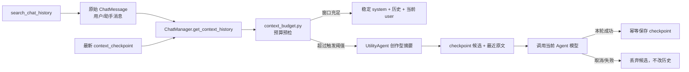

# SparkArc 聊天上下文管理

本文档描述 SparkArc 聊天链路的短期上下文预算、自动压缩、原始历史持久化与按需检索。它面向维护者和贡献者，不定义 StoryMemory 的剧情状态协议。

## 1. 术语与边界

SparkArc 有三层容易混淆但职责完全不同的数据：

| 层 | 真相源 | 作用 | 是否自动发给当前模型 |
|---|---|---|---|
| 短期上下文 | `context_budget.py` 生成的当前 messages | 当前一次模型请求的工作窗口 | 是 |
| 持久聊天历史 | `users.db.chat_messages` | 保存用户与助手原文，支持压缩后回查 | 否；只发送 checkpoint 与其后的原文 |
| StoryMemory | `server/agents/story_memory/` | 保存剧情事实、角色关系、场景进度等创作领域状态 | 由创作链路按需注入 |

**持久聊天历史不是长期记忆系统。** 系统不会从聊天中自动构造用户画像、跨项目偏好、置信度或遗忘曲线。原始消息只在所属用户、项目、Agent 与 `contextKey` 房间内保存，直到用户主动编辑、删除或清空。

## 2. 总体链路



关键收口点：

- 预算与压缩：`server/agents/context_budget.py`
- 摘要模型与提示：`server/agents/utility_agent.py`、`server/agents/prompts/utility.yaml`
- 原文、checkpoint 与检索：`server/agents/chat_manager.py`
- 成功后落盘事务：`server/agents/routes/chat.py`
- 工具门面：`server/agents/tools/chat_history.py` -> `tools/registry.py` -> `agent_tools.py`
- 前端唯一消费器：`client/src/components/stores/chatStore.ts`

## 3. 自适应预算

预算使用 Agent Matchbox 提供的模型上下文上限；真正的历史压缩由 SparkArc 主项目完成。
触发预算继续使用既有的连续安全余量，不按 256K/512K/1M 硬切分：

```text
reserved_output = min(max_output, 20_000, max_context - 256)
small_context_floor = min(16_000, max_context * 10%)
safety_margin = max(small_context_floor, max_context * 6.25%)
reserved_context = reserved_output + safety_margin
hard_budget = max(256, max_context - reserved_context)
trigger_budget = hard_budget
```

因此在 `max_output_tokens >= 20K` 时，256K、512K、1M 窗口的安全余量分别为 16K、32K、62.5K，另加 20K 正常输出预留。极小窗口的最低安全余量按 10% 平滑缩放，并额外保留至少 256 token 的可用预算。

历史压缩另由 `ContextCompactionBudget` 计算工作集比例。默认窗口段为 128K/28%、256K/24%、512K/18%、1M/14%、2M/12%，段间线性插值；导演和灵感 Agent 向更高密度摘要偏移，编剧 Agent 向更多近期原文偏移。摘要预算是工作集扣除稳定 system、当前请求和近期原文后的部分，并受当前模型真实 `max_output_tokens` 的约 95% 上限约束，不使用固定 12K 上限。

以 `max_output_tokens=64K` 且不计 system/current user 的微小差异为例，导演在 256K、512K、1M 窗口的目标工作集约为 56.3K、81.9K、120K；摘要预算约为 34.9K、50.8K、60.8K。这里的目标工作集是压缩后的总动态上下文目标，不是要求每次必须填满的 token 数。

只有完整请求超过 `trigger_budget` 才需要处理历史。系统优先完整保留 system、当前 user 和最近消息；工具调用消息按完整单元保留，不能留下没有对应 ToolMessage 的 assistant `tool_calls`。

### 3.1 短窗口模型切换

用户从长窗口模型切换到短窗口模型时，系统先检查不可丢弃的最小集合：稳定 system + 当前 user。

- 最小集合已超过 `hard_budget`：抛出 `context_window_incompatible`，前端提示更换大窗口模型。
- 摘要后仍超过 `hard_budget`：同样抛出不可重试错误。
- 不会对同一个不兼容请求重复调用上游三次。

### 3.2 压缩失败

上下文压缩器失败、返回不可用结果或其它压缩异常时，抛出 `context_compaction_failed`。系统不会静默删除最旧消息来换取一次“成功”响应，因为这种做法会让创作约束和用户原话无声消失。

## 4. 创作型摘要协议

上下文压缩器不是通用会议纪要器。固定 JSON schema 必须覆盖：

- 用户目标、硬约束及必要原话锚点
- 世界规则、时代、地点、角色、关系、时间线与当前位置
- 作者要求、审美偏好、禁区、受众与平台约束
- 已采用方案、明确否决方案及双方理由
- 新结论覆盖旧结论的版本关系
- 冲突、未确认假设与需要回查原文的位置
- 已完成进度、当前承诺、开放任务与工具结果
- 最近不能丢失的对话轮次

摘要不能补写剧情、不能把推测升级为事实，也不能只保留 AI 对用户诉求的转述。原始历史仍完整持久化；摘要证据不足时，后续 Agent 应调用 `search_chat_history`，而不是猜测。

当历史本身极长时，`UtilityAgent.compress_chat_history()` 复用 `TokenTextSplitter` 分块摘要，再合并为最终 schema；压缩请求始终复用调用方当前 Agent 的 LLM，不单独解析或切换工具 Agent 的模型；不会另写字符数切分器。

## 5. Checkpoint 数据模型

checkpoint 仍使用 `ChatMessage` 表，但与用户可见原文严格区分：

```json
{
  "role": "system",
  "content": {"summary": "..."},
  "metadata": {
    "kind": "context_checkpoint",
    "schema_version": 1,
    "source": "automatic_compaction",
    "source_message_id_start": 101,
    "source_message_id_end": 168,
    "compacted_through_message_id": 168,
    "original_messages": 68
  }
}
```

运行时历史固定为：

```text
最新 checkpoint + compacted_through_message_id 之后的原始 user/assistant 消息
```

旧 `context_summary` 没有边界时，读取层会按该记录写入前的最后一条原始消息补齐边界。相同或更旧边界的 checkpoint 不会重复写入。

### 5.1 落盘事务

自动压缩先产生内存候选，只有当前模型请求完整成功后才保存：

- 成功：幂等保存候选。
- 用户取消：不保存。
- 最终模型错误：不保存。
- 重试中间态：不保存。
- checkpoint 保存本身失败：记录错误，但不重放已经成功的模型或工具调用。

手动“压缩上下文”与自动压缩复用同一 checkpoint payload 和幂等保存协议，不维护第二套 summary 语义。

### 5.2 导演委派与子 Agent

导演和各专家 Agent 使用独立的 `agent_id + context_key` 历史；导演的主聊天历史不会自动变成每个专家的完整聊天历史。导演委派时，子 Agent 使用当前交接任务、项目上下文和该专家自己的交接快照；同一个专家再次被委派时，才会恢复它自己的 `DirectorHandoffMemory`。

导演节点和子 Agent 都会在模型调用前执行上下文预算检查。子 Agent 在工具循环追加新的 assistant tool call 与 ToolMessage 后，还会再次执行 `rebudget_existing_messages`。该压缩调用是同步发生在子 Agent 的 `chat_stream` 内，因此导演图会等待压缩完成；压缩成功后消息列表被替换为 `system -> 摘要 -> 近期完整轮次 -> 当前 user -> 当前工具尾部`，子 Agent 从下一轮模型调用继续原委派任务，成功后才把结果回交导演。

子 Agent 的压缩候选不会直接写入导演的普通聊天 checkpoint。委派结束时，压缩后的运行时消息快照会由 `conversation_recorder` 写入该专家的交接记忆；普通聊天路由中的自动压缩 checkpoint 则在对应 Agent 的聊天任务成功后保存。压缩失败属于不可重试的上下文错误，子 Agent 不会跳过压缩继续执行，也不会把未压缩旧历史静默丢弃。

### 5.3 编辑与删除

如果用户编辑或删除了已被 checkpoint 覆盖的原始消息，`ChatManager` 会删除覆盖它的 checkpoint 及对应压缩提示卡。下一次请求重新从仍存在的原文构建上下文，避免摘要与用户修改后的事实冲突。

## 6. 原始历史检索工具

`search_chat_history` 是只读工具，只在服务端已经注入活动聊天房间时绑定。模型参数中没有 `user_id`、`project_name`、`agent_id` 或 `context_key`，因此不能伪造房间或跨项目读取。

支持两种本地模式：

- `literal`：默认的不区分大小写连续文本搜索。
- `regex`：显式正则搜索，复用 `server/agents/text_search.py` 的公共底座；模式最多 1000 字符，每段文本 200ms 超时。

结果包括：

- 原始 `message_id`、角色、时间与命中附近摘录
- 前 8 个命中的相邻一轮原文，按消息 ID 去重
- `before_message_id` 分页游标
- 结构化的无效正则或超时错误

工具结果有严格摘录上限，防止一次回查重新撑爆短上下文。checkpoint、system 消息和压缩提示卡不参与检索。

### 6.1 为什么当前不自动向量化聊天

项目已有语义索引，但“启用项目文件语义检索”不等于授权把私人聊天发送给云端 Embedding 服务。当前版本不把聊天混入项目 LanceDB，也不在 checkpoint 后自动调用 Embedding。

未来只有同时满足以下条件才应增加语义召回：

1. UI 提供独立、明确的聊天历史语义检索开关。
2. 说明本地/云端 Embedding、费用与数据发送边界。
3. 原始 `ChatMessage` 仍是唯一事实源，向量仅为可删除、可重建缓存。
4. 只索引 checkpoint 已覆盖区间；最近消息本来就在当前窗口中。
5. 索引元数据带房间、消息 ID 与内容哈希，编辑/删除后可准确失效。

## 7. 前端事件与用户体验

预算操作在后台线程执行，事件通过现有 Chat NDJSON 链路实时发送：

```text
context_compaction_started
context_compaction_finished | context_compaction_failed
context_window_stats
```

`context_compaction_started` 会在上下文压缩器真正工作前到达前端，动画覆盖真实等待时间，不是压缩完成后补播。`chatStore` 将事件写入 assistant message 的 segments，刷新和重连后仍可从 task snapshot 恢复时序。

结构化错误码：

- `context_window_incompatible`
- `context_compaction_failed`

前端使用四语本地化文案，不依赖后端中文字符串做主判断。

## 8. 前缀缓存关系

压缩不会改变稳定 system 前缀的布局原则：

1. Agent 身份、模态 prompt、语言策略、工具清单、tool reference 与 tool_rules 位于稳定前缀。
2. checkpoint 和历史消息位于中段。
3. 当前编辑区、附件现场与本轮用户请求位于最后一条 user message。

checkpoint 更新会改变中段历史，因此该边界之后的缓存需要重新建立；它不会把动态编辑区重新塞回 system。更换模型、平台、Agent、工具绑定、语言或提示词同样会改变前缀，UI 不应承诺跨这些变更仍命中缓存。

压缩请求在可以复用源模型客户端时，会沿用原 Agent 的稳定 system、待压缩历史前缀和工具 schema，并把压缩指令追加到前缀之后；工具选择被设为 `none`，压缩模型的工具调用响应会被拒绝。这样只能提高与上游前缀缓存规则相容的机会，不能保证供应商一定返回缓存命中。若源前缀过大，UtilityAgent 会退回 JSON 历史输入并按 `TokenTextSplitter` 分块摘要。

## 9. StoryMemory 的边界

StoryMemory 服务剧情生产，而聊天 checkpoint 服务一次对话继续工作：

- 不得用 StoryMemory 替代用户原话与工程决策历史。
- 不得把聊天摘要自动写成剧情事实。
- 不得把 `search_chat_history` 改成跨项目或跨房间用户画像检索。
- StoryMemory 的吸收、冲突处理和场景状态更新仍走 `server/agents/story_memory/` 及其明确入口。

## 10. 研究依据与取舍

本实现参考现代工作型 Agent 的可核验实现，但按创作任务重新设计摘要内容：

- [OpenAI Codex `compact.rs`](https://github.com/openai/codex/blob/main/codex-rs/core/src/compact.rs)：replacement history、用户消息保留与稳定初始上下文重注入。
- [OpenAI Codex compact prompt](https://github.com/openai/codex/blob/main/codex-rs/prompts/templates/compact/prompt.md)：以可继续工作的 handoff 为目标，而非普通摘要。
- [Claude Code 工作机制](https://code.claude.com/docs/en/how-claude-code-works)：上下文窗口、自动压缩与工具输出管理。

Mem0、LongMemEval 等工作研究持久记忆、检索与知识更新，属于相邻领域，不是 SparkArc 聊天压缩协议的直接依据，也不应被表述为本轮实现的“长期记忆”。

SparkArc 与编程 Agent 的差异在于：代码 Agent 更强调文件、命令、测试和补丁；创作 Agent 还必须显式保留角色关系、叙事时间线、审美禁区、否决方案和版本覆盖。两者共享“可继续工作”的目标，但摘要 schema 不应照抄。

## 11. 测试护栏

相关测试全部离线，不得调用真实模型或第三方 API，位置见 `server/test/architecture/`（聊天时序与回放契约）与前端 `chatStore` 所在 `__tests__/` 目录（以目录实况为准，本文件不点名具体文件名）：

必须覆盖：自动触发、实时 started 事件、失败不丢历史、短窗口不可重试、成功后落盘、房间隔离、编辑失效、正则超时、前端动画与本地化错误。
